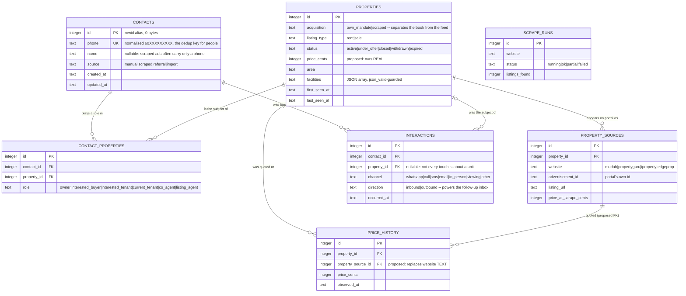

# Database Schema — Property Agent Workspace

| | |
|---|---|
| **Engine** | Turso Database 0.7.1 (SQLite dialect, Rust reimplementation) `[MEASURED: /Users/vincent-sequoia/.turso/tursodb --version @ 2026-08-06 → "Turso 0.7.1"]`; driver `pyturso` 0.7.2 `[MEASURED: .venv/lib/python3.13/site-packages/pyturso-0.7.2.dist-info @ 2026-08-06]` |
| **Doc version** | 1.0.0 |
| **Last updated** | 2026-08-06 |
| **Status** | Partially implemented — V1 DDL exists in the repo but is deployed **nowhere**; the only live database carries a pre-V1 (V0) shape |
| **Owner** | Vincent Khoo (sole operator) |

---

## 1. Scope & non-goals {#scope}

**Covers** the persistent state of a single Malaysian property agent's working tool:

- **the book** — own mandates, contacts, the roles people play on deals, every interaction, and the follow-up queue derived from them. Small, high-value, hand-curated, irreplaceable if lost.
- **the feed** — listings scraped from mudah.my, PropertyGuru, iProperty and EdgeProp. Large, low-value per row, entirely reconstructible by re-scraping.

The two halves share one `properties` table separated by an `acquisition` discriminator. That is a deliberate choice and is defended in §19.

**Non-goals.** n8n's own operational database (workflow definitions, execution history) lives in the `n8n_data` volume and is n8n's business, not ours. Google Sheets is a presentation sink, not a source of truth. The Ollama model layer holds no state. Analytical/BI modelling is out of scope — at the volumes projected in §15 the transactional tables answer every analytical question directly.

**Planning horizon** — 12 months, with a named 100x checkpoint (one district → the Klang Valley) in §16.

---

## 2. Current state & drift register {#current-state}

### 2.1 Sources consulted

| Rank | Source | Reached? | What it told us |
|---|---|---|---|
| **P0** | `listings.db` (+ `-wal`, `-shm`) at repo root | **yes** — read-only via `sqlite3 -readonly` and `tursodb --readonly` | One table, `listings`, 39 columns, **0 rows**. A V0 shape. Not the V1 schema at all |
| **P0** | Turso Cloud primary at `property-websites-webscraper-vincent-khoo.aws-ap-northeast-1.turso.io` | **NO — deliberately not contacted** | A production host I was not pointed at. Its true schema and row count are unknown. See OQ-1 |
| **P1** | Applied migration history | **none exists** | No `migrations/`, no `alembic/`, no version table. `PRAGMA user_version` = 0 `[MEASURED @ 2026-08-06]`. Schema changes are applied by hand |
| **P2** | ORM / model definitions | **none exist** | Every module under `src/pw/` is empty except a docstring `[MEASURED: wc -c on all 7 files @ 2026-08-06 → 32 bytes total]`. There is no application yet |
| **P3** | `src/pw/db/schema.sql` | yes | The V1 design: 7 tables + 1 view. Well-reasoned, internally consistent, **and applied to no database on disk** |
| **P3** | `test.json` → node 29 (`n8n-nodes-base.postgres`) | yes | An abandoned **PostgreSQL** DDL draft (`GENERATED ALWAYS AS IDENTITY`, `TIMESTAMPTZ`, `VARCHAR(20)`). Historical origin only — see §19 |
| **P4** | Existing `DATABASE_SCHEMA.md` | **none existed** | This document is the first |
| **P5** | `current-n8n-setup.json`, `what.json` | yes | The **real write path**. n8n is today the only thing that writes to the database |
| **P5** | `tests/test_schema.py` | yes | The only executable queries against V1. All 8 passed on the last run `[MEASURED: .pytest_cache/v/cache/lastfailed == {} @ 2026-08-06]` |
| **P5** | `git log`, `.env`, `docker-compose.yml`, `pyproject.toml`, `.gitignore` | yes | Engine resolution, config, history |

### 2.2 The headline

> ⚠️ **DRIFT (P0 vs P3) — the live database and the repo schema have no table in common.**
> `listings.db` contains exactly one domain table, `listings`, with 39 columns
> `[MEASURED: PRAGMA table_info(listings) @ 2026-08-06]`. `schema.sql` declares `contacts`,
> `properties`, `property_sources`, `contact_properties`, `interactions`, `price_history`,
> `scrape_runs` and the `follow_up_inbox` view. **Zero overlap.** Per Gate 1, P0 is fact:
> what is deployed is V0. P3 is intent: V1 is a design, not a deployment.

This is a *good* problem. `listings` holds **0 rows** `[MEASURED: SELECT count(*) FROM listings @ 2026-08-06 → 0]`. There is nothing to migrate, nothing to backfill, nothing to lose. **This is the cheapest schema-change moment this project will ever have**, and every recommendation below is priced accordingly. In six months, with 40,000 scraped rows and a year of interaction history, the same changes cost a maintenance window and a backfill script.

### 2.3 The `floor` / `floors` mismatch

`schema.sql` line 52 carries its own confession:

```sql
floor INTEGER,   -- NB: old schema said `floors`, code wrote `floor`
```

The comment is half right, and the half it gets wrong matters.

> ⚠️ **DRIFT (P0 vs P3 vs P5) — three sources, three spellings, and the comment points the wrong way.**
> - **P0, live** — the column is `floors SMALLINT` `[MEASURED: PRAGMA table_info(listings) → ordinal 11 = "floors" @ 2026-08-06]`. The "old" spelling is not old; it is what is deployed.
> - **P3, `schema.sql`** — declares `floor INTEGER`.
> - **P5, n8n** — the INSERT column list says `floor`, and binds it to the JavaScript key `$json.floor`, while the surrounding record builder emits `floors` nowhere.
>
> Per Gate 1, **P0 is fact**: the live column is `floors`. The comment in `schema.sql` describes
> the correct *destination* but implies the migration already happened. It has not.

**Resolution.** Keep `floor` (singular) as the V1 name — it is the correct English for "which floor is this unit on", it is what the n8n producer already emits, and `floors` invites the reading "how many floors does it have". Since the live table is empty, this costs a `CREATE TABLE`, not a rename. Fix the comment in `schema.sql` to stop implying history that did not occur.

### 2.4 The n8n write path is broken against the live schema

Not a stylistic drift — a hard, current, total failure of the only write path in the system.

> ⚠️ **DRIFT (P0 vs P5) — every n8n database call fails against `listings.db` as deployed.**

**The dedup probe** (`current-n8n-setup.json` nodes 22 and 24, `HTTP Request2` / `HTTP Request – Retrieve All Listings From DB`):

```sql
SELECT * FROM listings WHERE advertisement_id = ? OR phone = ?
```

```
[MEASURED: tursodb --readonly listings.db "EXPLAIN QUERY PLAN SELECT * FROM listings
           WHERE advertisement_id = 1 OR phone = '60123456789'" @ 2026-08-06]
  × Parse error: no such column: advertisement_id
```

**The INSERT** (`what.json`, and node 28's generated body) names 40 columns. Seven of them do not exist on the live table `[MEASURED: set difference of the INSERT column list against PRAGMA table_info(listings) @ 2026-08-06]`:

| n8n writes | Live table actually has | Nature of the mismatch |
|---|---|---|
| `advertisement_id` | `listing_id` | renamed concept |
| `floor` | `floors` | §2.3 |
| `scraped_date` | `scrapped_date` | **typo in the live column** (double `p`) |
| `created_date` | `created_at` | convention drift |
| `updated_date` | `updated_at` | convention drift |
| `rating_reason` | *(absent)* | column never added |
| `scam_reasons` | *(absent)* | column never added |

The statement fails on the first unknown column. Placeholder count is fine (40 `?` for 40 columns), so this is purely a naming failure — the least excusable kind and the easiest to fix.

**Two more producer defects, both live:**

1. **`facilities` is not JSON.** The pinned sample payload sends
   `"Playground, Tennis Court, Gymnasium, Parking, Security, ..."` — a comma-separated string.
   ```
   [MEASURED: SELECT json_valid('Playground, Tennis Court, Gymnasium') @ 2026-08-06 → 0]
   ```
   Both the live table and V1 guard this column with `CHECK (facilities IS NULL OR json_valid(facilities))`. The constraint is correct; **the producer is wrong**. See §6.2 and §19.
2. **Phones are not normalised.** The pinned payload carries `"0162339069"` — local Malaysian format. `schema.sql`'s header states the storage contract is digits-only with country code and no `+` (`60162339069`). Nothing in the n8n path performs that transform. A unique index over unnormalised input is decoration, not deduplication (doctrine §4). See §8, IG-2.
3. **The dedup key is never populated.** In the pinned payload the first bound argument — `advertisement_id` — is `{"type":"null"}`. The extractor assigns `listing_id: scraped.advertisement_id || ''`, and the upstream parser did not produce one. Even with the column names fixed, the row would insert with a null identity, and the live table declares `listing_id BIGINT UNIQUE NOT NULL` — so the second such row would collide on `NULL`… except SQLite treats `NULL`s as distinct in a unique index, so it would instead insert unboundedly many identity-less duplicates. See IG-1.

### 2.5 The cross-portal collision in the live unique key

The live table's only index is the implicit one behind `listing_id BIGINT UNIQUE`:

```
[MEASURED: SELECT name, sql FROM sqlite_master WHERE type='index' @ 2026-08-06
           → sqlite_autoindex_listings_1 | NULL]
```

> ⚠️ **DRIFT (P0 vs domain contract) — the live uniqueness key is `listing_id` alone.**
> The stated identity of a portal listing is **`(website, advertisement_id)`**. mudah ad `115402662`
> and an iProperty ad that happens to share that integer are different listings, and the live
> schema would reject the second as a duplicate. `schema.sql` gets this right with
> `UNIQUE (website, advertisement_id)` on `property_sources`. The live table does not.
>
> Confirmed at plan level — filtering on both columns still probes the single-column index:
> ```
> [MEASURED: EXPLAIN QUERY PLAN SELECT * FROM listings WHERE website='mudah' AND listing_id=1
>            @ 2026-08-06]
>   `--SEARCH listings USING INDEX sqlite_autoindex_listings_1 (listing_id=?)
> ```
> `website` is not part of the key; it is only a residual filter.

### 2.6 Migration-history defects

Reported as their own class per Gate 1 rule 4.

| Defect | Detail |
|---|---|
| **No migration mechanism at all** | No `migrations/`, no `alembic/`, no `drizzle/`, no `atlas.hcl`, and `PRAGMA user_version = 0` `[MEASURED @ 2026-08-06]`. There is no way to tell, from a database file, which schema version it holds — which is exactly how the V0/V1 divergence in §2.2 went unnoticed |
| **`schema.sql` is a bootstrap file, not a migration** | It is `CREATE TABLE IF NOT EXISTS` throughout. Run against `listings.db` it would create all seven V1 tables **alongside** the V0 `listings` table and report success. Silent divergence by design |
| **Applied but not in the repo** | The live `listings` table was created by something not in this repository. `test.json` node 29 holds a *Postgres* draft of it; no SQLite/Turso DDL for it exists anywhere in the tree |
| **Engine artifacts confirm provenance** | The live file contains `__turso_internal_seq___turso_internal_autoincrement_listings` `[MEASURED: .tables @ 2026-08-06]` — a Turso-Database-specific structure backing `AUTOINCREMENT`. The file was created by Turso, not stock SQLite. It remains readable by stock SQLite 3.51.0, so the on-disk format is compatible |

### 2.7 Engine maturity — the finding that constrains everything below

Gate 2 Step 3 requires validating every recommendation against the profile, and this engine's feature set is narrower than the SQLite profile assumes.

```
[MEASURED: /Users/vincent-sequoia/.turso/tursodb --help @ 2026-08-06]
  --experimental-views            --experimental-generated-columns
  --experimental-vacuum           --experimental-without-rowid
  --experimental-autovacuum       --experimental-attach
  --experimental-encryption       --experimental-multiprocess-wal
  --experimental-index-method     --experimental-mvcc-passive-checkpoint
```

Turso's own manual states the engine lacks *"multi-process and multi-threading access, savepoints, triggers, views, and vacuum"* outside those flags. That collides with this schema in three places:

1. **`follow_up_inbox` is a view.** It is the follow-up feature. On this engine views are experimental.
2. **Honest `updated_at` wants a trigger.** Triggers are experimental. Doctrine §8 calls `updated_at` maintained by a trigger the baseline; here it must be enforced in the application. See IG-4.
3. **The deployment shape is multi-process** — the n8n container, a future `pw-api` (FastAPI/uvicorn), an APScheduler process, and the test suite. Multi-process access is exactly what the manual excludes.

**Countervailing measurement, and it matters:** views demonstrably *work* through `pyturso` 0.7.2 — `tests/test_schema.py` queries `follow_up_inbox` in four tests and all 8 tests passed on the last run `[MEASURED: .pytest_cache/v/cache/lastfailed == {} @ 2026-08-06]`. So the Python binding is ahead of the CLI's flag gating, or enables the feature by default. Treat this as "works today, not contractually stable" — it is a pre-1.0 engine.

**Upsert and partial indexes are supported** and may be recommended freely (verified against current Turso documentation, 2026-08-06): `CREATE INDEX ... WHERE <predicate>` and `INSERT ... ON CONFLICT (cols) [WHERE expr] DO UPDATE SET ... ` including `excluded.*` references and conditional `WHERE` on the update. Note: a *partial* unique index used as a conflict target must repeat its `WHERE` clause in the `ON CONFLICT` clause.

### 2.8 Secrets

Not a schema defect, but it sits in the files this review read, so it gets one line. The Turso **read-write** auth token appears in plaintext in `.env` and in `current-n8n-setup.json` (twice, as a hardcoded `Authorization: Bearer` header on nodes 22 and 24). `.env` is gitignored; `current-n8n-setup.json` is **not** — it is untracked and uncovered by `.gitignore`, so a `git add -A` commits it. No tracked file currently contains the token `[MEASURED: grep over git ls-files @ 2026-08-06 → no matches]`. Add `current-n8n-setup.json` to `.gitignore` or move the credential to an n8n credential object.

---

## 3. Access patterns {#access-patterns}

IDs are permanent (Gate 4). `[E]` = evidenced by a real query in the repo or the n8n workflows; `[D]` = design intent inferred from the schema's own indexes and comments, not yet written anywhere.

| ID | Pattern | Predicates | Sort | Scanned→Returned | Frequency | Target | Provenance |
|---|---|---|---|---|---|---|---|
| **AP-01** | Before inserting a scraped listing, check whether we already know this ad *or* this person `[E]` | `advertisement_id = ? OR phone = ?` | — | full table → 0-2 | ~105/day | p99 < 50 ms | `[ESTIMATED: 35 ads/page × 3 portals × 1 run/day; page size from mudah `__NEXT_DATA__` extractor]` |
| **AP-02** | Resolve a portal ad to its property row `[E]` | `website = ? AND advertisement_id = ?` | — | ~1 → 1 | ~105/day | p99 < 10 ms | `[ESTIMATED: one probe per scraped listing, same basis as AP-01]` |
| **AP-03** | Resolve a person by normalised phone (the dedup key) `[E]` | `phone = ?` | — | ~1 → 1 | ~105/day | p99 < 10 ms | `[E: tests/test_schema.py::_contact; n8n node 22]` |
| **AP-04** | Insert or refresh one scraped listing `[E]` | write | — | — | ~105/day | p99 < 100 ms | `[ESTIMATED: as AP-01]` |
| **AP-05** | Browse the feed: rent listings in an area under a price ceiling, newest first, 20/page `[D]` | `acquisition='scraped' AND status='active' AND area=? AND listing_type=? AND price<=?` | `first_seen_at DESC, id DESC` | ~2,000 → 20 | ~30/day | p99 < 100 ms | `[ASSUMED: the agent browses their own feed a few dozen times a day. If this becomes a public web surface at 5k/day, AP-05 moves from "nice to index" to the hottest path in the system and §9's feed index becomes mandatory rather than recommended]` |
| **AP-06** | Follow-up inbox: who is owed a reply, who has gone quiet, who was never contacted — ordered by staleness `[E]` | `bucket = ?` over the view | `stale_hours DESC` | all contacts ⋈ all interactions → ~50 | ~20/day | p99 < 200 ms | `[E: tests/test_schema.py::test_owed_reply_ordering_is_by_staleness]` |
| **AP-07** | One contact's timeline, newest first `[D]` | `contact_id = ?` | `occurred_at DESC` | ~30 → 30 | ~40/day | p99 < 20 ms | `[D: idx_interactions_contact(contact_id, occurred_at DESC) exists for this]` |
| **AP-08** | Everyone attached to a property, with their role `[E]` | `property_id = ?` | — | ~3 → 3 | ~20/day | p99 < 20 ms | `[D: idx_cp_property]` |
| **AP-09** | Every property a contact is attached to, with their role `[E]` | `contact_id = ?` | — | ~3 → 3 | ~30/day | p99 < 20 ms | `[E: tests/test_schema.py::test_role_lives_on_the_relationship_not_the_person]` |
| **AP-10** | The mandate board: my own listings by status `[D]` | `acquisition='own_mandate' AND status = ?` | `updated_at DESC` | ~10 → ~10 | ~30/day | p99 < 20 ms | `[D: idx_properties_acq(acquisition, status) exists for this]` |
| **AP-11** | Staleness sweep: scraped listings not seen recently `[D]` | `acquisition='scraped' AND last_seen_at < ?` | — | ~4,000 → ~150 | 1/day | < 5 s | `[D: idx_properties_seen(last_seen_at) exists for this. No code performs this sweep yet — see OQ-4]` |
| **AP-12** | Scrape health: recent runs per portal `[D]` | `website = ?` | `started_at DESC` | ~365 → 10 | ~3/day | p99 < 20 ms | `[D: idx_scrape_runs(website, started_at DESC)]` |
| **AP-13** | Price trail for one property (**V2**) `[D]` | `property_id = ?` | `observed_at DESC` | ~12 → 12 | 0/day today | p99 < 20 ms | `[D: idx_price_history exists; no reader until V2 — see §19]` |
| **AP-14** | Narrow fuzzy-dedup candidates before doing string work in Python `[D]` | `area = ? AND bedrooms = ? AND size_sqft BETWEEN ? AND ?` | — | ~4,000 → ~15 | ~105/day | p99 < 50 ms | `[D: idx_properties_dedup(area, bedrooms, size_sqft) exists and its comment says exactly this]` |
| **AP-15** | Find a contact by name (partial match) `[D]` | `name LIKE ?` | `name` | all contacts → ~5 | ~15/day | p99 < 50 ms | `[D: idx_contacts_name exists. See §9 — it will not serve an infix LIKE]` |
| **AP-16** | Outreach queue: listings with a phone and no interaction yet `[E]` | V0: `contact_status = 'Not Contacted'`; V1: AP-06's `never_contacted` bucket | `first_seen_at DESC` | full table → ~50 | ~10/day | p99 < 200 ms | `[E: live column `contact_status NOT NULL DEFAULT 'Not Contacted'`]` |

**Read/write shape.** Overwhelmingly read-heavy by call count, but the writes are the interesting ones: one daily batch of ~105 upserts (AP-04) against a table read interactively all day. Single writer, no contention — the SQLite concurrency ceiling (profile §6) is not remotely in play. The correct optimisation is to wrap the daily batch in **one transaction**: unbatched, each insert is its own fsync and throughput drops by roughly two orders of magnitude (profile §6).

**Transactional boundaries.** Three aggregates must commit atomically, and they are the hard limit on any future sharding:

1. `properties` + its `property_sources` rows + any `price_history` row for the same observation. Splitting these lets a listing exist with no portal identity, or a price with no listing.
2. `contacts` + `contact_properties`. A role with a dangling person is meaningless.
3. `scrape_runs` counters + the rows that run produced. Today the counters are written independently, so they can disagree with reality — see IG-5.

**Multi-tenancy: none, and that is a decision, not an omission.** One agent, one database, no tenant key. Retrofitting a tenant key is among the most expensive migrations there is (doctrine §requirements-5), so it is worth naming the trigger: **the first day a second agent's data enters this database.** At that moment `tenant_id` must be added to every table and lead every composite index and unique constraint — including `UNIQUE (website, advertisement_id)`, which would become `UNIQUE (tenant_id, website, advertisement_id)`. Until then, the cost of carrying an always-`1` column exceeds its option value. See OQ-6.

---

## 4. Conventions {#conventions}

| Decision | Ruling | Why |
|---|---|---|
| **Case & separators** | `snake_case`, lowercase, everywhere | Already the house style in `schema.sql`; no exceptions found |
| **Table names** | plural (`contacts`, `properties`); columns singular | Consistent in V1 |
| **Primary key** | `id INTEGER PRIMARY KEY` — **without `AUTOINCREMENT`** | See §4.1 |
| **Foreign key** | `<singular_table>_id`; every FK gets an explicit `ON DELETE` action and its own index | Profile §3: FK columns are **not** indexed automatically |
| **Instants** | `TEXT`, ISO-8601, **always UTC**, via `datetime('now')` | Profile §2/§10: `datetime('now')` returns UTC; text sorts and compares correctly. Render local (`Asia/Kuala_Lumpur`) at the edge only |
| **Timestamp suffix** | `_at` for instants, `_on` for dates | V1 complies. The live V0 table's `scrapped_date` / `listing_date` violate it (and misspell it) |
| **Money** | **Open defect — see §4.2** | |
| **Booleans** | none exist today. When needed: `INTEGER CHECK (c IN (0,1))`, `NOT NULL`, named as an assertion (`is_active`), never negated | Profile §2 — there is no boolean type |
| **Enumerations** | `TEXT CHECK (c IN (...))` | Doctrine §4 default: visible in the DDL, portable, cheap to change. All six V1 enums already do this. Do **not** promote to lookup tables until a value needs attributes |
| **Units in names** | carried: `size_sqft`, `price_per_sqft`, `stale_hours` | V1 complies |
| **Constraint naming** | `idx_`, `uq_`, `fk_`, `ck_`, `trg_` + table + columns | V1 names its indexes but relies on *auto-generated* names for every `UNIQUE` and `CHECK` — you cannot drop what you cannot name. See §9.3 |
| **Soft delete** | **Per table. No blanket rule.** See §7.3 | Doctrine §7 |
| **Reserved words** | none in use. `status`, `role`, `source`, `notes`, `summary` are all safe in SQLite | |

### 4.1 Primary key strategy — and why nothing changes yet

**Ruling: keep `INTEGER PRIMARY KEY`. Drop `AUTOINCREMENT`. Do not add a public identifier yet — but name the day it becomes mandatory.**

*Keep the integer.* In SQLite-family engines `INTEGER PRIMARY KEY` **aliases the rowid and costs zero extra storage** (profile §9). It is already 64-bit, so the "never use a 32-bit key" rule is satisfied for free — no overflow risk at any volume this project will see. It gives perfect insert locality, the narrowest possible foreign keys, and the cheapest joins.

*Drop `AUTOINCREMENT`.* All seven V1 tables declare it. The profile's forbidden list (§11) is explicit: *"never propose `AUTOINCREMENT` reflexively — plain `INTEGER PRIMARY KEY` is faster."* It buys exactly one guarantee — ids are never reused after deletion — and costs a `sqlite_sequence` write on **every single insert**. On this engine it costs more than that: it materialises a whole extra table, visible in the live file as `__turso_internal_seq___turso_internal_autoincrement_listings` `[MEASURED: .tables @ 2026-08-06]`. Nothing in this system depends on id non-reuse. Rows are deleted (expired scrape rows) and their ids may be reused with no consequence, because nothing external ever saw them — which is precisely the next point.

*No `public_id`, yet.* Doctrine's two-key pattern (internal `id` + external UUIDv7/NanoID) exists to stop enumeration leaking your volume. **Nothing is externally exposed today.** `src/pw/api/` is empty `[MEASURED: 0 bytes @ 2026-08-06]`; there is no HTTP surface, no shared link, no public listing page. Adding 16 bytes and a unique index per row to defend against an attacker who has no endpoint to enumerate is paying a real write tax for a hypothetical.

The counter-argument deserves to be stated rather than waved away: retrofitting `public_id` **after** external links exist is the expensive version, because every already-shared URL must keep resolving. That is true, and it is why this is a *tripwire*, not a "never":

> **Trigger:** the first time `pw-api` returns a row identifier to anything outside this machine — a browser, a WhatsApp deep link, a shared listing page — `public_id TEXT NOT NULL UNIQUE` (UUIDv7, stored as 26-char text or 16-byte BLOB) ships **in the same release**, not after it.

Storing UUIDs as text is normally forbidden (2.25x the bytes in every index). Here the profile (§2) explicitly permits `TEXT` when human-readability of the file matters more than size, and at ~4,000 rows the difference is 40 KB. If volume reaches the 100x checkpoint, use `BLOB`.

*Why not the natural key?* `advertisement_id` is tempting — it is unique per portal and arrives with the data. Reject it: it is a **foreign** identifier we do not control, it collides across portals (§2.5), it is `NULL` in practice today (§2.4), and doctrine §3 is unambiguous that "permanent" reference numbers change. It belongs in a `UNIQUE` constraint, never in a primary key.

### 4.2 Money — an open defect, deliberately not "fixed" here

`properties.price`, `price_per_sqft`, and `price_history.price` are all `REAL`. The profile's forbidden list (§11) opens with *"never propose `REAL` for money"*, and doctrine §4 is equally blunt. IEEE-754 rounding loss on money is not theoretical.

The honest counter-argument, which is why this is a recommendation and not an emergency: Malaysian rental and sale prices are whole ringgit (`RM 450`, `RM 480,000`), and a `REAL` represents every integer up to 2^53 exactly. Today nothing sums, averages, or computes commission on these values — no code reads them at all. The loss materialises the moment someone computes a 2% commission or a price-per-sqft delta and stores the result.

**Ruling: store `price_cents INTEGER` (sen).** `price_per_sqft` may stay `REAL` — it is a derived display metric, never a payable amount, and doctrine's rule is about money, not about ratios. Because the tables are empty this is a `CREATE TABLE` today and a 12-step table rebuild (profile §5) in six months.

An amount without a currency is not a value (doctrine §4). Every price here is MYR. Rather than carry a constant `currency_code` column on every row, that fact is recorded here and enforced by a check: if a second currency ever appears, the column gets added then. Logged as OQ-5.

---

## 5. Entity relationship diagram {#erd}



Cardinality: `||--o{` one-to-many · `|o--o{` optional-one-to-many · `||--||` one-to-one.

`SCRAPE_RUNS` is deliberately unrelated — it is an operational log, not part of the domain graph. See IG-5.

---

## 6. Entities {#entities}

Volumes assume the **current scope**: one district (Kajang, Selangor), three portals actively wired (`mudah`, `propertyguru`, `iproperty`; EdgeProp named in the domain brief but present in no URL variable `[MEASURED: node 12 "Edit Fields – Set Variables" defines exactly three portal URLs @ 2026-08-06]`), one daily run at midnight `Asia/Kuala_Lumpur`.

The base estimate everything hangs from:

```
[ESTIMATED: ~4,000 distinct properties at 12 months
   ≈ active rent+sale inventory for one Selangor district across 3 portals.
   Derived from: ~35 ads on the first mudah search page (the extractor reads
   props.pageProps.initialStore.ads and the workflow requests page 1 only),
   × 3 portals × 1 run/day = ~105 observations/day; distinct units converge on
   district inventory rather than accumulating, with churn replacing expiry.]
```

> `[ASSUMED: the scraper stays on page 1 of each portal. If pagination is added — and the
> extractor already carries commented-out `totalPages` handling, so it is planned — the daily
> observation count multiplies by the page count. At 10 pages this becomes ~1,050/day and the
> 12-month property count rises toward the district's full inventory (~8,000-12,000). That
> changes nothing structural: §15 shows even 100x lands in the low hundreds of MB. What it
> *does* change is AP-01 and AP-14, which run **once per observation** — at 1,050/day an
> unindexed full scan per probe (the current live behaviour, §2.4) becomes noticeable.]`

### 6.1 `contacts` {#e-contacts}

**Purpose** — one row per human being, whoever they are to us this week.

**Grain** — one row per *person*, identified by normalised phone. Not per role, not per deal. This is the single best decision in the V1 schema and it is worth stating why: a landlord on one deal is a buyer on the next, so `role` deliberately does not live here. It lives on `contact_properties`, and `tests/test_schema.py::test_role_lives_on_the_relationship_not_the_person` locks that behaviour in.

**Volume** — 0 today `[MEASURED: table does not exist in any deployed database @ 2026-08-06]` · ~1,300 at 12 months `[ESTIMATED: ~4,000 properties, but agents and agencies repeat heavily across listings — roughly one distinct phone per three listings]` · +100/month thereafter.

| Column | Type | Null | Default | Description |
|---|---|---|---|---|
| `id` | `INTEGER` | no | rowid | PK. Rowid alias — zero storage |
| `name` | `TEXT` | **yes** | — | Nullable *for a reason*: a scraped ad frequently carries a phone and nothing else. `NULL` here means "we genuinely do not know", never "" |
| `phone` | `TEXT` | **yes** | — | **The dedup key.** Normalised: digits only, country code, no `+` (`60123456789`). `UNIQUE`. Nullable because a walk-in contact may have only an email — but see IG-2 |
| `email` | `TEXT` | yes | — | Should be lowercased before insert; not currently enforced (IG-2) |
| `company` | `TEXT` | yes | — | Agency name, for co-agents |
| `ren_number` | `TEXT` | yes | — | Malaysian agent registration (REN/E number). Regulator-issued identity |
| `notes` | `TEXT` | yes | — | Free text |
| `source` | `TEXT` | no | `'manual'` | `manual` \| `scraped` \| `referral` \| `import` |
| `created_at` | `TEXT` | no | `datetime('now')` | UTC ISO-8601 |
| `updated_at` | `TEXT` | no | `datetime('now')` | UTC. **Not maintained on update** — IG-4 |

**Constraints** — PK `id`; `UNIQUE (phone)`; `CHECK (source IN (...))`. No foreign keys — `contacts` is a root entity.

**Indexes**

| Index | Definition | Serves | Notes |
|---|---|---|---|
| *(implicit)* | `UNIQUE (phone)` | AP-03 | Auto-created by the `UNIQUE` constraint. Confirmed empirically on the live table: `sqlite_autoindex_listings_1` with `sql = NULL` `[MEASURED @ 2026-08-06]` |
| `idx_contacts_phone` | `(phone)` | **nothing** | ⚠️ **Redundant.** A pure duplicate of the implicit unique index above. Double write tax, zero read benefit. **Drop it** — §10 |
| `idx_contacts_source` | `(source)` | **nothing** | ⚠️ Four distinct values across ~1,300 rows. Doctrine §6: never index a low-cardinality column alone. **Drop it** — §10 |
| `idx_contacts_name` | `(name)` | AP-15, partially | Serves `LIKE 'Ahmad%'` (prefix). Will **not** serve `LIKE '%Ahmad%'`, which is what a search box actually sends. Keep only if the UI commits to prefix search — §9.2 |

**Storage estimate** — profile §9: `row ≈ record header + Σ(actual value widths) + ~4 B cell overhead`.

```
values: name 18 + phone 11 + email 22 + company 25 + ren_number 12 + notes 60
      + source 6 + created_at 19 + updated_at 19            = 192 B
        [ESTIMATED: name "Yong Wei Sim" ~18ch; company "GT Nelson Realty Sdn. Bhd." ~25ch;
         notes short. id = 0 B, it is the rowid]
header: 2 + 10 columns                                      =  12 B
cell:                                                       =   4 B
row_width                                                   ≈ 208 B
table  ≈ 208 B × 1,300                                      ≈ 270 KB
indexes (after dropping the two redundant ones):
  unique(phone)  (11 + 2 rowid + 4)  = 17 B
  idx_name       (18 + 2 + 4)        = 24 B                 ≈  53 KB
12-month total                                              ≈ 323 KB
```

**Lifecycle** — **never deleted.** This is the irreplaceable half of the database. A contact whose deals are all closed is still a contact. No soft delete, no retention limit, no purge — except a PDPA erasure request, which is a hard delete (§14). PII-bearing: see §14.

---

### 6.2 `properties` {#e-properties}

**Purpose** — one row per real-world unit, whether it arrived from a portal or from the agent's own mandate.

**Grain** — one row per **unit**, not per advertisement. A unit cross-listed on mudah and PropertyGuru is **one** row here and **two** rows in `property_sources`. Most modelling errors are grain errors; this one is correct, and it is what makes cross-portal deduplication and price history possible at all.

**Volume** — 0 today `[MEASURED @ 2026-08-06]` · ~4,000 at 12 months `[ESTIMATED: see §6 preamble]` · ~400,000 at the 100x checkpoint `[ASSUMED: expansion from one district to the Klang Valley. If instead the agent expands to all of Peninsular Malaysia, this is ~2M and §16's "no partitioning needed" conclusion still holds — but the 12-month total in §15 crosses 1 GB and the daily batch stops fitting comfortably in one transaction]`

| Column | Type | Null | Default | Description |
|---|---|---|---|---|
| `id` | `INTEGER` | no | rowid | PK |
| `acquisition` | `TEXT` | no | `'scraped'` | `own_mandate` \| `scraped`. **The discriminator that keeps 10 real mandates from drowning in 4,000 scraped rows.** Leads `idx_properties_acq` |
| `listing_type` | `TEXT` | no | `'rent'` | `rent` \| `sale` |
| `title` | `TEXT` | yes | — | Portal headline |
| `property_type` | `TEXT` | yes | — | Condominium, Terrace, Apartment… Free text today; a `CHECK` list once the portal vocabulary is known (OQ-3) |
| `price_cents` | `INTEGER` | yes | — | **Proposed, replacing `price REAL`** — §4.2. Sen. MYR |
| `price_per_sqft` | `REAL` | yes | — | Derived display metric; `REAL` is acceptable here (not a payable amount) |
| `size_sqft` | `REAL` | yes | — | |
| `bedrooms` | `INTEGER` | yes | — | |
| `bathrooms` | `INTEGER` | yes | — | |
| `car_parks` | `INTEGER` | yes | — | |
| `floor` | `INTEGER` | yes | — | Which floor the unit is on. **Live database says `floors`** — §2.3 |
| `furnishing` | `TEXT` | yes | — | |
| `tenure` | `TEXT` | yes | — | Freehold / Leasehold |
| `facilities` | `TEXT` | yes | — | JSON array, guarded by `CHECK (json_valid(...))`. See below |
| `full_address` | `TEXT` | yes | — | |
| `area` | `TEXT` | yes | — | "Kajang". Leads two indexes. See IG-3 |
| `latitude` | `REAL` | yes | — | |
| `longitude` | `REAL` | yes | — | |
| `status` | `TEXT` | no | `'active'` | `active` \| `under_offer` \| `closed` \| `withdrawn` \| `expired`. See §7.3 |
| `scam_score` | `INTEGER` | yes | — | 0-100, V2. Currently always `NULL` — costs 0 bytes per row (profile §9) |
| `summary` | `TEXT` | yes | — | LLM-generated |
| `first_seen_at` | `TEXT` | no | `datetime('now')` | |
| `last_seen_at` | `TEXT` | no | `datetime('now')` | **The liveness signal.** Drives AP-11 and the expiry rule in §7.3 |
| `created_at` | `TEXT` | no | `datetime('now')` | |
| `updated_at` | `TEXT` | no | `datetime('now')` | Not maintained on update — IG-4 |

**On `facilities TEXT` guarded by `json_valid` — keep it, and here is the argument.**

*For.* Facilities are genuinely sparse and externally shaped: every portal uses its own vocabulary, the list length varies from zero to twenty, and the set is not ours to define. Doctrine §4 names exactly this case — *"correct for genuinely sparse or externally-shaped data: raw scraper payloads"*. The alternative, a `facilities` lookup table plus a `property_facilities` join table, buys referential integrity over a vocabulary **we do not control and cannot validate**, and costs a join on every listing read plus a normalisation step that will silently drop any facility the portal invents next month. The `CHECK (facilities IS NULL OR json_valid(facilities))` guard is the profile's documented idiom (§2) and is the difference between a JSON column and a text column you *hope* is JSON.

*Against — and this is where it actually stands today.* The constraint is right and the producer is wrong: n8n sends a comma-separated string, and `json_valid('Playground, Tennis Court, Gymnasium')` returns **0** `[MEASURED @ 2026-08-06]`. So on the day the column names are fixed (§2.4), this constraint becomes the *next* thing to fail. That is the constraint doing its job — it is the last line of defence catching a producer bug — but it must be fixed at the producer: emit `["Playground","Tennis Court","Gymnasium"]`.

*The limit.* A JSON column is not an escape hatch for modelling relationships, and any key you filter or sort on frequently gets promoted to a real column with a real index (doctrine §4). Today **nothing filters on facilities** — no query in the repo, the tests, or the n8n workflows references it in a `WHERE` clause `[MEASURED: grep across all query sites @ 2026-08-06]`. So: no index, no promotion, recorded in §9.2 as a deliberate omission. The day "listings with a pool" becomes a filter, `has_pool` becomes a column or an expression index over `json_extract`.

*One live-schema note.* The deployed V0 table declares `facilities JSONB`. In SQLite affinity rules `JSONB` matches none of the INT/CHAR/TEXT/BLOB/REAL patterns and therefore resolves to **NUMERIC affinity** — not a JSON type, because per profile §11 no such type exists. In practice a JSON array string is not numeric-convertible so it is stored as text anyway, making this harmless but actively misleading. V1's `TEXT` is correct; keep it.

**Constraints** — PK `id`; `CHECK` on `acquisition`, `listing_type`, `status`; `CHECK (facilities IS NULL OR json_valid(facilities))`. No foreign keys out. Missing and recommended: `CHECK ((latitude IS NULL) = (longitude IS NULL))` — a presence pair (doctrine §5); half a coordinate is not a location.

**Indexes**

| Index | Definition | Serves | Notes |
|---|---|---|---|
| `idx_properties_acq` | `(acquisition, status)` | AP-10 | Correct: equality, equality. Keep |
| `idx_properties_area` | `(area)` | **nothing** | ⚠️ **Left-prefix redundant** with `idx_properties_dedup(area, …)`. Doctrine §6: do not create `(a)` when `(a,b)` exists. **Drop** — §10 |
| `idx_properties_price` | `(listing_type, price)` | AP-05, partially | Cannot serve AP-05 — no `area`. Superseded by the proposed feed index |
| `idx_properties_seen` | `(last_seen_at)` | AP-11 | Correct. Keep |
| `idx_properties_dedup` | `(area, bedrooms, size_sqft)` | AP-14 | Equality, equality, range — textbook column order. Keep |
| **`idx_properties_feed`** | **proposed** — `(area, listing_type, first_seen_at DESC, price_cents) WHERE acquisition='scraped' AND status='active'` | **AP-05** | See §9.1 |

**Storage estimate**

```
values: acquisition 7 + listing_type 4 + title 55 + property_type 11
      + price_cents 4 + price_per_sqft 8 + size_sqft 8
      + bedrooms 1 + bathrooms 1 + car_parks 1 + floor 1
      + furnishing 19 + tenure 8 + facilities 120 + full_address 40 + area 6
      + latitude 8 + longitude 8 + status 6 + scam_score 0 (NULL)
      + summary 130 + first_seen_at 19 + last_seen_at 19
      + created_at 19 + updated_at 19                       = 522 B
        [ESTIMATED: title ~55ch ("Forest Green Condominium Sungai Long" is 36; longer ones
         run to 80). facilities ~120 B as a JSON array of ~10 short names. summary ~130 B
         from the LLM chain. Timestamps are 19-char ISO strings.
         NULL costs 0 bytes and small integers cost 1 (profile §9)]
header: 2 + 26 columns                                      =  28 B
cell:                                                       =   4 B
row_width                                                   ≈ 554 B
table  ≈ 554 B × 4,000                                      ≈ 2.2 MB
indexes (after §10's drops, with the feed index added):
  acq   (7+6+2+4)=19 · seen (19+2+4)=25 · dedup (6+1+8+2+4)=21
  price (4+4+2+4)=14 · feed (6+4+19+4+2+4)=39            Σ = 118 B
       ≈ 118 B × 4,000                                      ≈ 470 KB
12-month total                                              ≈ 2.7 MB
at the 100x checkpoint (400,000 rows)                       ≈ 269 MB
```

**Lifecycle** — split by `acquisition`; see §7.3. `own_mandate` rows are permanent. `scraped` rows are disposable and expire on `last_seen_at`.

---

### 6.3 `property_sources` {#e-property-sources}

**Purpose** — one row per portal appearance of a property. This table is what makes cross-portal deduplication and price history possible; without it, a unit listed twice is either two rows or a lost fact.

**Grain** — one row per **(portal, advertisement)** pair. Exactly the dedup key the domain specifies.

**Volume** — 0 today `[MEASURED @ 2026-08-06]` · ~5,600 at 12 months `[ESTIMATED: 4,000 properties × 1.4 portal appearances each — cross-listing between mudah and the two agent portals is common for agent-held stock and rare for owner-direct ads]` · ~560,000 at 100x.

| Column | Type | Null | Default | Description |
|---|---|---|---|---|
| `id` | `INTEGER` | no | rowid | PK |
| `property_id` | `INTEGER` | no | — | FK → `properties(id)` `ON DELETE CASCADE` |
| `website` | `TEXT` | no | — | `mudah` \| `propertyguru` \| `iproperty` \| `edgeprop`. **No `CHECK` today** — should have one (§8, IG-6) |
| `advertisement_id` | `TEXT` | no | — | The portal's own id. `TEXT`, not integer — correct, because portal ids are opaque strings even when they look numeric |
| `listing_url` | `TEXT` | yes | — | |
| `listed_at` | `TEXT` | yes | — | The portal's own posting date, when given |
| `price_at_scrape_cents` | `INTEGER` | yes | — | **Proposed, replacing `price_at_scrape REAL`** — §4.2 |
| `first_seen_at` | `TEXT` | no | `datetime('now')` | |
| `last_seen_at` | `TEXT` | no | `datetime('now')` | |

**Constraints** — PK `id`; **`UNIQUE (website, advertisement_id)`** — the exact-match dedup key, and the thing the live V0 table gets wrong (§2.5); FK `property_id` → `properties(id)` **`ON DELETE CASCADE`**. Cascade is right here: a portal appearance has no meaning without the unit it describes (doctrine §5).

**Indexes**

| Index | Definition | Serves | Notes |
|---|---|---|---|
| *(implicit)* | `UNIQUE (website, advertisement_id)` | AP-02, AP-04 | The dedup probe and the upsert conflict target |
| `idx_sources_property` | `(property_id)` | AP-08 and the FK | **Required**, not optional: profile §3 — FK columns are not indexed automatically, and without this index every `properties` delete scans this table while holding a write lock |

**Storage estimate**

```
values: property_id 3 + website 10 + advertisement_id 9 + listing_url 65
      + listed_at 19 + price_at_scrape_cents 4
      + first_seen_at 19 + last_seen_at 19                  = 148 B
        [ESTIMATED: listing_url ~65 B ("https://www.mudah.my/view?ad_id=115402662" is 41;
         PropertyGuru and iProperty slugs run to 100+). website "propertyguru" = 12,
         averaged to 10. advertisement_id ~9 digits ("115402662"). property_id needs
         3 bytes once ids exceed 65,535]
header: 2 + 9 columns                                       =  11 B
cell:                                                       =   4 B
row_width                                                   ≈ 163 B
table  ≈ 163 B × 5,600                                      ≈ 913 KB
indexes: unique(website,advertisement_id) (10+9+2+4)=25
         idx_sources_property (3+2+4)=9              Σ = 34 B  ≈ 190 KB
12-month total                                              ≈ 1.1 MB
at the 100x checkpoint (560,000 rows)                       ≈ 110 MB
```

**Lifecycle** — deleted by cascade when the parent property is purged. Never independently deleted: an ad disappearing from a portal is `last_seen_at` going stale, not a deletion.

---

### 6.4 `contact_properties` {#e-contact-properties}

**Purpose** — the owner ↔ property ↔ role join. The heart of the book.

**Grain** — one row per **(person, property, role)** triple. The same person can be `owner` of one unit and `interested_buyer` of another; the same person can even be both `owner` and `co_agent` on one unit. All three are legitimate and the grain permits them.

**Volume** — 0 today · ~2,000 at 12 months `[ESTIMATED: roughly one owner/agent link per scraped listing that yields a phone, plus a handful of buyer-side links per mandate]`

| Column | Type | Null | Default | Description |
|---|---|---|---|---|
| `id` | `INTEGER` | no | rowid | PK |
| `contact_id` | `INTEGER` | no | — | FK → `contacts(id)` `ON DELETE CASCADE` |
| `property_id` | `INTEGER` | no | — | FK → `properties(id)` `ON DELETE CASCADE` |
| `role` | `TEXT` | no | — | `owner` \| `interested_buyer` \| `interested_tenant` \| `current_tenant` \| `co_agent` \| `listing_agent` |
| `notes` | `TEXT` | yes | — | |
| `created_at` | `TEXT` | no | `datetime('now')` | No `updated_at` — a link is created and destroyed, not edited |

**Constraints** — PK `id`; `UNIQUE (contact_id, property_id, role)`; `CHECK (role IN (...))`; two FKs, both `ON DELETE CASCADE`. Cascade is correct on both sides: a role linking to a deleted person or a purged unit is noise.

**Indexes**

| Index | Definition | Serves | Notes |
|---|---|---|---|
| *(implicit)* | `UNIQUE (contact_id, property_id, role)` | AP-09, and the `contact_id` FK | Leads with `contact_id`, so by the left-prefix rule it already serves every `contact_id = ?` lookup |
| `idx_cp_contact` | `(contact_id)` | **nothing** | ⚠️ **Left-prefix redundant** with the unique index above. **Drop** — §10 |
| `idx_cp_property` | `(property_id)` | AP-08 and the `property_id` FK | **Required.** `property_id` is *second* in the unique key, so the left-prefix rule does **not** cover it. Keep |

**Storage estimate** — `values 3+3+17+30+19 = 72 B` + `header 2+6 = 8 B` + `cell 4 B` ≈ **84 B/row** `[ESTIMATED: role ~17ch avg, notes ~30 B]`. Table ≈ 84 × 2,000 ≈ **168 KB**; indexes ≈ 33 B × 2,000 ≈ 66 KB. **12-month total ≈ 234 KB.**

**Lifecycle** — cascade-deleted only. Never soft-deleted: removing a role is a correction, not a historical event.

---

### 6.5 `interactions` {#e-interactions}

**Purpose** — every touch between the agent and a person. Append-only in spirit, and the raw material the follow-up inbox is computed from.

**Grain** — one row per **touch**: one WhatsApp exchange, one call, one viewing.

**Volume** — 0 today · ~7,300 at 12 months `[ESTIMATED: ~20 logged touches/working day for one active agent]` · this is the fastest-growing table in the *book* half, and still trivially small.

| Column | Type | Null | Default | Description |
|---|---|---|---|---|
| `id` | `INTEGER` | no | rowid | PK |
| `contact_id` | `INTEGER` | no | — | FK → `contacts(id)` `ON DELETE CASCADE` |
| `property_id` | `INTEGER` | **yes** | — | FK → `properties(id)` `ON DELETE SET NULL`. Nullable *for a reason*: "called to catch up" is a real interaction with no unit attached |
| `channel` | `TEXT` | no | — | `whatsapp` \| `call` \| `sms` \| `email` \| `in_person` \| `viewing` \| `other` |
| `direction` | `TEXT` | no | — | `inbound` (they contacted you) \| `outbound` (you contacted them). **This single column powers the entire follow-up inbox** |
| `occurred_at` | `TEXT` | no | `datetime('now')` | When it happened — distinct from `created_at`, when it was logged. Backdating is normal and the two columns exist so it stays honest |
| `created_at` | `TEXT` | no | `datetime('now')` | |

**Constraints** — PK `id`; `CHECK` on `channel` and `direction` (both exercised by `test_bad_enum_values_are_rejected`); FK `contact_id` **`CASCADE`** (an interaction with a deleted person is unreadable); FK `property_id` **`SET NULL`** (the interaction still happened even after the unit is purged — the right call, and a good example of choosing the delete action deliberately rather than inheriting a default).

**Indexes**

| Index | Definition | Serves | Notes |
|---|---|---|---|
| `idx_interactions_contact` | `(contact_id, occurred_at DESC)` | AP-07, AP-06 | Equality then sort — correct order, and the descending direction matches the query. Keep |
| `idx_interactions_property` | `(property_id)` | the FK | No AP cites it directly, but it is **not** an orphan: `ON DELETE SET NULL` must find every child row on every property delete, and profile §3 says FK columns are not indexed automatically. Keep, justified as an FK index — §10 |

**Storage estimate** — `values 3+3+8+8+19+80+19 = 140 B` + `header 2+7 = 9 B` + `cell 4 B` ≈ **153 B/row** `[ESTIMATED: summary ~80 B]`. Table ≈ 153 × 7,300 ≈ **1.1 MB**; indexes ≈ 33 B × 7,300 ≈ 241 KB. **12-month total ≈ 1.3 MB.**

**Lifecycle** — **permanent, and should be append-only.** Doctrine §8: an audit log the application can rewrite is theatre. There is no `updated_at` here, which is the right instinct; the discipline to match it is "never `UPDATE interactions`". Recorded in §14.

---

### 6.6 `price_history` {#e-price-history}

**Purpose** — the observed price trail per property. Seeded in V1, read by nothing until V2's price-drop alerts.

**Grain** — **undecided, and that is the entire problem.** See below.

**Volume** — 0 today · **anywhere from 5,400 to 2,044,000 rows at 12 months**, depending on one line of application logic that nobody has written. This is the widest uncertainty in the document and the reason this table gets the longest argument.

| Column | Type | Null | Default | Description |
|---|---|---|---|---|
| `id` | `INTEGER` | no | rowid | PK |
| `property_id` | `INTEGER` | no | — | FK → `properties(id)` `ON DELETE CASCADE` |
| `property_source_id` | `INTEGER` | yes | — | **Proposed, replacing `website TEXT`** — see below |
| `price_cents` | `INTEGER` | no | — | **Proposed, replacing `price REAL`** — §4.2 |
| `observed_at` | `TEXT` | no | `datetime('now')` | |
| ~~`website`~~ | ~~`TEXT`~~ | — | — | **Proposed for removal** — see below |

**Keep the table. The schema comment's reasoning is correct and I endorse it.**

> `-- Unused until V2 (price-drop alerts) but seeded from V1 day one: cheap now, impossible to backfill later.`

That is exactly right, and it is the rare case where building ahead of the requirement is correct rather than speculative. Price history is a **time series you cannot reconstruct**. A price observed on 2026-08-06 and not recorded is gone; no amount of future effort recovers it. The cost of carrying an empty table is one `CREATE TABLE`, one index definition, and zero bytes of storage. The cost of adding it in six months is six months of missing history — which is to say, the V2 feature launches with nothing to show.

**But "seeded but unused" is hiding two real defects, and both are free to fix today and expensive to fix later.**

**Defect 1 — the write policy is undecided, and it is worth 600x in storage.** Nothing states when a row is inserted. The two plausible readings of "seeded from day one" differ enormously:

```
(a) naive — insert one row per portal observation, every run:
    5,600 sources × 365 days                    = 2,044,000 rows/yr
    row ≈ (3 + 3 + 4 + 19) + (2+5) + 4          =        40 B
    table  = 40 B × 2,044,000                   ≈      82 MB/yr
    index (property_id, observed_at DESC)
           = (3 + 19 + 2 + 4) B × 2,044,000     ≈      57 MB/yr
    total                                       ≈     139 MB/yr

(b) change-only — insert only when the price differs from the last recorded price:
    5,600 sources × ~8%/month price-change rate × 12
        [ASSUMED: 8% of listings change price in a given month. Malaysian rental
         asking prices are sticky; sale prices move more. If it is 30%, this
         becomes ~20,000 rows/yr and is still under 1 MB — the conclusion is
         insensitive to this assumption, which is exactly why (b) is safe]
                                                =    ~5,400 rows/yr
    total                                       ≈     275 KB/yr
```

**139 MB versus 275 KB — a factor of ~500 — decided by one `WHERE` clause.** This is precisely what Gate 5b exists to surface: discovering *before* implementation that a table is 139 MB rather than 275 KB changes the backup story, the index budget, and whether the daily batch still fits in one transaction. At the 100x checkpoint policy (a) produces **13.9 GB/year** and this table stops being an afterthought and becomes the entire database.

**Ruling: policy (b), change-only, specified now as a V1 invariant even though nothing reads it yet.** Insert a row only when the observed price differs from the most recent recorded price for that source. It is one comparison in the ingest path and it is the difference between a time series and a log of nothing happening.

**Defect 2 — `website TEXT` is a dangling reference where a foreign key belongs.** "Which portal quoted this price" is a fact that already lives, fully normalised, in `property_sources`. Storing the portal name as loose text here means:

- No referential integrity — `website` can say `'mudah'` for a property with no mudah source row.
- **The question is unanswerable when it matters most.** If a unit is listed twice on mudah (which happens — agents relist), `website = 'mudah'` cannot tell you *which* ad quoted the price. That is a 3NF violation in spirit: `website` depends on the source appearance, not on the `(property_id, observed_at)` grain.
- It duplicates a value that will be re-spelled inconsistently the first time a portal is added.

**Ruling: replace `website TEXT` with `property_source_id INTEGER REFERENCES property_sources(id) ON DELETE CASCADE`.** Keep `property_id` as well — denormalised deliberately, so AP-13 ("price trail for this unit, across all portals") is a single-table index probe rather than a join. That duplication is registered in §13.

**Defect 3 — no uniqueness, so re-running a scrape inserts duplicate observations.** Add `UNIQUE (property_source_id, observed_at)`, which also gives the ingest path a natural upsert conflict target.

**This is the cheapest possible moment for all three.** The table is empty. Changing a column type or adding a constraint in SQLite requires the 12-step table rebuild (profile §5) — an exclusive lock and a full rewrite. On an empty table that is instantaneous; on a 2-million-row table it is a maintenance window.

**Constraints (proposed)** — PK `id`; FK `property_id` → `properties(id)` `ON DELETE CASCADE`; FK `property_source_id` → `property_sources(id)` `ON DELETE CASCADE`; `UNIQUE (property_source_id, observed_at)`; `CHECK (price_cents > 0)`.

**Indexes**

| Index | Definition | Serves | Notes |
|---|---|---|---|
| `idx_price_history` | `(property_id, observed_at DESC)` | AP-13 | Equality then sort. Correct. Keep |
| *(implicit)* | `UNIQUE (property_source_id, observed_at)` | AP-04 upsert, and the FK | Proposed. Also covers the `property_source_id` FK by left prefix |

**Lifecycle** — cascade-deleted with the parent property, which is a deliberate and slightly uncomfortable choice: purging an expired scraped listing destroys its price trail. If price history is meant to outlive the listing (a reasonable V2 requirement — "what did rents in Kajang do last year?"), then `properties` must not be hard-deleted, and §7.3's archive option becomes mandatory rather than optional. Logged as OQ-4.

---

### 6.7 `scrape_runs` {#e-scrape-runs}

**Purpose** — operational log of each scrape execution. Not part of the domain graph.

**Grain** — one row per portal per run.

**Volume** — 0 today · ~1,095 at 12 months `[ESTIMATED: 3 portals × 365 daily runs]`. Negligible at any horizon.

| Column | Type | Null | Default | Description |
|---|---|---|---|---|
| `id` | `INTEGER` | no | rowid | PK |
| `website` | `TEXT` | no | — | |
| `started_at` | `TEXT` | no | `datetime('now')` | |
| `finished_at` | `TEXT` | yes | — | `NULL` while running. Correct use of nullable-means-unknown |
| `status` | `TEXT` | no | `'running'` | `running` \| `ok` \| `partial` \| `failed` |
| `pages_fetched` | `INTEGER` | no | `0` | |
| `listings_found` | `INTEGER` | no | `0` | |
| `new_count` | `INTEGER` | no | `0` | |
| `duplicate_count` | `INTEGER` | no | `0` | |
| `error_count` | `INTEGER` | no | `0` | |
| `notes` | `TEXT` | yes | — | |

**Constraints** — PK `id`; `CHECK (status IN (...))`. Recommended additions: `CHECK (finished_at IS NULL OR finished_at >= started_at)` — a cross-column coherence rule (doctrine §5) — and `CHECK (status = 'running') = (finished_at IS NULL)` to stop a run being simultaneously finished and running.

**Indexes** — `idx_scrape_runs (website, started_at DESC)` serves AP-12. Equality then sort. Keep.

**Storage estimate** — `values 12+19+19+2+1+2+1+1+1+40 = 98 B` + `header 2+11 = 13 B` + `cell 4 B` ≈ **115 B/row**. **12-month total ≈ 126 KB + 33 KB index ≈ 159 KB.**

**Lifecycle** — the one table with a genuine retention limit. Keep 90 days; hard-delete beyond that. Nothing references it, nothing audits it, and a two-year-old scrape count answers no question anyone will ask.

**A gap worth naming.** `scrape_runs` has no relationship to the rows a run produced. `properties` and `property_sources` carry no `scrape_run_id`. So `listings_found` is an independently-written counter that can disagree with reality and nothing will ever detect the disagreement — a computed value with no maintenance mechanism (doctrine §13). Adding `scrape_run_id` to `property_sources` would make the counter verifiable and give free per-run provenance. Deliberately **not** recommended for V1: it adds 3 bytes and an index to the largest table to serve no current access pattern, and Gate 4 forbids indexes without an AP. Recorded as IG-5 and OQ-7 instead.

---

### 6.8 `listings` (V0, live) {#e-listings-v0} — **DEPRECATED**

**DEPRECATED (v1.0.0)** — superseded by `properties` + `property_sources` + `contacts` + `contact_properties`. Documented because it is the only table that actually exists, and because the n8n layer still targets it.

**Purpose** — the original single-table design: one flat row per scraped listing with the person, the unit, the portal appearance, the AI scores, and the CRM state all inline.

**Grain** — one row per advertisement. Note this is a *different grain* from `properties` (one row per unit) — which is precisely why cross-portal deduplication is impossible in V0 and possible in V1.

**Volume** — **0 rows** `[MEASURED: SELECT count(*) FROM listings @ 2026-08-06]`. File size 20,480 B = 5 pages × 4,096 B `[MEASURED: PRAGMA page_count × PRAGMA page_size @ 2026-08-06]` — essentially schema-only.

**Why it is the wrong shape**, briefly, since it is being retired:

- **God table** (doctrine §13) — 39 columns tracking three different lifecycles: the unit (immutable-ish), the portal ad (changes on rescrape), and the CRM state (`contact_status`, `last_contact`, `viewing_date`, `remarks` — changes on human action). Split by lifecycle.
- **No person entity.** `owner_name`, `agent_name`, `agent_agency`, `phone` are inline, so the same agent appearing on 40 listings is 40 copies of their name and phone, with no way to record that you called them once.
- **1NF violation in practice** — `facilities` receives a comma-separated string (§2.4).
- **Wrong uniqueness key** — `listing_id` alone, colliding across portals (§2.5).
- **Money in `NUMERIC(10,2)`**, which per profile §11 is an affinity declaration, not a decimal type. It is not enforced and it is not exact.
- **Every access pattern is a full scan.** Only one index exists. See §18.

**Lifecycle** — drop it once the n8n producer is retargeted. It holds no data, so the drop is free and irreversible in name only. This is the **point of no return** marked in §17.

---

## 7. Relationships & invariants {#relationships}

### 7.1 Cardinalities

| Relationship | Cardinality | Delete action | Why that action |
|---|---|---|---|
| `properties` → `property_sources` | 1 : 0..N | `CASCADE` | A portal appearance is meaningless without its unit |
| `properties` → `price_history` | 1 : 0..N | `CASCADE` | See the OQ-4 caveat in §6.6 |
| `property_sources` → `price_history` | 1 : 0..N | `CASCADE` *(proposed)* | |
| `contacts` → `contact_properties` | 1 : 0..N | `CASCADE` | A role with no person is noise |
| `properties` → `contact_properties` | 1 : 0..N | `CASCADE` | |
| `contacts` → `interactions` | 1 : 0..N | `CASCADE` | |
| `properties` → `interactions` | 0..1 : 0..N | **`SET NULL`** | The conversation still happened after the unit is gone |
| `contacts` ↔ `properties` | M : N via `contact_properties`, with `role` as link metadata | — | The reason a join table is correct here rather than an array column: the link carries its own attribute |

### 7.2 Invariants the DDL enforces

1. A person appears once, keyed by normalised phone — `UNIQUE (contacts.phone)`.
2. A portal advertisement appears once — `UNIQUE (property_sources.website, advertisement_id)`.
3. A person holds a given role on a given property at most once — `UNIQUE (contact_properties.contact_id, property_id, role)`.
4. Six enumerations are closed sets — `CHECK ... IN (...)`, verified by `test_bad_enum_values_are_rejected`.
5. `facilities` is either absent or valid JSON — `CHECK (json_valid(...))`.
6. Role is a property of the *relationship*, never of the person — enforced structurally by where the column lives, and locked by `test_role_lives_on_the_relationship_not_the_person`.

### 7.3 `status` versus soft delete — the argument

The question: `properties.status` already carries `withdrawn` and `expired`; there is no `deleted_at` anywhere in the schema. Is that a gap?

**They are different axes, and conflating them is a real error.** `status` is a **lifecycle** fact about the deal — *what stage is this in?* A soft-delete marker is a **visibility** fact about the row — *should this be shown or counted at all?* A withdrawn mandate is still a mandate; the agent absolutely wants to see it in "everything I ever worked on". A deleted row is one that should vanish. Adding `deleted_at` to a table that already has `status` produces states with no defined meaning — what is `status='active' AND deleted_at IS NOT NULL`? — and every future query has to guess.

But the two halves of `properties` want opposite things, which is why doctrine §7 says decide **per table**, and here it must be decided per *partition of a table*:

**The book (`acquisition = 'own_mandate'`) — reject soft delete.**
`status` already covers every terminal state an agent recognises: `closed` (it sold or let), `withdrawn` (the owner pulled it), `expired` (the mandate ran out). There is no fourth state meaning "pretend this never existed" — an agent does not delete mandates, and the row is referenced by `interactions` and `contact_properties` that must keep resolving. Ten to fifty rows, permanent, no filter needed on any query. **Adding `deleted_at` here would cost every query a `WHERE deleted_at IS NULL` clause (doctrine §7 cost 1: one forgotten filter is a data leak) to express a state the domain does not have.**

**The feed (`acquisition = 'scraped'`) — reject soft delete too, but for the opposite reason: use hard delete plus archive.**
These rows are disposable and reconstructible. Soft-deleting them incurs all five of doctrine §7's costs — permanent table growth, filtered indexes on every query, broken uniqueness — to preserve rows whose entire value was that they were current. Doctrine §7's third option is the right one here: **hard-delete the live row, insert it into an append-only `properties_archive` in the same transaction.** The hot table stays fast, the market history survives for V2's "what did Kajang rents do last year", and no query needs a filter.

**So the real defect is not a missing `deleted_at`. It is that nothing ever sets `expired`, and nothing ever purges.**

`last_seen_at` exists, `idx_properties_seen` exists to serve exactly this query, and AP-11 describes it — but **no code performs the sweep** `[MEASURED: no UPDATE or DELETE against properties exists in the repo, the tests, or the n8n workflows @ 2026-08-06]`. So `expired` is an enum value that can never occur, and scraped rows accumulate forever with no lifecycle at all. The mechanism, to be run daily after the scrape (documented, not executed — I do not run DML):

```sql
-- Turso Database 0.7.x / stock SQLite 3.37+ — daily, after the scrape batch
UPDATE properties
   SET status = 'expired', updated_at = datetime('now')
 WHERE acquisition = 'scraped'
   AND status      = 'active'
   AND last_seen_at < datetime('now', '-14 days');
```

> `[ASSUMED: 14 days is the "gone from the portal" threshold. If portals silently drop and
> re-post listings on a shorter cycle, 14 days marks live listings expired and the feed
> under-reports. If it is too short a window the sweep churns. Start at 14 and measure the
> re-appearance rate — `first_seen_at` versus `last_seen_at` on rows that come back tells you
> directly.]`

And the purge that follows it, at 90 days, into the archive.

**One index consequence.** Because `status` is a plain column with no filtered index, "active listings only" — which is *every* feed query — has no serving structure. That is why §9.1's proposed feed index is a **partial** index with `WHERE acquisition='scraped' AND status='active'`: it indexes only the rows anyone queries, which is roughly ten times smaller and considerably more selective than indexing all five statuses. Partial indexes are confirmed supported on this engine (§2.7).

---

## 8. Integrity gaps {#integrity-gaps}

Invariants the engine cannot enforce, or does not currently.

| ID | Invariant | Why the DDL cannot hold it | Enforced instead at | Risk if bypassed |
|---|---|---|---|---|
| **IG-1** | Every scraped listing has a portal advertisement id | `advertisement_id` is `NOT NULL` in V1, which is correct — but the producer currently binds `NULL` (§2.4). In V0's `listing_id BIGINT UNIQUE NOT NULL`, SQLite treats `NULL`s as **distinct** in a unique index, so a nullable variant would admit unlimited identity-less duplicates | The scraper's extractor must fail the item, not emit `null` | Unbounded duplicate rows that no dedup query can collapse — the exact failure the whole `property_sources` design exists to prevent |
| **IG-2** | Phones are E.164-normalised digits; emails lowercased | SQLite has no `CHECK` that can express "is a valid Malaysian mobile" cheaply, and normalisation is inherently a transform, not a predicate. A partial guard **is** expressible and should be added: `CHECK (phone IS NULL OR (phone GLOB '6[0-9]*' AND length(phone) BETWEEN 10 AND 13))` | Python, before insert — the `schema.sql` header already declares this contract | **A unique index over unnormalised input is decoration** (doctrine §4). `0162339069` and `60162339069` are the same person and two rows. Deduplication silently stops working, which is the single most valuable thing this database does |
| **IG-3** | `area` values are a controlled vocabulary | Free-text `TEXT`. "Kajang", "kajang", "Selangor - Kajang" and "Kajang, Selangor" are four different areas to an index. The live pinned payload contains `"Selangor - Kajang"` in `full_address` and nothing in `area` | Python normalisation, then a `CHECK` list or a lookup table once the vocabulary is known | AP-05 and AP-14 both lead with `area`. If it is inconsistent, the feed index and the dedup index are both partially blind — queries return subsets and nobody notices |
| **IG-4** | `updated_at` reflects the last write | The baseline mechanism is a trigger (doctrine §8), and **triggers are experimental on this engine** (§2.7). `DEFAULT datetime('now')` fires on insert only | Every application write path must set it explicitly | `updated_at` silently equals `created_at` forever — losing the cheapest debugging column that exists (doctrine §13). This is the concrete cost of the engine choice in §16 |
| **IG-5** | `scrape_runs` counters equal the rows the run produced | No `scrape_run_id` on `property_sources`, so there is nothing to count against | Nothing today | A computed value with no maintenance mechanism (doctrine §13). Scrape health metrics drift from reality undetectably — you learn the scraper broke by noticing the feed is stale, not from the dashboard |
| **IG-6** | `website` is one of four known portals | `property_sources.website` has **no `CHECK`**, unlike every other enumerated column in the schema. An oversight rather than a decision — it is trivially expressible | — | `'mudah'`, `'Mudah'`, `'mudah.my'` become three portals. Breaks the `UNIQUE (website, advertisement_id)` dedup key, which is the whole point of the table. **Add the `CHECK`** — it is one line and costs nothing |
| **IG-7** | Foreign keys are actually enforced | `PRAGMA foreign_keys = ON` **defaults to OFF and must be set on every connection** (profile §4/§10 — "the single most common SQLite data-integrity failure"). `schema.sql` sets it at the top of the *script*, which covers the connection that applies the schema and **no other**. The n8n path opens a fresh HTTP connection per request and never sets it | Every connection, explicitly, in application code | Every `ON DELETE CASCADE` and `SET NULL` in §7.1 silently does nothing. Orphan rows accumulate and the schema's referential guarantees are fiction. **This is the highest-severity item in this table** |
| **IG-8** | No two properties are the same real-world unit | Genuine fuzzy matching — address strings, size tolerance, coordinate proximity. Not expressible as a constraint in any engine | Python, narrowed by `idx_properties_dedup` (AP-14) | Duplicate units in the feed. Contained, not prevented — which is the correct design; AP-14 exists precisely to make the Python step cheap |
| **IG-9** | Overlapping-tenancy rules (no two `current_tenant` roles on one unit at once) | Requires an exclusion constraint. **SQLite family has none** (profile §4). Not currently a modelled requirement, but named because check-then-insert in the application is a race condition, always | Serialized write path. The single-writer model makes this materially safer here than on a multi-writer engine | Only relevant if tenancy periods get modelled in V2 |

---

## 9. Indexing strategy {#indexing}

### 9.1 The one index that is missing

**AP-05 — browsing the feed — has no serving structure.** `idx_properties_price(listing_type, price)` lacks `area`; `idx_properties_area(area)` lacks price and sort. Neither can serve the composite, so the query scans and then sorts. This is confirmed empirically against the live table, where the equivalent query produces exactly that shape:

```
[MEASURED: tursodb --readonly listings.db "EXPLAIN QUERY PLAN SELECT id, listing_title, price
           FROM listings WHERE area='Kajang' AND price<=1500
           ORDER BY scrapped_date DESC LIMIT 20" @ 2026-08-06]
  QUERY PLAN
  |--SCAN listings
  `--USE SORTER FOR ORDER BY
```

```sql
-- Turso Database 0.7.x / stock SQLite 3.37+
CREATE INDEX idx_properties_feed
    ON properties (area, listing_type, first_seen_at DESC, price_cents)
 WHERE acquisition = 'scraped' AND status = 'active';
```

Column order follows doctrine §6 — **equality predicates first (`area`, `listing_type`), then the sort column (`first_seen_at DESC`), then the range (`price_cents`)**. Putting `price_cents` before `first_seen_at` would still let the index be *used* but would reintroduce the sort, which is the expensive half. The trade-off, stated plainly: with this ordering the price ceiling is a residual filter applied to index entries rather than a seek bound, so a very selective price cap reads more index entries than strictly necessary. That is the right trade here because the sort feeds pagination and the scan is bounded by `LIMIT`.

It is **partial** because every feed query filters on exactly that predicate pair, which is what makes the index roughly ten times smaller and lets it stay resident (doctrine §6). Partial-index support on this engine is verified (§2.7).

Keyset pagination, not offset (doctrine §6 — `OFFSET 100000` reads and discards 100,000 rows every time):

```sql
-- Turso Database 0.7.x / stock SQLite 3.37+ — page N+1 of AP-05
SELECT id, title, price_cents, area, first_seen_at
  FROM properties
 WHERE acquisition = 'scraped' AND status = 'active'
   AND area = ?1 AND listing_type = ?2 AND price_cents <= ?3
   AND (first_seen_at, id) < (?4, ?5)
 ORDER BY first_seen_at DESC, id DESC
 LIMIT 20;
```

### 9.2 Deliberately **not** indexed

Stating these prevents someone adding them "for safety" later (doctrine §13).

| Not indexed | Why |
|---|---|
| `properties.facilities` | Nothing filters on it `[MEASURED: no `WHERE` clause references it anywhere in the repo or workflows @ 2026-08-06]`. An expression index over `json_extract` becomes correct the day "has a pool" is a filter — not before |
| `properties.status` alone | Five values, ~4,000 rows. Doctrine §6: use a partial index instead — which §9.1 does |
| `properties.acquisition` alone | Two values. Already the leading column of `idx_properties_acq` and the partial predicate of the feed index |
| `properties.latitude` / `longitude` | Proximity search is not an access pattern yet. When it is, it needs an **R\*Tree virtual table** (profile §3), not a B-tree on either column — a B-tree on latitude cannot answer "within 2 km" |
| `properties.title`, `summary` | Substring search is not an access pattern. When it is, it needs **FTS5** (profile §3), not a B-tree — `LIKE '%x%'` cannot use an ordered index |
| `interactions.occurred_at` alone | Always queried with `contact_id`, and `idx_interactions_contact(contact_id, occurred_at DESC)` covers it by left prefix |
| `contacts.email` | No access pattern. Would need a `lower(email)` expression index to be useful at all |
| `scrape_runs.status` | Four values, ~1,095 rows. A full scan of this table will always be cheaper than an index probe |
| Everything on `price_history` beyond the two named | Nothing reads this table until V2 (§6.6). Indexes for a reader that does not exist are a pure write tax |

### 9.3 Constraint naming

Every V1 `UNIQUE` and `CHECK` is anonymous — the engine generates the name. Doctrine §2: *you cannot drop what you cannot name*, and the generated name differs between engines and sometimes between versions. Since these are all `CREATE TABLE` recreations anyway (§17), name them at creation: `uq_property_sources_website_ad`, `ck_properties_status`, and so on. Cost: zero. Benefit: the day one needs changing, it is one statement instead of a 12-step rebuild to find out what it was called.

---

## 10. Traceability matrix {#traceability}

### 10.1 Access pattern → serving structure

| AP | Served by | Status |
|---|---|---|
| AP-01 | `UNIQUE(website, advertisement_id)` + `UNIQUE(contacts.phone)` — **but only if split into two probes**; see the orphan analysis below | ⚠️ partial |
| AP-02 | `UNIQUE (property_sources.website, advertisement_id)` | ✅ |
| AP-03 | `UNIQUE (contacts.phone)` | ✅ |
| AP-04 | `UNIQUE (website, advertisement_id)` as the upsert conflict target | ✅ |
| AP-05 | **nothing today** → `idx_properties_feed` (proposed, §9.1) | ❌ **orphan AP** |
| AP-06 | `idx_interactions_contact (contact_id, occurred_at DESC)` for the inner aggregate; the outer `LEFT JOIN` over `contacts` is an unavoidable full scan | ⚠️ partial |
| AP-07 | `idx_interactions_contact` | ✅ |
| AP-08 | `idx_cp_property` | ✅ |
| AP-09 | `UNIQUE (contact_id, property_id, role)` by left prefix | ✅ |
| AP-10 | `idx_properties_acq (acquisition, status)` | ✅ |
| AP-11 | `idx_properties_seen (last_seen_at)` | ✅ |
| AP-12 | `idx_scrape_runs (website, started_at DESC)` | ✅ |
| AP-13 | `idx_price_history (property_id, observed_at DESC)` | ✅ |
| AP-14 | `idx_properties_dedup (area, bedrooms, size_sqft)` | ✅ |
| AP-15 | `idx_contacts_name (name)` — **prefix matches only** | ⚠️ partial |
| AP-16 | AP-06's `never_contacted` bucket (V1); nothing at all in V0 | ⚠️ inherits AP-06 |

### 10.2 Structure → access pattern

| Structure | Serves | Verdict |
|---|---|---|
| `UNIQUE (contacts.phone)` | AP-03, AP-01 | keep |
| `idx_contacts_phone` | — | **DROP — orphan** |
| `idx_contacts_source` | — | **DROP — orphan** |
| `idx_contacts_name` | AP-15 (partial) | keep conditionally |
| `idx_properties_acq` | AP-10 | keep |
| `idx_properties_area` | — | **DROP — orphan (left-prefix redundant)** |
| `idx_properties_price` | AP-05 (insufficient) | **DROP** once `idx_properties_feed` lands |
| `idx_properties_seen` | AP-11 | keep |
| `idx_properties_dedup` | AP-14 | keep |
| `UNIQUE (website, advertisement_id)` | AP-02, AP-04 | keep |
| `idx_sources_property` | AP-08 + FK integrity | keep |
| `UNIQUE (contact_id, property_id, role)` | AP-09 | keep |
| `idx_cp_contact` | — | **DROP — orphan (left-prefix redundant)** |
| `idx_cp_property` | AP-08 + FK integrity | keep |
| `idx_interactions_contact` | AP-06, AP-07 | keep |
| `idx_interactions_property` | FK integrity only | **keep — justified, not orphan** |
| `idx_price_history` | AP-13 | keep |
| `idx_scrape_runs` | AP-12 | keep |
| `sqlite_autoindex_listings_1` (V0, live) | AP-02 (partially — wrong key, §2.5) | dies with the table |

### 10.3 Orphan checks — both reported explicitly

**Orphan access patterns — patterns with no serving structure. Result: THREE found.**

1. **AP-05 (browse the feed) — a genuine missing-index defect.** No index covers `(area, listing_type, price)` with the `first_seen_at` sort. Measured today as `SCAN` + `USE SORTER FOR ORDER BY` (§9.1). **The index that should exist is `idx_properties_feed`, defined in §9.1.** This is the most user-visible gap in the schema: the feed is the thing the agent looks at.

2. **AP-01 (dedup probe) — served by two indexes that the query's own shape prevents it from using.** `WHERE advertisement_id = ? OR phone = ?` is an `OR` across two *different* tables' keys. Measured on the live table:
   ```
   [MEASURED: EXPLAIN QUERY PLAN SELECT * FROM listings
              WHERE listing_id = 1 OR phone = '60123456789' @ 2026-08-06]
     QUERY PLAN
     `--SCAN listings
   ```
   versus the same probe on one key alone:
   ```
   [MEASURED: EXPLAIN QUERY PLAN SELECT * FROM listings WHERE listing_id = 1 @ 2026-08-06]
     QUERY PLAN
     `--SEARCH listings USING INDEX sqlite_autoindex_listings_1 (listing_id=?)
   ```
   The index exists and is perfectly good; the `OR` defeats it. **No index can fix this — the query must change.** Split it into two indexed probes (`UNION`, or two round trips), which is also the semantically correct thing: "have I seen this ad?" and "do I know this person?" are different questions with different answers and different follow-up actions. In V1 they are different *tables*, so the split is forced anyway.

3. **AP-16 (outreach queue) in its V0 form** — `contact_status = 'Not Contacted'` has no index. Measured as `SCAN` + `USE SORTER FOR ORDER BY` (§18). V1 dissolves this pattern into AP-06's `never_contacted` bucket, so **no new index is proposed** — the defect retires with the V0 table.

**Orphan structures — indexes with no access pattern. Result: FOUR found, one near-miss cleared.**

1. **`idx_contacts_phone`** — `contacts.phone` is already `UNIQUE`, and a `UNIQUE` constraint creates its own index. Confirmed on the live database, where `listing_id BIGINT UNIQUE` produced `sqlite_autoindex_listings_1` with no explicit DDL `[MEASURED @ 2026-08-06]`. This is a **pure duplicate** — the same key indexed twice, paying double write tax on every insert and update, forever, for zero read benefit. **Drop.**
2. **`idx_contacts_source`** — four distinct values over ~1,300 rows. Doctrine §6 forbids indexing a low-cardinality column alone; the planner will usually decline it anyway. No AP cites it. **Drop.**
3. **`idx_properties_area`** — left-prefix redundant with `idx_properties_dedup(area, bedrooms, size_sqft)`, which already serves every `area = ?` lookup. Doctrine §6: do not create `(a)` when `(a, b)` exists. **Drop.**
4. **`idx_cp_contact`** — left-prefix redundant with `UNIQUE (contact_id, property_id, role)`, which leads with `contact_id`. **Drop.**

**Cleared on inspection — `idx_interactions_property`.** No access pattern cites it directly, which flags it as a candidate orphan. It is not one: `interactions.property_id` carries `ON DELETE SET NULL`, and profile §3 states foreign key columns are **not** indexed automatically. Without this index every property delete scans the whole `interactions` table while holding a write lock. It silently serves referential integrity, and that is now documented rather than left to be rediscovered by whoever next audits the index list. **Keep.**

**Net effect of the four drops:** four fewer B-tree writes per affected row insert, on a table set where the daily batch is ~105 upserts. Small in absolute terms — but they cost something and return nothing, and the reason to remove them now is that an index nobody can justify is one nobody later dares to drop.

---

## 11. Views & materialized views {#views}

### `follow_up_inbox`

The product feature, expressed as a view: three buckets over the interaction log.

| | |
|---|---|
| **Purpose** | Classify every contact into `owed_reply` (they messaged last — the ball is in your court), `awaiting_them` (you messaged last), or `never_contacted`, with `stale_hours` measuring how long it has sat there |
| **Refresh** | None — it is a plain view, computed on every read |
| **Staleness** | Zero by construction |
| **Locking** | None |
| **Cost** | A `GROUP BY` over all `interactions` plus a `LEFT JOIN` against all `contacts`, on every read. At ~1,300 contacts and ~7,300 interactions this is microseconds. **The threshold to watch: ~100,000 interactions**, at which point promote it to a real table rebuilt after each write — materialized views do not exist in this engine family (profile §10) |
| **Engine risk** | **Views are behind `--experimental-views` on this engine** (§2.7). They demonstrably work through `pyturso` 0.7.2 `[MEASURED: 8/8 tests pass, four of which query this view @ 2026-08-06]`, but "works" and "supported" are different guarantees |

Two subtleties in the definition that are easy to get wrong and are correct here — both locked by tests:

- `MAX(a, b)` inside the `CASE` is SQLite's **two-argument scalar** max, not the aggregate. `COALESCE(MAX(last_inbound_at, last_outbound_at), last_inbound_at, last_outbound_at)` therefore returns the later of the two when both exist and the non-null one when only one does. `test_stale_hours_measures_the_latest_touch` exists specifically because getting this wrong makes a thread you replied to yesterday report as weeks stale.
- `never_contacted` yields `NULL` stale hours rather than a sentinel — `test_never_contacted_has_null_stale_hours`. `NULL` means unknown, which is exactly right: there is no ball, so it has been in nobody's court for no time.

**Recommended addition — an active-feed view.** Doctrine §9: a view is the cheap way to stop a filter being forgotten. Since §7.3 rules that scraped rows are hard-deleted rather than soft-deleted, there is no `deleted_at` to forget — but there *is* a `status='active'` that every feed query must remember:

```sql
-- Turso Database 0.7.x / stock SQLite 3.37+
CREATE VIEW active_feed AS
SELECT * FROM properties
 WHERE acquisition = 'scraped' AND status = 'active';
```

Its predicate matches `idx_properties_feed`'s partial predicate exactly, so queries through it use that index.

---

## 12. Triggers & functions {#triggers}

**There are no triggers, and on this engine there should not be.**

Doctrine §8 makes a trigger-maintained `updated_at` the baseline, on the grounds that you cannot trust every write path to remember and the one that forgets is the one you need. That recommendation is **not available here**: triggers are gated behind `--experimental-*` on Turso Database 0.7.x and listed as absent in its manual (§2.7). Per Gate 2 Step 3, where the engine lacks a feature and the profile offers no workaround, the requirement moves to the application layer and is recorded as a gap — **IG-4**.

If the embedded path moves to stock SQLite (§16, the recommended direction), triggers become available and stable, and this is the first thing to add:

```sql
-- stock SQLite 3.37+ ONLY — not on Turso Database 0.7.x
CREATE TRIGGER trg_properties_updated_at
AFTER UPDATE ON properties FOR EACH ROW
BEGIN
  UPDATE properties SET updated_at = datetime('now') WHERE id = NEW.id;
END;
```

(One per mutable table: `contacts`, `properties`. `interactions` and `contact_properties` have no `updated_at` by design — they are append-only.)

No stored functions. No user-defined functions. Both would be application code in a database, and this database has no application yet.

---

## 13. Denormalization register {#denormalization}

| Field | Source of truth | Maintained by | Staleness tolerated | Justifying AP |
|---|---|---|---|---|
| `price_history.property_id` (alongside the proposed `property_source_id`) | `property_sources.property_id` | Application, at insert | **Zero** — set once, never updated; the parent link is immutable | **AP-13.** Without it, "price trail for this unit across all portals" needs a join to `property_sources` on every read. With it, it is a single index probe on `idx_price_history` |
| `properties.price_cents` (the current price, also observable as the newest `price_history` row) | Arguably `price_history` | Application, on each scrape | One scrape cycle (~24 h) | **AP-05.** The feed browse filters and sorts on current price; deriving it from a `MAX(observed_at)` subquery per row would make the hottest read path a correlated subquery |
| `properties.price_per_sqft` | `price_cents / size_sqft` | Producer, at insert | Until the next scrape | Display only. **Note the drift risk**: when `price_cents` updates on a rescrape and `size_sqft` does not, nothing recomputes this. Prefer a *generated column* — but generated columns are experimental on this engine (§2.7), so it stays a plain column with an application obligation. Revisit on the move to stock SQLite |

**Not denormalization, and frequently mistaken for it:** `property_sources.price_at_scrape_cents` is a **snapshot of a mutable value at observation time** (doctrine §1). The current asking price and the price this portal quoted on 3 August are different facts, and storing both is correctness, not redundancy. The same argument covers every row in `price_history`.

**Explicitly rejected denormalizations.** No `properties.contact_count`, no `contacts.last_interaction_at`, no `properties.source_count`. Each would need a maintenance mechanism (trigger — unavailable, §12) and each answers a question that a sub-millisecond index probe already answers at these volumes. Doctrine §1 requires a **measured** slow query before denormalizing; there is no such measurement because there is no such query.

---

## 14. Audit, retention & PII {#audit-pii}

### 14.1 Audit

**Layer 1 of doctrine §8's five — row provenance only, and that is the right depth for a single-operator tool.** Every table carries `created_at`; the mutable ones carry `updated_at`. There is no `created_by` / `updated_by` because there is exactly one actor, and there is no `audit_log` table because the generic after-trigger that would populate it needs triggers, which this engine gates as experimental (§2.7).

`interactions` is the de-facto business audit log — it records who was contacted, how, in which direction, and when. It has no `updated_at`, which is the correct instinct: **it should be append-only**. Doctrine §8 says an audit log the application can rewrite is theatre. The discipline that makes it real is simply "never `UPDATE interactions`", and since the engine offers no `REVOKE`, that is a code-review rule, not an enforced one. Recorded here so it is at least written down.

**Escalation trigger:** the day a second person can write to this database, layer 2 (a change log with an actor id) stops being optional.

### 14.2 Retention

| Table | Retention | Mechanism |
|---|---|---|
| `contacts` | **Forever** | Never deleted except on a PDPA erasure request |
| `contact_properties`, `interactions` | **Forever** | The book. Irreplaceable |
| `properties` where `acquisition='own_mandate'` | **Forever** | §7.3 |
| `properties` where `acquisition='scraped'` | `expired` at 14 days without a sighting; hard-deleted to `properties_archive` at 90 days | §7.3. **Neither step is implemented** — see OQ-4 |
| `property_sources` | Follows its parent (cascade) | |
| `price_history` | Follows its parent (cascade) — **and this is the uncomfortable part**: purging a scraped listing destroys its price trail, which is precisely what V2 wants (§6.6, OQ-4) | |
| `scrape_runs` | **90 days**, hard delete | Not implemented |

### 14.3 PII register

Malaysia's **PDPA 2010** applies. Personal data here is collected from public portal listings — which limits the sensitivity but does not exempt it, and a data subject can still demand erasure.

| Column | Classification | Source | Erasure strategy |
|---|---|---|---|
| `contacts.phone` | **PII — direct identifier, and the primary key of a person in this system** | Scraped from public ads, or entered manually | **Hard delete of the `contacts` row**, cascading to `contact_properties` and `interactions`. Soft delete does not satisfy erasure regulation (doctrine §7 cost 5) — which is a further argument for §7.3's no-soft-delete ruling |
| `contacts.name` | PII — direct identifier | as above | cascade with the row |
| `contacts.email` | PII — direct identifier | as above | cascade with the row |
| `contacts.ren_number` | PII — **regulator-issued** professional identifier | public agent registry | cascade with the row |
| `contacts.company` | Low — a business name, not personal data | | — |
| `contacts.notes`, `interactions.summary` | **PII, free-text, unbounded, and the hardest to erase** | agent-authored | Erased with the parent row. Risk: an agent may name a third party in a note about someone else, and that person's erasure request cannot reach it. No mechanism proposed — flagged as OQ-8 |
| `properties.full_address`, `latitude`, `longitude` | Borderline — a property address is personal data when it identifies a resident | scraped | Retained; the property is the subject, not the person |
| `properties.summary`, `outreach_message` (V0) | Potentially PII — LLM-generated text that quotes owner names. The pinned sample contains `"Hi Yong Wei Sim, this is Vincent Khoo…"` | LLM | Erased with the row |

**Encryption at rest: none.** Turso Database offers it behind `--experimental-encryption` (§2.7). A database file holding several thousand people's names and phone numbers on a laptop is a real exposure; full-disk encryption (FileVault) is the pragmatic answer today. Flagged as OQ-9.

**Crypto-shredding is not recommended here.** Doctrine §7 offers it as an erasure strategy, but it means per-subject encryption keys, and at this scale the operational cost exceeds a `DELETE`.

---

## 15. Storage & growth projection {#storage}

Formula, from profile §9 — SQLite stores rows as variable-length records, integers in the smallest width that fits, `NULL` at zero bytes, and `INTEGER PRIMARY KEY` at zero because it *is* the rowid:

```
row_width  = record_header (2 + 1 per column) + Σ(actual value widths) + ~4 B cell overhead
table_size = row_width × rows
index_size = Σ over indexes of (key_bytes + rowid_varint 1-9 + ~4 B cell) × rows
```

### 15.1 Twelve-month projection, current scope (one district, 3 portals, daily)

| Table | Rows @ 12mo | Row width | Table | Indexes | **Total** |
|---|---|---|---|---|---|
| `price_history` **(policy b, change-only)** | ~5,400 | 40 B | 216 KB | 151 KB | **367 KB** |
| `properties` | ~4,000 | 554 B | 2.2 MB | 470 KB | **2.7 MB** |
| `interactions` | ~7,300 | 153 B | 1.1 MB | 241 KB | **1.3 MB** |
| `property_sources` | ~5,600 | 163 B | 913 KB | 190 KB | **1.1 MB** |
| `contacts` | ~1,300 | 208 B | 270 KB | 53 KB | **323 KB** |
| `contact_properties` | ~2,000 | 84 B | 168 KB | 66 KB | **234 KB** |
| `scrape_runs` | ~1,095 | 115 B | 126 KB | 33 KB | **159 KB** |
| | | | | **12-month total** | **≈ 6.2 MB** |

*All row counts `[ESTIMATED]` per §6; all row widths `[ESTIMATED]` with the per-table arithmetic shown inline in §6.1-6.7 so a reader can recompute them.*

### 15.2 The number that actually matters

| Scenario | `price_history` @ 12mo | **Whole database @ 12mo** |
|---|---|---|
| Change-only writes (**recommended**) | 367 KB | **≈ 6.2 MB** |
| Every observation written | 139 MB | **≈ 145 MB** |
| Every observation, at the 100x checkpoint | **13.9 GB/yr** | **≈ 14.6 GB** |

**One undecided `WHERE` clause spans a factor of 24 today and 2,400 at the checkpoint.** That is the entire justification for Gate 5b: nobody would have found this by reading the DDL, because the DDL is identical in both cases. It is a decision in code that has not been written yet, which makes now the only cheap moment to make it.

### 15.3 Where the current deployment fails

| Constraint | Headroom |
|---|---|
| **Storage** | Effectively unbounded. Even the pessimistic 14.6 GB is nowhere near the engine's 281 TB ceiling or any plausible disk |
| **Working set in RAM** | At ~6 MB the entire database — data *and* indexes — fits in page cache. Every query is a memory read. This holds until roughly the 100x checkpoint |
| **Write concurrency** | **One writer, database-wide.** With ~105 writes/day in a single nightly batch, utterly irrelevant. This is SQLite's real ceiling and this workload is three orders of magnitude below it |
| **`count(*)`** | A full scan; there is no cheap estimate (profile §10). Fine at these volumes; do not build a dashboard that recounts on every page load |
| **What actually fails first** | **None of the above.** The binding constraints are engine *maturity* (§2.7) and the multi-process deployment shape — not size, not throughput. See §16 |

---

## 16. Scaling plan {#scaling}

The scaling ladder (doctrine §11) says do the cheap thing first, and most "we need to migrate" conversations are a missing index. Here, one rung of the ladder is genuinely relevant and the rest are not — but the engine question is real and is not about scale at all.

### 16.1 Now — rungs 1 and 2 only

| Rung | Action | Status |
|---|---|---|
| **1. Fix the schema and the queries** | Add `idx_properties_feed` (§9.1); drop four orphan indexes (§10.3); split AP-01's `OR` into two indexed probes; use keyset pagination; **wrap the daily batch in one transaction** — unbatched, each insert is its own fsync and throughput drops ~100x (profile §6) | **The whole job** |
| **2. Connection pooling** | **Not applicable.** An embedded engine has no connections to pool in the network sense (profile §6). What replaces it: `PRAGMA journal_mode=WAL` (already set on the live file `[MEASURED: PRAGMA journal_mode → wal @ 2026-08-06]`), `PRAGMA synchronous=NORMAL`, `PRAGMA busy_timeout=5000`, and **`PRAGMA foreign_keys=ON` on every connection** (IG-7). For the Turso Cloud HTTP path there is no persistent connection at all — each n8n call is a fresh request, which is why IG-7 bites hardest there | pragmas partly set |
| 3-7 | Vertical scale, caching, replicas, partitioning, sharding | **All unnecessary and will remain so.** A 6 MB database on one laptop serving one human does not need any of it. Partitioning is worth considering above ~50-100M rows (doctrine §11); the 100x checkpoint projects ~400k |

### 16.2 The engine decision — argued, not assumed

**The question is not "SQLite or Postgres". It is "Turso Database or stock SQLite".** Getting that framing right matters, because the reflex when a schema doc says "SQLite" is to reach for Postgres, and here that would be solving the wrong problem at meaningful cost.

**Why not Postgres — the size argument fails.** The 12-month projection is 6 MB and the 100x checkpoint is ~270 MB. A multi-GB SQLite database serving heavy reads is entirely normal (profile preamble). Migrating to Postgres would buy nothing this workload can use and would cost a server to run, back up, and patch, plus a connection pooler, plus the loss of "the database is a file I can copy". Rejected on the evidence — see §19.

**Why the current engine is nonetheless a problem, and it is not about scale:**

1. **Views, triggers, generated columns, `WITHOUT ROWID`, `VACUUM`, and `ATTACH` are all experimental** on Turso Database 0.7.x `[MEASURED: tursodb --help @ 2026-08-06]`. This schema *needs* a view (`follow_up_inbox` — it is the follow-up feature) and *wants* triggers (`updated_at`, IG-4) and generated columns (`price_per_sqft`, §13).
2. **Multi-process access is documented as unsupported**, and the deployment is inherently multi-process: the n8n container, a future `pw-api`, an APScheduler process, and the test runner.
3. **It is pre-1.0.** The repo pins `pyturso>=0.7.2` with no upper bound, so a `uv sync` can pull a breaking minor at any time.

**Recommendation: move the embedded path to stock SQLite; keep Turso Cloud only if the n8n layer genuinely needs network access to the data.**

The move is close to free, which is what makes it the right call rather than a preference:

- `pyturso` presents a DB-API-shaped interface, so the Python change is `import sqlite3` in place of `import turso` plus an exception-type rename in the two tests that assert `turso.IntegrityError`.
- The project's own interpreter already ships **SQLite 3.51.0** `[MEASURED: .venv/bin/python -c "import sqlite3; print(sqlite3.sqlite_version)" @ 2026-08-06]` — far above 3.37, so `STRICT` tables, `RETURNING`, partial indexes, generated columns, and stable views and triggers are all available **at zero install cost**.
- The on-disk format is already compatible: stock `sqlite3` 3.51.0 reads the Turso-created `listings.db` without complaint `[MEASURED @ 2026-08-06]`.
- **`STRICT` tables are the single biggest win.** Profile §2: SQLite has type *affinity*, not types — a `TEXT` column will silently accept an integer. `STRICT` (3.37+) turns declarations into enforcement. For a database fed by a scraper and an LLM, both of which emit whatever they emit, that is worth more than every index in §9.

**What keeps Turso Cloud in the picture:** the n8n container talks to the database over the HTTP `/v2/pipeline` API, and an embedded file is not reachable that way. If n8n remains the ingest path, the remote stays. §17 offers the alternative — put a single writer in front of it — which is better for IG-7 (foreign keys per connection) regardless of engine.

**When to revisit Postgres — the actual triggers, so nobody has to guess:**

| Trigger | Why it forces the move |
|---|---|
| A **second machine** must write to the same database | The hard boundary. Profile §6: multi-machine writes are not a SQLite workload, and it is the usual reason to migrate — *not* size |
| Sustained **concurrent writers > 1** | The one-writer ceiling. ~105 writes/day in one batch is not close |
| **More than ~5 concurrent human users** | Multi-tenancy (§3) arrives at the same moment, and both retrofits are cheaper together |
| Genuine need for **geospatial** proximity search | R\*Tree can do bounding boxes, but PostGIS is a different class of tool |

None is true today: one agent, one district, one machine.

### 16.3 The 100x checkpoint

Expansion from Kajang to the Klang Valley: ~400,000 properties, ~560,000 sources, ~270 MB total with change-only price history. What changes:

- The working set stops fitting in page cache. `idx_properties_feed` being **partial** matters here — it indexes only active scraped rows, and that is what keeps the hot index resident.
- `count(*)` on `properties` becomes noticeable (profile §10). Cache the number.
- The daily batch grows from ~105 to ~10,500 upserts. Still one transaction, still seconds.
- **Still no partitioning, no sharding, no replicas.** 400k rows is a small table.

---

## 17. Migration plan {#migration}

**Framing: this is not a migration, it is a first deployment that happens to have a corpse to remove.** The live `listings` table holds **0 rows** `[MEASURED @ 2026-08-06]`. There is no backfill, no dual-write, no data at risk. Every step below is cheap *today* and expensive in six months, and that asymmetry is the reason to do it now.

Per the hard constraint, **I do not write migration files.** The DDL below is ready to lift out and apply in the order given.

| # | Change | Lock / duration | Blocks | Abort-safe? | Forward fix |
|---|---|---|---|---|---|
| **M1** | Fix `schema.sql` **before it is ever applied**: drop `AUTOINCREMENT` (§4.1); `price REAL` → `price_cents INTEGER` (§4.2); `price_history.website TEXT` → `property_source_id` FK (§6.6); add `UNIQUE (property_source_id, observed_at)`; add `CHECK` on `property_sources.website` (IG-6); add the lat/lng presence-pair check (§6.2); name every constraint (§9.3); drop the four orphan indexes (§10.3); add `idx_properties_feed` (§9.1); fix the misleading `floor`/`floors` comment (§2.3) | none — edits a file | nothing | **yes** | Edit again. Nothing is deployed |
| **M2** | Decide and document the `price_history` write policy: **change-only** (§6.6) | none — a decision | nothing | **yes** | — |
| **M3** | Apply the corrected `schema.sql` to a **fresh** database file. Set `PRAGMA journal_mode=WAL`, `synchronous=NORMAL`, and establish `foreign_keys=ON` + `busy_timeout=5000` as per-connection defaults in application code (IG-7) | exclusive on a new empty file — **milliseconds** | nothing | **yes** — pure expand | Delete the file and redo |
| **M4** | Move the Python path from `pyturso` to stdlib `sqlite3`; adopt `STRICT` tables (§16.2). Update the two tests asserting `turso.IntegrityError` | none | nothing | **yes** | Revert the import |
| **M5** | **Fix the n8n producer.** Rename the 7 mismatched columns (§2.4); emit `facilities` as a JSON array; normalise phones to `60…`; ensure `advertisement_id` is populated and fail the item if it is not (IG-1); split AP-01's `OR` probe into two indexed probes (§10.3) | none — workflow edits | nothing | **yes** | Revert the workflow |
| **M6** | Retarget n8n writes at a **single writer** — either `pw-api` or the V1 tables directly. Verify with a full scrape run against the new schema | none | nothing | **yes** — **this is the last abort-safe moment** | Point n8n back at the V0 table; it still exists |
| **M7** | **`DROP TABLE listings`** | exclusive, **milliseconds** (0 rows) | nothing | ❌ **NO** | None. The V0 table and every workflow path that referenced it are gone |

> ### ⛔ Point of no return: **M7**
> Everything through M6 is reversible by pointing n8n back at `listings`, which still exists and
> still works (badly). M7 removes that fallback. Because the table holds 0 rows the *data* risk is
> nil — the risk is purely that an un-migrated workflow path still targets it and starts failing.
> **Do not run M7 until a full scrape run has completed end-to-end against the V1 tables.**

**Notes on the lock and disk profile (Gate 5a).** Every step here is either a file edit or a `CREATE TABLE` on an empty database. No step rebuilds a populated table, so no step needs the temporary disk headroom that a table rewrite normally demands (the whole table again) or an index build (the finished index again). **That is only true today.** The same M1 changes applied after six months of scraping would each require the 12-step table rebuild (profile §5) — an exclusive lock for the duration, the whole table rewritten, every index, trigger and view recreated by hand, and no online alternative in this engine family. On a 400k-row `properties` table that is a maintenance window; on `price_history` under policy (a) it would be a 2-million-row rewrite. **Doing M1 now converts a future maintenance window into a text edit.**

**Ongoing discipline, once there is data:** one logical change per migration file; never edit an applied migration; forward-fix rather than down-migrate (doctrine §10). And adopt `PRAGMA user_version` as a schema-version marker from M3 — it is free, and its absence is how the V0/V1 divergence in §2.2 stayed invisible.

**Upsert shape for the ingest path (M5/M6)**, replacing the current blind `INSERT`:

```sql
-- Turso Database 0.7.x / stock SQLite 3.37+ — AP-04
INSERT INTO property_sources
       (property_id, website, advertisement_id, listing_url, listed_at,
        price_at_scrape_cents, first_seen_at, last_seen_at)
VALUES (?1, ?2, ?3, ?4, ?5, ?6, datetime('now'), datetime('now'))
    ON CONFLICT (website, advertisement_id) DO UPDATE
   SET last_seen_at          = datetime('now'),
       price_at_scrape_cents = excluded.price_at_scrape_cents,
       listing_url           = excluded.listing_url;
```

This is what makes `last_seen_at` meaningful, and therefore what makes the expiry sweep in §7.3 possible. Verified supported on this engine, including `excluded.*` references (§2.7).

---

## 18. Query plan assertions {#plan-assertions}

Split by what could actually be measured. Gate 5d forbids presenting an unverified plan as though it were run.

### 18.1 Measured — against the live `listings` table

Run with `tursodb --readonly listings.db "EXPLAIN QUERY PLAN <select>"` on 2026-08-06, engine **Turso 0.7.1**. **Caveat, stated because it changes how much these are worth: the table holds 0 rows and has no `sqlite_stat1`, so these plans show index *eligibility*, not cost-based choices.** A planner with statistics may choose differently. They are still decisive for the two questions that matter — *does an index exist that can serve this at all*, and *does the query shape permit its use*.

| AP | Query | Plan | Verdict |
|---|---|---|---|
| AP-01 | `WHERE advertisement_id = ? OR phone = ?` **(as n8n sends it)** | `× Parse error: no such column: advertisement_id` | ❌ **The live write path does not execute.** §2.4 |
| AP-01 | `WHERE listing_id = ? OR phone = ?` (corrected) | `` `--SCAN listings `` | ❌ Full scan — the `OR` defeats both indexes. §10.3 |
| AP-02 | `WHERE listing_id = ?` | `` `--SEARCH listings USING INDEX sqlite_autoindex_listings_1 (listing_id=?) `` | ✅ Index used |
| AP-02 | `WHERE website = ? AND listing_id = ?` | `` `--SEARCH listings USING INDEX sqlite_autoindex_listings_1 (listing_id=?) `` | ⚠️ Index used, but on `listing_id` only — `website` is a residual filter, confirming the cross-portal collision in §2.5 |
| AP-03 | `WHERE phone = ?` | `` `--SCAN listings `` | ❌ **The people-dedup key has no index on the live table.** V1 fixes this with `UNIQUE (contacts.phone)` |
| AP-05 | `WHERE area = ? AND price <= ? ORDER BY scrapped_date DESC LIMIT 20` | `` |--SCAN listings `` / `` `--USE SORTER FOR ORDER BY `` | ❌ Full scan **and** an unindexed sort. The orphan AP in §10.3 |
| AP-16 | `WHERE contact_status = ? ORDER BY scrapped_date DESC LIMIT 50` | `` |--SCAN listings `` / `` `--USE SORTER FOR ORDER BY `` | ❌ Full scan and sort. Retires with the V0 table |

**Summary of what was measured: of six executable live access patterns, one fails to parse, four full-scan, and one uses an index built on the wrong key.** The V0 schema serves no access pattern correctly.

### 18.2 Unverified — assertions for the V1 schema

The V1 tables exist in **no database on disk**, so these cannot be measured. They are an unchecked checklist for whoever applies §17 — verify each after M3, before M7.

```
Plan command (both engines):  EXPLAIN QUERY PLAN <select>;
Read as:  SEARCH … USING INDEX = good · SCAN = full scan · USE TEMP B-TREE / SORTER FOR ORDER BY = unindexed sort
Run ANALYZE after the first bulk load — without sqlite_stat1 the planner guesses (profile §3).
```

- [ ] **AP-02** — `SELECT property_id FROM property_sources WHERE website=? AND advertisement_id=?` → `SEARCH property_sources USING INDEX sqlite_autoindex_property_sources_1 (website=? AND advertisement_id=?)`; no `SCAN`.
- [ ] **AP-03** — `SELECT id FROM contacts WHERE phone=?` → `SEARCH contacts USING INDEX ... (phone=?)`; no `SCAN`.
- [ ] **AP-04** — the §17 upsert → conflict resolved via the `(website, advertisement_id)` unique index; **no `SCAN property_sources`**.
- [ ] **AP-05** — the keyset query in §9.1 → `SEARCH properties USING INDEX idx_properties_feed (area=? AND listing_type=?)`; **no `SCAN properties`**; **no `USE TEMP B-TREE FOR ORDER BY`** — the index must supply the order. *If a sort node appears, the `first_seen_at DESC` position in the index is wrong; re-check the column order against §9.1.*
- [ ] **AP-06** — `SELECT * FROM follow_up_inbox WHERE bucket='owed_reply' ORDER BY stale_hours DESC` → the inner aggregate uses `idx_interactions_contact`; a `SCAN contacts` on the outer `LEFT JOIN` is **expected and acceptable** (it is a full classification by definition); **no nested-loop join over an unindexed inner relation**.
- [ ] **AP-07** — `SELECT * FROM interactions WHERE contact_id=? ORDER BY occurred_at DESC LIMIT 30` → `SEARCH interactions USING INDEX idx_interactions_contact (contact_id=?)`; **no sort node** — the index is already `DESC`.
- [ ] **AP-08** — `SELECT * FROM contact_properties WHERE property_id=?` → `SEARCH ... USING INDEX idx_cp_property`.
- [ ] **AP-09** — `SELECT * FROM contact_properties WHERE contact_id=?` → `SEARCH ... USING INDEX sqlite_autoindex_contact_properties_1` (the unique key's left prefix). *If this reports `SCAN`, the `idx_cp_contact` drop in §10.3 was wrong — revert it.*
- [ ] **AP-10** — `SELECT * FROM properties WHERE acquisition='own_mandate' AND status=?` → `SEARCH properties USING INDEX idx_properties_acq`.
- [ ] **AP-11** — `SELECT id FROM properties WHERE acquisition='scraped' AND last_seen_at < ?` → `SEARCH properties USING INDEX idx_properties_seen (last_seen_at<?)`.
- [ ] **AP-12** — `SELECT * FROM scrape_runs WHERE website=? ORDER BY started_at DESC LIMIT 10` → `SEARCH ... USING INDEX idx_scrape_runs`; no sort node.
- [ ] **AP-13** — `SELECT price_cents, observed_at FROM price_history WHERE property_id=? ORDER BY observed_at DESC` → `SEARCH ... USING INDEX idx_price_history`; no sort node.
- [ ] **AP-14** — `SELECT id FROM properties WHERE area=? AND bedrooms=? AND size_sqft BETWEEN ? AND ?` → `SEARCH properties USING INDEX idx_properties_dedup (area=? AND bedrooms=? AND size_sqft>? AND size_sqft<?)`.
- [ ] **AP-15** — `SELECT * FROM contacts WHERE name LIKE ?` → with a **prefix** pattern (`'Ahmad%'`), `SEARCH contacts USING INDEX idx_contacts_name`. **With an infix pattern (`'%Ahmad%'`) expect `SCAN` — that is not fixable with a B-tree** and needs FTS5 (§9.2). Confirm which one the UI actually sends before keeping this index.
- [ ] **Cross-cutting** — after each of the four index drops in §10.3, re-run the AP that the dropped index might have been silently serving; confirm no plan regressed from `SEARCH` to `SCAN`.
- [ ] **Cross-cutting** — estimated versus actual rows within an order of magnitude on AP-05 and AP-14. A wide gap means `ANALYZE` has not run or `area` values are inconsistent (IG-3).

---

## 19. Rejected alternatives {#rejected}

| # | Considered | Why it lost |
|---|---|---|
| 1 | **PostgreSQL** — drafted in `test.json` node 29 (`GENERATED ALWAYS AS IDENTITY`, `TIMESTAMPTZ`, `JSONB`, `VARCHAR(20)`) and abandoned | Buys nothing this workload can use: 6 MB at 12 months, one writer, one machine, one human (§15, §16.2). Costs a server, a backup story, a pooler, and the "database is a file" property. **Revisit only on the triggers in §16.2** — and note Postgres *would* solve IG-4 (triggers), `follow_up_inbox` stability, row-level security, and exclusion constraints (IG-9). Today those are not worth a server |
| 2 | **Keeping the V0 flat `listings` table** | A god table (doctrine §13) mixing three lifecycles in 39 columns, with no person entity, the wrong grain for cross-portal dedup, and the wrong uniqueness key (§6.8). Every measured access pattern is a full scan (§18.1) |
| 3 | **Splitting the book and the feed into two tables** (`mandates` and `listings`) instead of one `properties` + `acquisition` | Tempting — the halves have different volumes, lifecycles, and value. Rejected because **a scraped listing routinely becomes an own mandate**: the agent calls the owner and wins the listing. With one table that is `UPDATE properties SET acquisition='own_mandate'`; with two it is a cross-table move that breaks every FK from `interactions` and `contact_properties` and loses `first_seen_at`. The discriminator plus `idx_properties_acq` gets the isolation benefit without the migration cost |
| 4 | **`AUTOINCREMENT` on every primary key** (as V1 declares) | Profile §11 forbids it reflexively. Costs a `sqlite_sequence` write per insert, and on this engine an extra internal table (§4.1). Buys only id non-reuse, which nothing here needs |
| 5 | **UUIDv7 / `public_id` now** | Nothing is externally exposed — `src/pw/api/` is empty `[MEASURED: 0 bytes @ 2026-08-06]`. 16 bytes and a unique index per row to defend an endpoint that does not exist. **Not "never" — a tripwire**, defined in §4.1 |
| 6 | **`advertisement_id` as the natural primary key** | A foreign identifier we do not control, colliding across portals (§2.5), and currently `NULL` in the live producer (§2.4). Doctrine §3: "permanent" reference numbers change. It is a `UNIQUE` constraint, not a key |
| 7 | **Soft delete (`deleted_at`) on `properties`** | Argued at length in §7.3. `status` already carries every lifecycle state the book has; the feed wants hard-delete-plus-archive. Adding both axes creates states with no defined meaning, and doctrine §7's five costs all land — including that soft delete does not satisfy PDPA erasure (§14.3) |
| 8 | **Dropping `price_history` until V2** | The schema comment is right: price history is a time series that cannot be backfilled. An empty table costs nothing; six months of unrecorded prices costs the V2 feature its launch. **Kept — but its write policy is specified now** (§6.6), because that is the 500x decision |
| 9 | **Keeping `price_history.website TEXT`** | A dangling reference where an FK belongs. Cannot identify *which* ad quoted a price when a unit is listed twice on one portal, and admits values inconsistent with `property_sources` (§6.6) |
| 10 | **Normalizing `facilities` into a lookup + join table** | Buys referential integrity over a vocabulary **we do not control**, at the cost of a join on every listing read and a normalisation step that silently drops whatever the portal invents next. Doctrine §4 names scraper payloads as the correct case for a semi-structured column. **Kept as `TEXT` + `json_valid`; the producer is what must change** (§6.2) |
| 11 | **`facilities` as a comma-separated string** (what the producer currently sends) | A 1NF violation and doctrine §13's named anti-pattern: unindexable, unjoinable, unfixable. It also simply fails the existing `CHECK` `[MEASURED: json_valid('Playground, Tennis Court, Gymnasium') → 0 @ 2026-08-06]` |
| 12 | **A materialized `follow_up_inbox`** | Materialized views do not exist in this engine family (profile §10). At ~7,300 interactions the live view costs microseconds. **The threshold to revisit is ~100k interactions** (§11) |
| 13 | **Google Sheets as the source of truth** | Still written by the workflows and useful as a human-readable sink. Not a database: no constraints, no transactions, no referential integrity, no dedup key. Demote to an export target |
| 14 | **Adding `scrape_run_id` to `property_sources` now** | Would make `scrape_runs`' counters verifiable (IG-5) and give free per-run provenance. Rejected for V1: 3 bytes plus an index on the largest table to serve **no current access pattern**, and Gate 4 forbids structures without an AP. Logged as OQ-7 |

---

## 20. Open questions {#open-questions}

Each carries the assumption currently in force and what breaks if it is wrong.

1. **What is actually in the Turso Cloud database?** I deliberately did not connect to `property-websites-webscraper-vincent-khoo.aws-ap-northeast-1.turso.io` — it is a production host I was not pointed at. *In force:* the remote mirrors the local V0 shape. *Blast radius:* if it holds real rows, §17 stops being a free first deployment and becomes a genuine migration with a backfill, and the M7 point of no return acquires real data risk. **Check first: `SELECT count(*) FROM listings` and `.schema` against the remote.** *Who answers:* Vincent.
2. **Is `pw` (Python/FastAPI) or n8n the intended long-term system?** Both exist; `src/pw/` is entirely empty while n8n does all the work. *In force:* n8n is the ingest layer and `pw` will become the read/API layer. *Blast radius:* determines whether M6's single writer is worth building, and whether the engine can be embedded (§16.2) or must stay HTTP-reachable. *Who answers:* Vincent.
3. **Is `property_type` a closed set?** *In force:* free text. *Blast radius:* small — a `CHECK` can be added cheaply later, but only if values were consistent meanwhile; otherwise it needs a data cleanup first. Same question, sharper, for `area` (IG-3), where inconsistency partially blinds two indexes.
4. **What is the retention rule for scraped listings, and must price history outlive them?** *In force:* `expired` at 14 days, purge at 90, and `price_history` cascades away with the property. *Blast radius:* the two rules conflict. If V2 wants "what did Kajang rents do last year", purging destroys exactly that. Fixing it later is impossible — the data is gone. **Decide before the purge job is written.**
5. **Will a second currency ever appear?** *In force:* everything is MYR; no `currency_code` column. *Blast radius:* small and additive — but every stored amount becomes ambiguous retroactively, and no migration can tell you which rows were which.
6. **Will a second agent ever use this database?** *In force:* no; no tenant key anywhere. *Blast radius:* **the most expensive item on this list.** Retrofitting `tenant_id` means altering every table and rebuilding every composite index and unique constraint — including `UNIQUE (website, advertisement_id)`. Doctrine calls this a rewrite, not a migration. If the answer is "probably, within a year", add the column now while the tables are empty.
7. **Should `property_sources` carry `scrape_run_id`?** *In force:* no (§19 item 14). *Blast radius:* IG-5 persists — scrape health counters stay unverifiable. Cheap to add now, a table rebuild later.
8. **How should free-text PII in `notes` and `interactions.summary` be handled on an erasure request?** *In force:* erased only with the parent row. *Blast radius:* a third party named in someone else's note is unreachable by any erasure query. PDPA exposure, small but real.
9. **Should the database be encrypted at rest?** *In force:* no; relying on full-disk encryption. *Blast radius:* a laptop holding a few thousand people's names and phone numbers. Turso's encryption is `--experimental-`, so this may be an argument for stock SQLite plus SQLCipher, or simply for confirming FileVault is on.
10. **Is the scraper staying on page 1 of each portal?** *In force:* yes — the workflow requests one page and the pagination code is commented out. *Blast radius:* every volume figure in §6 and §15 scales linearly with page count. Nothing structural changes even at 10x, but AP-01 and AP-14 run once per observation, so the missing indexes in §10.3 start to hurt.

---

## 21. Changelog {#changelog}

| Version | Date | Author | Change |
|---|---|---|---|
| 1.0.0 | 2026-08-06 | keystone | Initial document. Established Turso Database 0.7.1 as the resolved engine and recorded its experimental-feature constraints. Recorded the V0/V1 divergence, the broken n8n write path, the `floor`/`floors` three-way mismatch, and the cross-portal collision in the live unique key. Defined AP-01…AP-16 with a full traceability matrix (3 orphan access patterns, 4 orphan indexes). Ruled on primary key strategy, money representation, soft delete versus `status`, `price_history` write policy, and `facilities` as a JSON column. Storage projection: ~6.2 MB at 12 months, ~14.6 GB under the wrong `price_history` policy. |
