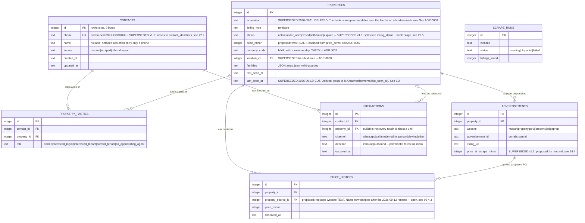

# Entities & relationships

*Part of [Database Schema](../DATABASE_SCHEMA.md) — §5–§7. Chapter files are authoritative; the root index only summarises.*

---

## 5. Entity relationship diagram {#erd}

> ⚠️ **This diagram predates the 2026-09-11 ADR set and has not been redrawn.** It does not show
> `mandates`, `deals`, `locations` or `location_postcodes`, and the `properties` attributes below
> carry inline supersession notes instead. The entity sections in §6 are authoritative where they
> disagree with it. Redrawing is a task for whoever drafts the M1c DDL.



Cardinality: `||--o{` one-to-many · `|o--o{` optional-one-to-many · `||--||` one-to-one.

`SCRAPE_RUNS` is deliberately unrelated — it is an operational log, not part of the domain graph. See IG-5.

---

## 6. Entities {#entities}

Volumes assume the **current scope**: one district (Kajang, Selangor), three portals actively wired (`mudah`, `propertyguru`, `iproperty`; EdgeProp named in the domain brief but present in no URL variable `[MEASURED: node 12 "Edit Fields – Set Variables" defines exactly three portal URLs @ 2026-08-06]`), one daily run at midnight `Asia/Kuala_Lumpur`.

The base estimate everything hangs from:

```
[ESTIMATED: ~4,000 distinct properties at 12 months
   ≈ active rent+sale inventory for one Selangor district across 3 portals.
   Derived from: ~35 ads on the first mudah search page (the extractor reads
   props.pageProps.initialStore.ads and the workflow requests page 1 only),
   × 3 portals × 1 run/day = ~105 observations/day; distinct units converge on
   district inventory rather than accumulating, with churn replacing expiry.]
```

> `[ASSUMED: the scraper stays on page 1 of each portal. If pagination is added — and the
> extractor already carries commented-out `totalPages` handling, so it is planned — the daily
> observation count multiplies by the page count. At 10 pages this becomes ~1,050/day and the
> 12-month property count rises toward the district's full inventory (~8,000-12,000). That
> changes nothing structural: §15 shows even 100x lands in the low hundreds of MB. What it
> *does* change is AP-01 and AP-14, which run **once per observation** — at 1,050/day an
> unindexed full scan per probe (the current live behaviour, §2.4) becomes noticeable.]`

### 6.1 `contacts` {#e-contacts}

**Purpose** — one row per human being, whoever they are to us this week.

**Grain** — one row per *person*, identified by normalised phone. Not per role, not per deal. This is the single best decision in the V1 schema and it is worth stating why: a landlord on one deal is a buyer on the next, so `role` deliberately does not live here. It lives on `property_parties`, and `tests/test_schema.py::test_role_lives_on_the_relationship_not_the_person` locks that behaviour in.

**Volume** — 0 today `[MEASURED: table does not exist in any deployed database @ 2026-08-06]` · ~1,300 at 12 months `[ESTIMATED: ~4,000 properties, but agents and agencies repeat heavily across listings — roughly one distinct phone per three listings]` · +100/month thereafter.

| Column | Type | Null | Default | Description |
|---|---|---|---|---|
| `id` | `INTEGER` | no | rowid | PK. Rowid alias — zero storage |
| `name` | `TEXT` | **yes** | — | Nullable *for a reason*: a scraped ad frequently carries a phone and nothing else. `NULL` here means "we genuinely do not know", never "" |
| `phone` | `TEXT` | **yes** | — | **The dedup key.** Normalised: digits only, country code, no `+` (`60123456789`). `UNIQUE`. Nullable because a walk-in contact may have only an email — but see IG-2. **⚠️ SUPERSEDED v1.1.0** — identity keyed on one mutable, nullable attribute. Moves to `contact_identifiers`; see §22.2 |
| `email` | `TEXT` | yes | — | Should be lowercased before insert; not currently enforced (IG-2) |
| `company` | `TEXT` | yes | — | Agency name, for co-agents |
| `ren_number` | `TEXT` | yes | — | Malaysian agent registration (REN/E number). Regulator-issued identity |
| `notes` | `TEXT` | yes | — | Free text |
| `source` | `TEXT` | no | `'manual'` | `manual` \| `scraped` \| `referral` \| `import` |
| `created_at` | `TEXT` | no | `datetime('now')` | UTC ISO-8601 |
| `updated_at` | `TEXT` | no | `datetime('now')` | UTC. **Not maintained on update** — IG-4. **⚠️ SUPERSEDED v1.1.0** — a column that always equals `created_at` asserts something false; fix or cut. See §24.6 |

**Constraints** — PK `id`; `UNIQUE (phone)`; `CHECK (source IN (...))`. No foreign keys — `contacts` is a root entity.

> ⚠️ **SUPERSEDED v1.1.0** — `UNIQUE (phone)` is replaced by `uq_contact_identifiers_kind_value`, and `phone` / `email` / `ren_number` move out of this table. The *grain* defended above is unchanged and still correct. See §22.2.

**Indexes**

| Index | Definition | Serves | Notes |
|---|---|---|---|
| *(implicit)* | `UNIQUE (phone)` | AP-03 | Auto-created by the `UNIQUE` constraint. Confirmed empirically on the live table: `sqlite_autoindex_listings_1` with `sql = NULL` `[MEASURED @ 2026-08-06]` |
| `idx_contacts_phone` | `(phone)` | **nothing** | ⚠️ **Redundant.** A pure duplicate of the implicit unique index above. Double write tax, zero read benefit. **Drop it** — §10 |
| `idx_contacts_source` | `(source)` | **nothing** | ⚠️ Four distinct values across ~1,300 rows. Doctrine §6: never index a low-cardinality column alone. **Drop it** — §10 |
| `idx_contacts_name` | `(name)` | AP-15, partially | Serves `LIKE 'Ahmad%'` (prefix). Will **not** serve `LIKE '%Ahmad%'`, which is what a search box actually sends. Keep only if the UI commits to prefix search — §9.2 |

**Storage estimate** — profile §9: `row ≈ record header + Σ(actual value widths) + ~4 B cell overhead`.

```
values: name 18 + phone 11 + email 22 + company 25 + ren_number 12 + notes 60
      + source 6 + created_at 19 + updated_at 19            = 192 B
        [ESTIMATED: name "Yong Wei Sim" ~18ch; company "GT Nelson Realty Sdn. Bhd." ~25ch;
         notes short. id = 0 B, it is the rowid]
header: 2 + 10 columns                                      =  12 B
cell:                                                       =   4 B
row_width                                                   ≈ 208 B
table  ≈ 208 B × 1,300                                      ≈ 270 KB
indexes (after dropping the two redundant ones):
  unique(phone)  (11 + 2 rowid + 4)  = 17 B
  idx_name       (18 + 2 + 4)        = 24 B                 ≈  53 KB
12-month total                                              ≈ 323 KB
```

**Lifecycle** — **never deleted.** This is the irreplaceable half of the database. A contact whose deals are all closed is still a contact. No soft delete, no retention limit, no purge — except a PDPA erasure request, which is a hard delete (§14). PII-bearing: see §14.

---

### 6.2 `properties` {#e-properties}

**Purpose** — one row per real-world unit, whether it arrived from a portal or from the agent's own mandate.

**Grain** — one row per **unit**, not per advertisement. A unit cross-listed on mudah and PropertyGuru is **one** row here and **two** rows in `advertisements`. Most modelling errors are grain errors; this one is correct, and it is what makes cross-portal deduplication and price history possible at all.

**Volume** — 0 today `[MEASURED @ 2026-08-06]` · ~4,000 at 12 months `[ESTIMATED: see §6 preamble]` · ~400,000 at the 100x checkpoint `[ASSUMED: expansion from one district to the Klang Valley. If instead the agent expands to all of Peninsular Malaysia, this is ~2M and §16's "no partitioning needed" conclusion still holds — but the 12-month total in §15 crosses 1 GB and the daily batch stops fitting comfortably in one transaction]`

| Column | Type | Null | Default | Description |
|---|---|---|---|---|
| `id` | `INTEGER` | no | rowid | PK |
| `acquisition` | `TEXT` | no | `'scraped'` | `own_mandate` \| `scraped`. **⚠️ SUPERSEDED 2026-09-11 — DELETED.** A one-bit lossy summary of two orthogonal tables, welded into an either/or that reality breaks, and maintained by no event. The book is *an open `mandates` row exists*; the feed is *an `advertisements` row exists*; both at once is routine. See [ADR 0006](../adr/0006-acquisition-is-deleted-the-book-and-the-feed-are-derived.md) |
| `listing_type` | `TEXT` | no | `'rent'` | `rent` \| `sale` |
| `title` | `TEXT` | yes | — | Portal headline |
| `property_type` | `TEXT` | yes | — | Condominium, Terrace, Apartment… Free text today; a `CHECK` list once the portal vocabulary is known (OQ-3) |
| `price_minor` | `INTEGER` | yes | — | **Proposed, replacing `price REAL`** — §4.2. Sen. **Renamed from `price_minor` 2026-09-11**: the minor unit of MYR is the sen, and the name must survive a currency whose minor unit is neither. See [ADR 0007](../adr/0007-currency-is-a-column-not-a-table.md) |
| `currency_code` | `TEXT` | no | `'MYR'` | **Added 2026-09-11.** ISO 4217, with a membership `CHECK`. Carried so that no stored amount is ever retroactively ambiguous — ADR 0007 |
| `price_per_sqft` | `REAL` | yes | — | Derived display metric; `REAL` is acceptable here (not a payable amount). **⚠️ SUPERSEDED v1.1.0** — derived, no reader, documented drift bug. **Cut**; see §24.3 |
| `size_sqft` | `REAL` | yes | — | |
| `bedrooms` | `INTEGER` | yes | — | |
| `bathrooms` | `INTEGER` | yes | — | |
| `car_parks` | `INTEGER` | yes | — | |
| `floor` | `INTEGER` | yes | — | Which floor the unit is on. **Live database says `floors`** — §2.3 |
| `furnishing` | `TEXT` | yes | — | |
| `tenure` | `TEXT` | yes | — | Freehold / Leasehold |
| `facilities` | `TEXT` | yes | — | JSON array, guarded by `CHECK (json_valid(...))`. See below |
| `full_address` | `TEXT` | yes | — | |
| `area` | `TEXT` | yes | — | "Kajang". Leads two indexes. See IG-3. **⚠️ SUPERSEDED 2026-09-11** — replaced by `location_id`; free text is the defect Location exists to fix |
| `location_id` | `INTEGER` | yes | — | **Added 2026-09-11.** FK → `locations(id)`. Nullable because resolution can fail, and a failed resolution must not block the insert — ADR 0008 |
| `location_raw` | `TEXT` | yes | — | **Added 2026-09-11.** The address string as scraped, retained so a quarantined row re-resolves without a re-scrape — ADR 0008 |
| `postcode` | `TEXT` | yes | — | **Added 2026-09-11.** The raw five-digit token from the scraped address, retained even when it resolves to nothing. Resolver input, never a user-facing filter — ADR 0008 |
| `latitude` | `REAL` | yes | — | |
| `longitude` | `REAL` | yes | — | |
| `status` | `TEXT` | no | `'active'` | `active` \| `under_offer` \| `closed` \| `withdrawn` \| `expired`. See §7.3. **⚠️ SUPERSEDED v1.1.0** — mixes a machine-owned lifecycle with a human-owned one, so the expiry sweep and the agent overwrite each other. Becomes `listing_status`; see §22.5 |
| `scam_score` | `INTEGER` | yes | — | 0-100, V2. Currently always `NULL` — costs 0 bytes per row (profile §9) |
| `summary` | `TEXT` | yes | — | LLM-generated |
| `first_seen_at` | `TEXT` | no | `datetime('now')` | |
| `last_seen_at` | `TEXT` | no | `datetime('now')` | Was the liveness signal for AP-11 and the expiry rule in §7.3. **⚠️ SUPERSEDED 2026-09-12 — CUT.** Derived, with no maintaining event: it is `MAX(advertisements.last_seen_at)`. Liveness is a fact about Advertisements and is read from them. See below |
| `created_at` | `TEXT` | no | `datetime('now')` | **⚠️ SUPERSEDED v1.1.0** — provably always equal to `first_seen_at`. **Cut**; see §24.5 |
| `updated_at` | `TEXT` | no | `datetime('now')` | Not maintained on update — IG-4. **⚠️ SUPERSEDED v1.1.0** — fix or cut, not the current middle state. See §24.6 |

**On `facilities TEXT` guarded by `json_valid` — keep it, and here is the argument.**

*For.* Facilities are genuinely sparse and externally shaped: every portal uses its own vocabulary, the list length varies from zero to twenty, and the set is not ours to define. Doctrine §4 names exactly this case — *"correct for genuinely sparse or externally-shaped data: raw scraper payloads"*. The alternative, a `facilities` lookup table plus a `property_facilities` join table, buys referential integrity over a vocabulary **we do not control and cannot validate**, and costs a join on every listing read plus a normalisation step that will silently drop any facility the portal invents next month. The `CHECK (facilities IS NULL OR json_valid(facilities))` guard is the profile's documented idiom (§2) and is the difference between a JSON column and a text column you *hope* is JSON.

*Against — and this is where it actually stands today.* The constraint is right and the producer is wrong: n8n sends a comma-separated string, and `json_valid('Playground, Tennis Court, Gymnasium')` returns **0** `[MEASURED @ 2026-08-06]`. So on the day the column names are fixed (§2.4), this constraint becomes the *next* thing to fail. That is the constraint doing its job — it is the last line of defence catching a producer bug — but it must be fixed at the producer: emit `["Playground","Tennis Court","Gymnasium"]`.

*The limit.* A JSON column is not an escape hatch for modelling relationships, and any key you filter or sort on frequently gets promoted to a real column with a real index (doctrine §4). Today **nothing filters on facilities** — no query in the repo, the tests, or the n8n workflows references it in a `WHERE` clause `[MEASURED: grep across all query sites @ 2026-08-06]`. So: no index, no promotion, recorded in §9.2 as a deliberate omission. The day "listings with a pool" becomes a filter, `has_pool` becomes a column or an expression index over `json_extract`.

*One live-schema note.* The deployed V0 table declares `facilities JSONB`. In SQLite affinity rules `JSONB` matches none of the INT/CHAR/TEXT/BLOB/REAL patterns and therefore resolves to **NUMERIC affinity** — not a JSON type, because per profile §11 no such type exists. In practice a JSON array string is not numeric-convertible so it is stored as text anyway, making this harmless but actively misleading. V1's `TEXT` is correct; keep it.

**Constraints** — PK `id`; `CHECK` on ~~`acquisition`~~ (deleted 2026-09-11), `listing_type`, `status`; `CHECK (facilities IS NULL OR json_valid(facilities))`. No foreign keys out. Missing and recommended: `CHECK ((latitude IS NULL) = (longitude IS NULL))` — a presence pair (doctrine §5); half a coordinate is not a location.

**Indexes**

| Index | Definition | Serves | Notes |
|---|---|---|---|
| `idx_properties_acq` | `(acquisition, status)` | AP-10 | ~~Correct: equality, equality. Keep~~ **⚠️ DELETED 2026-09-11 and not replaced.** AP-10 now leads from `mandates`, which is the small table — see ADR 0006 |
| `idx_properties_area` | `(area)` | **nothing** | ⚠️ **Left-prefix redundant** with `idx_properties_dedup(area, …)`. Doctrine §6: do not create `(a)` when `(a,b)` exists. **Drop** — §10 |
| `idx_properties_price` | `(listing_type, price)` | AP-05, partially | Cannot serve AP-05 — no `area`. Superseded by the proposed feed index |
| `idx_properties_seen` | `(last_seen_at)` | AP-11 | ~~Correct. Keep~~ **⚠️ DELETED 2026-09-12** — its only column is cut. AP-11 now probes `idx_advertisements_property (property_id, last_seen_at)` instead, and that index already had to exist for the foreign key. See §6.3 |
| `idx_properties_dedup` | `(area, bedrooms, size_sqft)` | AP-14 | Equality, equality, range — textbook column order. Keep |
| **`idx_properties_feed`** | **proposed** — `(location_id, listing_type, first_seen_at DESC, price_minor) WHERE listing_status='visible'` | **AP-05** | See §9.1. **⚠️ Amended 2026-09-11** — the partial predicate shortens now that `acquisition` is gone, and the leading column is `location_id` rather than free-text `area`. The feed's exclusion of own-mandate units becomes a `NOT EXISTS` against `ux_mandates_open` `[MEASURED 2026-09-02: 4,000 properties / 12 mandates — 74 µs]` |

**Storage estimate**

```
values: listing_type 4 + title 55 + property_type 11      [acquisition 7 B removed 2026-09-11;
        currency_code 3 and location_id 2 added, so the row width below is within a byte]
      + price_minor 4 + price_per_sqft 8 + size_sqft 8
      + bedrooms 1 + bathrooms 1 + car_parks 1 + floor 1
      + furnishing 19 + tenure 8 + facilities 120 + full_address 40 + area 6
      + latitude 8 + longitude 8 + status 6 + scam_score 0 (NULL)
      + summary 130 + first_seen_at 19                      [last_seen_at 19 B removed 2026-09-12]
      + created_at 19 + updated_at 19                       = 503 B
        [ESTIMATED: title ~55ch ("Forest Green Condominium Sungai Long" is 36; longer ones
         run to 80). facilities ~120 B as a JSON array of ~10 short names. summary ~130 B
         from the LLM chain. Timestamps are 19-char ISO strings.
         NULL costs 0 bytes and small integers cost 1 (profile §9)]
header: 2 + 25 columns                                      =  27 B
cell:                                                       =   4 B
row_width                                                   ≈ 534 B
table  ≈ 534 B × 4,000                                      ≈ 2.1 MB
indexes (after §10's drops, with the feed index added):
  dedup (6+1+8+2+4)=21 · price (4+4+2+4)=14
  feed  (6+4+19+4+2+4)=39                                Σ =  74 B
       ≈ 74 B × 4,000                                       ≈ 296 KB
12-month total                                              ≈ 2.4 MB
at the 100x checkpoint (400,000 rows)                       ≈ 243 MB
        [acq 19 B dropped 2026-09-11 with ADR 0006; seen 25 B dropped 2026-09-12
         with last_seen_at. The sweep's cost moves to advertisements, where §6.3's
         idx_advertisements_property widens by the same column — see the note there]
```

**✅ Ruled 2026-09-12 — `last_seen_at` is cut.** Raised as an open defect on 2026-09-11; closed
here.

It is provably `MAX(advertisements.last_seen_at)`. That makes it the same defect class as
`properties.created_at`, which §24.5 already cut for exactly this reason, and the same class as
`acquisition`, which ADR 0006 deleted for it. The failure mode is the one that class always has:
the copy and the source drift, nothing errors, and the staleness sweep quietly works from the
wrong number. It was the last column of its kind in the schema.

**What settled it is that both readers had already moved.** The purge rule rewritten on
2026-09-11 (§7.3) states its staleness condition as *"**every** Advertisement of it is stale past
the threshold"*, which reads `advertisements` and not this column. AP-11 was amended the same day
to *"staleness is a fact about Advertisements, not about the discriminator"*
([`02-access-patterns.md` §3](02-access-patterns.md#access-patterns)). Keeping the column would
therefore mean maintaining a copy that nothing reads — and nothing maintains it today either: no
writer in the repo, the tests or the n8n workflows updates `properties.last_seen_at`
`[MEASURED: grep across all write sites @ 2026-09-12]`.

**What the cut costs.** `idx_properties_seen` is deleted and `idx_advertisements_property` widens
from `(property_id)` to `(property_id, last_seen_at)` — a widening of an index the foreign key
already required, not a new one. The two roughly cancel: `properties` loses 25 B per row and
`advertisements` gains 19 B per row, against 400,000 and 560,000 rows respectively at the 100x
checkpoint. The sweep becomes one index probe per property. At 400,000 properties against a
`< 5 s` daily budget that is not close.

> ⚠️ **Write the predicate as `NOT EXISTS`, not as `MAX(...) < threshold`.** A Property with no
> Advertisement at all yields `NULL` from `MAX`, and `NULL < datetime(...)` is `NULL` rather than
> true, so such a row would never satisfy the condition and would leak forever. `NOT EXISTS`
> treats "no Advertisement" as "nothing fresh", which is the intended reading. The form is given
> in §7.3. `[MEASURED 2026-09-12: three properties — one with a fresh ad, one with only stale
> ads, one with no ads at all. The MAX form returns the stale-ad property only; NOT EXISTS
> returns it and the ad-less one, which is correct]`

**Lifecycle** — the book half is permanent; the feed half is disposable and expires on
staleness. See §7.3. **⚠️ Amended 2026-09-11**: the split is no longer read from a column. A
Property is in the book while an open Mandate on it exists, and in the feed while any
Advertisement of it exists — and both at once is routine rather than exceptional.

---

### 6.3 `advertisements` {#e-advertisements}

> ✅ **Renamed 2026-09-12 — was `property_sources`.** One row here is one **Advertisement**, which
> is the glossary's word for it, and `apps/web/CONTEXT.md` lists *"property source"* under
> `_Avoid_`. The old name described the category the row belonged to rather than the row itself,
> which is the failure the naming rule at [`02-access-patterns.md` §4.3](02-access-patterns.md#naming-rule)
> exists to catch. The full ruling is there. In SQLite this is a table rebuild rather than a
> rename, and it is free while the table is empty. Carried by **M1c**.

**Purpose** — one row per portal appearance of a property. This table is what makes cross-portal deduplication and price history possible; without it, a unit listed twice is either two rows or a lost fact.

**Grain** — one row per **(portal, advertisement)** pair. Exactly the dedup key the domain specifies.

**Volume** — 0 today `[MEASURED @ 2026-08-06]` · ~5,600 at 12 months `[ESTIMATED: 4,000 properties × 1.4 portal appearances each — cross-listing between mudah and the two agent portals is common for agent-held stock and rare for owner-direct ads]` · ~560,000 at 100x.

| Column | Type | Null | Default | Description |
|---|---|---|---|---|
| `id` | `INTEGER` | no | rowid | PK |
| `property_id` | `INTEGER` | no | — | FK → `properties(id)` `ON DELETE CASCADE` |
| `website` | `TEXT` | no | — | `mudah` \| `propertyguru` \| `iproperty` \| `edgeprop`. **No `CHECK` today** — should have one (§8, IG-6) |
| `advertisement_id` | `TEXT` | no | — | The portal's own id. `TEXT`, not integer — correct, because portal ids are opaque strings even when they look numeric |
| `listing_url` | `TEXT` | yes | — | |
| `listed_at` | `TEXT` | yes | — | The portal's own posting date, when given |
| `price_at_scrape_minor` | `INTEGER` | yes | — | **Proposed, replacing `price_at_scrape REAL`** — §4.2. **⚠️ SUPERSEDED v1.1.0** — third copy of the same price, no reader. **Cut**; see §24.4 |
| `first_seen_at` | `TEXT` | no | `datetime('now')` | |
| `last_seen_at` | `TEXT` | no | `datetime('now')` | |

**Constraints** — PK `id`; **`UNIQUE (website, advertisement_id)`** — the exact-match dedup key, and the thing the live V0 table gets wrong (§2.5); FK `property_id` → `properties(id)` **`ON DELETE CASCADE`**. Cascade is right here: a portal appearance has no meaning without the unit it describes (doctrine §5).

> ⚠️ **AMENDED v1.1.0** — two columns are proposed for addition here: `content_hash` and `parser_version` (§22.4), which make "did this ad actually change" a single comparison. `website TEXT` is proposed to become `portal_id` referencing a `portals` table, turning the dedup key into `UNIQUE (portal_id, advertisement_id)` and retiring IG-6 structurally (§23.1).

**Indexes**

| Index | Definition | Serves | Notes |
|---|---|---|---|
| *(implicit)* | `UNIQUE (website, advertisement_id)` | AP-02, AP-04 | The dedup probe and the upsert conflict target |
| `idx_advertisements_property` | `(property_id, last_seen_at)` | AP-08, AP-11 and the FK | **Required**, not optional: profile §3 — FK columns are not indexed automatically, and without this index every `properties` delete scans this table while holding a write lock. **⚠️ Widened 2026-09-12** — `last_seen_at` is appended so the staleness sweep probes this index instead of the deleted `idx_properties_seen`. Doctrine §6 forbids keeping `(a)` beside `(a,b)`, so this is a widening rather than a new index |

**Storage estimate**

```
values: property_id 3 + website 10 + advertisement_id 9 + listing_url 65
      + listed_at 19 + price_at_scrape_minor 4
      + first_seen_at 19 + last_seen_at 19                  = 148 B
        [ESTIMATED: listing_url ~65 B ("https://www.mudah.my/view?ad_id=115402662" is 41;
         PropertyGuru and iProperty slugs run to 100+). website "propertyguru" = 12,
         averaged to 10. advertisement_id ~9 digits ("115402662"). property_id needs
         3 bytes once ids exceed 65,535]
header: 2 + 9 columns                                       =  11 B
cell:                                                       =   4 B
row_width                                                   ≈ 163 B
table  ≈ 163 B × 5,600                                      ≈ 913 KB
indexes: unique(website,advertisement_id) (10+9+2+4)=25
         idx_advertisements_property (3+19+2+4)=28          Σ = 53 B  ≈ 297 KB
12-month total                                              ≈ 1.2 MB
at the 100x checkpoint (560,000 rows)                       ≈ 121 MB
        [idx_advertisements_property widened by last_seen_at 2026-09-12, from 9 B to 28 B.
         The offsetting saving is in §6.2: properties drops idx_properties_seen at 25 B
         per row over 400,000 rows, against 19 B per row over 560,000 here]
```

**Lifecycle** — deleted by cascade when the parent property is purged. Never independently deleted: an ad disappearing from a portal is `last_seen_at` going stale, not a deletion.

---

### 6.4 `property_parties` {#e-contact-properties}

> ⚠️ **RENAMED 2026-09-11 — `contact_properties` → `property_parties`.** The old name describes
> the two tables it joins; the new one describes what one row *is*. The rule it now satisfies is
> in `02-access-patterns.md` §4: **a table is named after what one row is, plural.** A row here is
> one person in one role against one unit — structurally identical to `deal_parties` (§23.2),
> which already carries the better name.
>
> **In SQLite this is a table rebuild, not a rename**, because the FKs pointing at it and the
> named constraints inside it have to be recreated. Do it in M1c while the table holds zero rows;
> after six months of data it is a maintenance window.

**Purpose** — the owner ↔ property ↔ role join. The heart of the book.

**Grain** — one row per **(person, property, role)** triple. The same person can be `owner` of one unit and `interested_buyer` of another; the same person can even be both `owner` and `co_agent` on one unit. All three are legitimate and the grain permits them.

**Volume** — 0 today · ~2,000 at 12 months `[ESTIMATED: roughly one owner/agent link per scraped listing that yields a phone, plus a handful of buyer-side links per mandate]`

| Column | Type | Null | Default | Description |
|---|---|---|---|---|
| `id` | `INTEGER` | no | rowid | PK |
| `contact_id` | `INTEGER` | no | — | FK → `contacts(id)` `ON DELETE CASCADE` |
| `property_id` | `INTEGER` | no | — | FK → `properties(id)` `ON DELETE CASCADE` |
| `role` | `TEXT` | no | — | `owner` \| `interested_buyer` \| `interested_tenant` \| `current_tenant` \| `co_agent` \| `listing_agent`. **⚠️ SUPERSEDED v1.1.0** — the two `interested_*` roles are deal state, not unit facts, and move to `deal_parties`. See §24.7 |
| `notes` | `TEXT` | yes | — | |
| `created_at` | `TEXT` | no | `datetime('now')` | No `updated_at` — a link is created and destroyed, not edited |

**Constraints** — PK `id`; `UNIQUE (contact_id, property_id, role)`; `CHECK (role IN (...))`; two FKs, both `ON DELETE CASCADE`. Cascade is correct on both sides: a role linking to a deleted person or a purged unit is noise.

> ⚠️ **SUPERSEDED v1.1.0** — the table is **kept**, but it has `created_at` and no `ended_on`, so `current_tenant` is permanent — false of every tenancy that has ever existed. Add `ended_on TEXT` and move the two `interested_*` roles to `deal_parties`. See §24.7.

**Indexes**

| Index | Definition | Serves | Notes |
|---|---|---|---|
| *(implicit)* | `UNIQUE (contact_id, property_id, role)` | AP-09, and the `contact_id` FK | Leads with `contact_id`, so by the left-prefix rule it already serves every `contact_id = ?` lookup |
| `idx_pp_contact` | `(contact_id)` | **nothing** | ⚠️ **Left-prefix redundant** with the unique index above. **Drop** — §10 |
| `idx_pp_property` | `(property_id)` | AP-08 and the `property_id` FK | **Required.** `property_id` is *second* in the unique key, so the left-prefix rule does **not** cover it. Keep |

**Storage estimate** — `values 3+3+17+30+19 = 72 B` + `header 2+6 = 8 B` + `cell 4 B` ≈ **84 B/row** `[ESTIMATED: role ~17ch avg, notes ~30 B]`. Table ≈ 84 × 2,000 ≈ **168 KB**; indexes ≈ 33 B × 2,000 ≈ 66 KB. **12-month total ≈ 234 KB.**

**Lifecycle** — cascade-deleted only. Never soft-deleted: removing a role is a correction, not a historical event.

---

### 6.5 `interactions` {#e-interactions}

**Purpose** — every touch between the agent and a person. Append-only in spirit, and the raw material the follow-up inbox is computed from.

**Grain** — one row per **touch**: one WhatsApp exchange, one call, one viewing.

**Volume** — 0 today · ~7,300 at 12 months `[ESTIMATED: ~20 logged touches/working day for one active agent]` · this is the fastest-growing table in the *book* half, and still trivially small.

| Column | Type | Null | Default | Description |
|---|---|---|---|---|
| `id` | `INTEGER` | no | rowid | PK |
| `contact_id` | `INTEGER` | no | — | FK → `contacts(id)` `ON DELETE CASCADE` |
| `property_id` | `INTEGER` | **yes** | — | FK → `properties(id)` `ON DELETE SET NULL`. Nullable *for a reason*: "called to catch up" is a real interaction with no unit attached |
| `channel` | `TEXT` | no | — | `whatsapp` \| `call` \| `sms` \| `email` \| `in_person` \| `viewing` \| `other` |
| `direction` | `TEXT` | no | — | `inbound` (they contacted you) \| `outbound` (you contacted them). **This single column powers the entire follow-up inbox** |
| `occurred_at` | `TEXT` | no | `datetime('now')` | When it happened — distinct from `created_at`, when it was logged. Backdating is normal and the two columns exist so it stays honest |
| `created_at` | `TEXT` | no | `datetime('now')` | |

**Constraints** — PK `id`; `CHECK` on `channel` and `direction` (both exercised by `test_bad_enum_values_are_rejected`); FK `contact_id` **`CASCADE`** (an interaction with a deleted person is unreadable); FK `property_id` **`SET NULL`** (the interaction still happened even after the unit is purged — the right call, and a good example of choosing the delete action deliberately rather than inheriting a default).

**Indexes**

| Index | Definition | Serves | Notes |
|---|---|---|---|
| `idx_interactions_contact` | `(contact_id, occurred_at DESC)` | AP-07, AP-06 | Equality then sort — correct order, and the descending direction matches the query. Keep |
| `idx_interactions_property` | `(property_id)` | the FK | No AP cites it directly, but it is **not** an orphan: `ON DELETE SET NULL` must find every child row on every property delete, and profile §3 says FK columns are not indexed automatically. Keep, justified as an FK index — §10 |

**Storage estimate** — `values 3+3+8+8+19+80+19 = 140 B` + `header 2+7 = 9 B` + `cell 4 B` ≈ **153 B/row** `[ESTIMATED: summary ~80 B]`. Table ≈ 153 × 7,300 ≈ **1.1 MB**; indexes ≈ 33 B × 7,300 ≈ 241 KB. **12-month total ≈ 1.3 MB.**

**Lifecycle** — **permanent, and should be append-only.** Doctrine §8: an audit log the application can rewrite is theatre. There is no `updated_at` here, which is the right instinct; the discipline to match it is "never `UPDATE interactions`". Recorded in §14.

---

### 6.6 `price_history` {#e-price-history}

**Purpose** — the observed price trail per property. Seeded in V1, read by nothing until V2's price-drop alerts.

**Grain** — **undecided, and that is the entire problem.** See below.

**Volume** — 0 today · **anywhere from 5,400 to 2,044,000 rows at 12 months**, depending on one line of application logic that nobody has written. This is the widest uncertainty in the document and the reason this table gets the longest argument.

| Column | Type | Null | Default | Description |
|---|---|---|---|---|
| `id` | `INTEGER` | no | rowid | PK |
| `property_id` | `INTEGER` | no | — | FK → `properties(id)` `ON DELETE CASCADE` |
| `property_source_id` | `INTEGER` | yes | — | **Proposed, replacing `website TEXT`** — see below |
| `price_minor` | `INTEGER` | no | — | **Proposed, replacing `price REAL`** — §4.2 |
| `observed_at` | `TEXT` | no | `datetime('now')` | |
| ~~`website`~~ | ~~`TEXT`~~ | — | — | **Proposed for removal** — see below |

**Keep the table. The schema comment's reasoning is correct and I endorse it.**

> `-- Unused until V2 (price-drop alerts) but seeded from V1 day one: cheap now, impossible to backfill later.`

That is exactly right, and it is the rare case where building ahead of the requirement is correct rather than speculative. Price history is a **time series you cannot reconstruct**. A price observed on 2026-08-06 and not recorded is gone; no amount of future effort recovers it. The cost of carrying an empty table is one `CREATE TABLE`, one index definition, and zero bytes of storage. The cost of adding it in six months is six months of missing history — which is to say, the V2 feature launches with nothing to show.

**But "seeded but unused" is hiding two real defects, and both are free to fix today and expensive to fix later.**

**Defect 1 — the write policy is undecided, and it is worth 600x in storage.** Nothing states when a row is inserted. The two plausible readings of "seeded from day one" differ enormously:

```
(a) naive — insert one row per portal observation, every run:
    5,600 sources × 365 days                    = 2,044,000 rows/yr
    row ≈ (3 + 3 + 4 + 19) + (2+5) + 4          =        40 B
    table  = 40 B × 2,044,000                   ≈      82 MB/yr
    index (property_id, observed_at DESC)
           = (3 + 19 + 2 + 4) B × 2,044,000     ≈      57 MB/yr
    total                                       ≈     139 MB/yr

(b) change-only — insert only when the price differs from the last recorded price:
    5,600 sources × ~8%/month price-change rate × 12
        [ASSUMED: 8% of listings change price in a given month. Malaysian rental
         asking prices are sticky; sale prices move more. If it is 30%, this
         becomes ~20,000 rows/yr and is still under 1 MB — the conclusion is
         insensitive to this assumption, which is exactly why (b) is safe]
                                                =    ~5,400 rows/yr
    total                                       ≈     275 KB/yr
```

**139 MB versus 275 KB — a factor of ~500 — decided by one `WHERE` clause.** This is precisely what Gate 5b exists to surface: discovering *before* implementation that a table is 139 MB rather than 275 KB changes the backup story, the index budget, and whether the daily batch still fits in one transaction. At the 100x checkpoint policy (a) produces **13.9 GB/year** and this table stops being an afterthought and becomes the entire database.

**Ruling: policy (b), change-only, specified now as a V1 invariant even though nothing reads it yet.** Insert a row only when the observed price differs from the most recent recorded price for that source. It is one comparison in the ingest path and it is the difference between a time series and a log of nothing happening.

**Defect 2 — `website TEXT` is a dangling reference where a foreign key belongs.** "Which portal quoted this price" is a fact that already lives, fully normalised, in `advertisements`. Storing the portal name as loose text here means:

- No referential integrity — `website` can say `'mudah'` for a property with no mudah source row.
- **The question is unanswerable when it matters most.** If a unit is listed twice on mudah (which happens — agents relist), `website = 'mudah'` cannot tell you *which* ad quoted the price. That is a 3NF violation in spirit: `website` depends on the source appearance, not on the `(property_id, observed_at)` grain.
- It duplicates a value that will be re-spelled inconsistently the first time a portal is added.

**Ruling: replace `website TEXT` with `property_source_id INTEGER REFERENCES advertisements(id) ON DELETE CASCADE`.** Keep `property_id` as well — denormalised deliberately, so AP-13 ("price trail for this unit, across all portals") is a single-table index probe rather than a join. That duplication is registered in §13.

**Defect 3 — no uniqueness, so re-running a scrape inserts duplicate observations.** Add `UNIQUE (property_source_id, observed_at)`, which also gives the ingest path a natural upsert conflict target.

**This is the cheapest possible moment for all three.** The table is empty. Changing a column type or adding a constraint in SQLite requires the 12-step table rebuild (profile §5) — an exclusive lock and a full rewrite. On an empty table that is instantaneous; on a 2-million-row table it is a maintenance window.

**Constraints (proposed)** — PK `id`; FK `property_id` → `properties(id)` `ON DELETE CASCADE`; FK `property_source_id` → `advertisements(id)` `ON DELETE CASCADE`; `UNIQUE (property_source_id, observed_at)`; `CHECK (price_minor > 0)`.

**Indexes**

| Index | Definition | Serves | Notes |
|---|---|---|---|
| `idx_price_history` | `(property_id, observed_at DESC)` | AP-13 | Equality then sort. Correct. Keep |
| *(implicit)* | `UNIQUE (property_source_id, observed_at)` | AP-04 upsert, and the FK | Proposed. Also covers the `property_source_id` FK by left prefix |

**Lifecycle** — cascade-deleted with the parent property, which is a deliberate and slightly uncomfortable choice: purging an expired scraped listing destroys its price trail. If price history is meant to outlive the listing (a reasonable V2 requirement — "what did rents in Kajang do last year?"), then `properties` must not be hard-deleted, and §7.3's archive option becomes mandatory rather than optional. Logged as OQ-4.

---

### 6.7 `scrape_runs` {#e-scrape-runs}

**Purpose** — operational log of each scrape execution. Not part of the domain graph.

> ⚠️ **SUPERSEDED v1.1.0** — **the whole table is a candidate for removal**, conditional on OQ-2. If n8n stays the ingest layer it duplicates, worse, an execution history n8n already keeps and §1 scoped out. If it stays, six of its eleven columns should go and the counters should be derived. See §24.2.

**Grain** — one row per portal per run.

**Volume** — 0 today · ~1,095 at 12 months `[ESTIMATED: 3 portals × 365 daily runs]`. Negligible at any horizon.

| Column | Type | Null | Default | Description |
|---|---|---|---|---|
| `id` | `INTEGER` | no | rowid | PK |
| `website` | `TEXT` | no | — | |
| `started_at` | `TEXT` | no | `datetime('now')` | |
| `finished_at` | `TEXT` | yes | — | `NULL` while running. Correct use of nullable-means-unknown |
| `status` | `TEXT` | no | `'running'` | `running` \| `ok` \| `partial` \| `failed` |
| `pages_fetched` | `INTEGER` | no | `0` | |
| `listings_found` | `INTEGER` | no | `0` | |
| `new_count` | `INTEGER` | no | `0` | |
| `duplicate_count` | `INTEGER` | no | `0` | |
| `error_count` | `INTEGER` | no | `0` | |
| `notes` | `TEXT` | yes | — | |

**Constraints** — PK `id`; `CHECK (status IN (...))`. Recommended additions: `CHECK (finished_at IS NULL OR finished_at >= started_at)` — a cross-column coherence rule (doctrine §5) — and `CHECK (status = 'running') = (finished_at IS NULL)` to stop a run being simultaneously finished and running.

**Indexes** — `idx_scrape_runs (website, started_at DESC)` serves AP-12. Equality then sort. Keep.

**Storage estimate** — `values 12+19+19+2+1+2+1+1+1+40 = 98 B` + `header 2+11 = 13 B` + `cell 4 B` ≈ **115 B/row**. **12-month total ≈ 126 KB + 33 KB index ≈ 159 KB.**

**Lifecycle** — the one table with a genuine retention limit. Keep 90 days; hard-delete beyond that. Nothing references it, nothing audits it, and a two-year-old scrape count answers no question anyone will ask.

**A gap worth naming.** `scrape_runs` has no relationship to the rows a run produced. `properties` and `advertisements` carry no `scrape_run_id`. So `listings_found` is an independently-written counter that can disagree with reality and nothing will ever detect the disagreement — a computed value with no maintenance mechanism (doctrine §13). Adding `scrape_run_id` to `advertisements` would make the counter verifiable and give free per-run provenance. Deliberately **not** recommended for V1: it adds 3 bytes and an index to the largest table to serve no current access pattern, and Gate 4 forbids indexes without an AP. Recorded as IG-5 and OQ-7 instead.

---

### 6.8 `listings` (V0, live) {#e-listings-v0} — **DEPRECATED**

**DEPRECATED (v1.0.0)** — superseded by `properties` + `advertisements` + `contacts` + `property_parties`. Documented because it is the only table that actually exists, and because the n8n layer still targets it.

**Purpose** — the original single-table design: one flat row per scraped listing with the person, the unit, the portal appearance, the AI scores, and the CRM state all inline.

**Grain** — one row per advertisement. Note this is a *different grain* from `properties` (one row per unit) — which is precisely why cross-portal deduplication is impossible in V0 and possible in V1.

**Volume** — **0 rows** `[MEASURED: SELECT count(*) FROM listings @ 2026-08-06]`. File size 20,480 B = 5 pages × 4,096 B `[MEASURED: PRAGMA page_count × PRAGMA page_size @ 2026-08-06]` — essentially schema-only.

**Why it is the wrong shape**, briefly, since it is being retired:

- **God table** (doctrine §13) — 39 columns tracking three different lifecycles: the unit (immutable-ish), the portal ad (changes on rescrape), and the CRM state (`contact_status`, `last_contact`, `viewing_date`, `remarks` — changes on human action). Split by lifecycle.
- **No person entity.** `owner_name`, `agent_name`, `agent_agency`, `phone` are inline, so the same agent appearing on 40 listings is 40 copies of their name and phone, with no way to record that you called them once.
- **1NF violation in practice** — `facilities` receives a comma-separated string (§2.4).
- **Wrong uniqueness key** — `listing_id` alone, colliding across portals (§2.5).
- **Money in `NUMERIC(10,2)`**, which per profile §11 is an affinity declaration, not a decimal type. It is not enforced and it is not exact.
- **Every access pattern is a full scan.** Only one index exists. See §18.

**Lifecycle** — drop it once the n8n producer is retargeted. It holds no data, so the drop is free and irreversible in name only. This is the **point of no return** marked in §17.

---

## 7. Relationships & invariants {#relationships}

### 7.1 Cardinalities

| Relationship | Cardinality | Delete action | Why that action |
|---|---|---|---|
| `properties` → `advertisements` | 1 : 0..N | `CASCADE` | A portal appearance is meaningless without its unit |
| `properties` → `price_history` | 1 : 0..N | `CASCADE` | See the OQ-4 caveat in §6.6 |
| `advertisements` → `price_history` | 1 : 0..N | `CASCADE` *(proposed)* | |
| `contacts` → `property_parties` | 1 : 0..N | `CASCADE` | A role with no person is noise |
| `properties` → `property_parties` | 1 : 0..N | `CASCADE` | |
| `contacts` → `interactions` | 1 : 0..N | `CASCADE` | |
| `properties` → `interactions` | 0..1 : 0..N | **`SET NULL`** | The conversation still happened after the unit is gone |
| `contacts` ↔ `properties` | M : N via `property_parties`, with `role` as link metadata | — | The reason a join table is correct here rather than an array column: the link carries its own attribute |

### 7.2 Invariants the DDL enforces

1. A person appears once, keyed by normalised phone — `UNIQUE (contacts.phone)`.
2. A portal advertisement appears once — `UNIQUE (advertisements.website, advertisement_id)`.
3. A person holds a given role on a given property at most once — `UNIQUE (property_parties.contact_id, property_id, role)`.
4. Six enumerations are closed sets — `CHECK ... IN (...)`, verified by `test_bad_enum_values_are_rejected`.
5. `facilities` is either absent or valid JSON — `CHECK (json_valid(...))`.
6. Role is a property of the *relationship*, never of the person — enforced structurally by where the column lives, and locked by `test_role_lives_on_the_relationship_not_the_person`.

### 7.3 `status` versus soft delete — the argument

The question: `properties.status` already carries `withdrawn` and `expired`; there is no `deleted_at` anywhere in the schema. Is that a gap?

**They are different axes, and conflating them is a real error.** `status` is a **lifecycle** fact about the deal — *what stage is this in?* A soft-delete marker is a **visibility** fact about the row — *should this be shown or counted at all?* A withdrawn mandate is still a mandate; the agent absolutely wants to see it in "everything I ever worked on". A deleted row is one that should vanish. Adding `deleted_at` to a table that already has `status` produces states with no defined meaning — what is `status='active' AND deleted_at IS NOT NULL`? — and every future query has to guess.

But the two halves of `properties` want opposite things, which is why doctrine §7 says decide **per table**, and here it must be decided per *partition of a table*:

**The book (an open Mandate exists) — reject soft delete.**
`status` already covers every terminal state an agent recognises: `closed` (it sold or let), `withdrawn` (the owner pulled it), `expired` (the mandate ran out). There is no fourth state meaning "pretend this never existed" — an agent does not delete mandates, and the row is referenced by `interactions` and `property_parties` that must keep resolving. Ten to fifty rows, permanent, no filter needed on any query. **Adding `deleted_at` here would cost every query a `WHERE deleted_at IS NULL` clause (doctrine §7 cost 1: one forgotten filter is a data leak) to express a state the domain does not have.**

**The feed (an Advertisement exists) — reject soft delete too, but for the opposite reason: use hard delete plus archive.**
These rows are disposable and reconstructible. Soft-deleting them incurs all five of doctrine §7's costs — permanent table growth, filtered indexes on every query, broken uniqueness — to preserve rows whose entire value was that they were current. Doctrine §7's third option is the right one here: **hard-delete the live row, insert it into an append-only `properties_archive` in the same transaction.** The hot table stays fast, the market history survives for V2's "what did Kajang rents do last year", and no query needs a filter.

**So the real defect is not a missing `deleted_at`. It is that nothing ever sets `expired`, and nothing ever purges.**

`advertisements.last_seen_at` exists, `idx_advertisements_property` covers it, and AP-11 describes it — but **no code performs the sweep** `[MEASURED: no UPDATE or DELETE against properties exists in the repo, the tests, or the n8n workflows @ 2026-08-06]`. So `expired` is an enum value that can never occur, and scraped rows accumulate forever with no lifecycle at all. The mechanism, to be run daily after the scrape (documented, not executed — I do not run DML):

```sql
-- ⚠️ SUPERSEDED 2026-09-11 — predicates below reference a deleted column. Kept for the argument.
UPDATE properties
   SET status = 'expired', updated_at = datetime('now')
 WHERE acquisition = 'scraped'
   AND status      = 'active'
   AND last_seen_at < datetime('now', '-14 days');
```

**The replacement, current as of 2026-09-12.** `properties.last_seen_at` is cut (§6.2) and
`acquisition` is gone (ADR 0006), so both predicates are now read from `advertisements`:

```sql
UPDATE properties
   SET listing_status = 'hidden', updated_at = datetime('now')
 WHERE listing_status = 'visible'
   AND NOT EXISTS (
         SELECT 1 FROM advertisements a
          WHERE a.property_id   = properties.id
            AND a.last_seen_at >= datetime('now', '-14 days'));
```

> ⚠️ **`NOT EXISTS`, never `MAX(a.last_seen_at) < datetime(...)`.** The two are not equivalent
> where a Property has no Advertisement at all: `MAX` over no rows is `NULL`, the comparison
> evaluates to `NULL` rather than true, and that row is silently skipped on every run, forever.
> `NOT EXISTS` reads "nothing fresh", which covers "nothing at all". The same shape is required
> at point 5 of the purge rule below. `[MEASURED 2026-09-12 — see §6.2]`

Note that this hides rather than expires. `expired` left `properties.status` with ADR 0003's
third lifecycle — expiry is now a fact about a Mandate, and what the sweep does to a Property is
take it out of the feed. See §22.5.

> `[ASSUMED: 14 days is the "gone from the portal" threshold. If portals silently drop and
> re-post listings on a shorter cycle, 14 days marks live listings expired and the feed
> under-reports. If it is too short a window the sweep churns. Start at 14 and measure the
> re-appearance rate — `first_seen_at` versus `last_seen_at` on rows that come back tells you
> directly.]`

And the purge that follows it, at 90 days, into the archive.

---

#### ⚠️ The 90-day purge was a data-loss path. Rewritten 2026-09-11.

**The defect.** The rule as written purged on `acquisition = 'scraped' AND last_seen_at < …`,
and **every foreign key into `properties` is `ON DELETE CASCADE` or `SET NULL`**
`[MEASURED: apps/scraper/src/pw/db/schema.sql:82,100,118,134]`. So a scraped property the agent
had actually worked — interactions logged, an owner link recorded in `property_parties` — was
hard-deleted at ninety days and took the agent's own work with it. No error, no warning, no
report. The irreplaceable half destroyed by a rule written for the replaceable one.

The discriminator is what made it unfixable: `acquisition` says how the unit *arrived*, and the
question the purge needs answered is whether anyone has *touched* it since. Those are different
questions, and one column could only answer the first.

**The replacement rule, which is only expressible once the discriminator is gone.** Purge a
Property when **all** of these hold:

1. no Mandate has ever existed on it — not merely no *open* one;
2. no Deal references it;
3. no Interaction references it;
4. no `property_parties` row references it;
5. **every** Advertisement of it is stale past the threshold — expressed as `NOT EXISTS (a fresh
   Advertisement)`, so that a Property with no Advertisement at all satisfies it rather than
   evaluating to `NULL`. See the sweep above.

Point 5 is the one the old rule got wrong in the other direction as well: a unit cross-listed on
three portals is not stale because one portal dropped it.

`[MEASURED 2026-09-11]` the replacement was run against a comparison database holding a worked,
converted property and **returned zero rows**, which is correct. The old rule hard-deleted that
same property whenever the manual discriminator update had been missed — which is the failure
mode [ADR 0006](../adr/0006-acquisition-is-deleted-the-book-and-the-feed-are-derived.md) exists
to remove.

**Still open:** whether `price_history` must outlive the property it belongs to. It currently
cascades away, and that loss is unrecoverable. See `07-decisions.md` §20 item 4.

**One index consequence.** Because `status` is a plain column with no filtered index, "active listings only" — which is *every* feed query — has no serving structure. That is why §9.1's proposed feed index is a **partial** index with `WHERE listing_status='visible'` (**amended 2026-09-11** — it was `WHERE acquisition='scraped' AND status='active'`, and the predicate shortens now that the discriminator is gone): it indexes only the rows anyone queries, which is roughly ten times smaller and considerably more selective than indexing all five statuses. Partial indexes are confirmed supported on this engine (§2.7).

---
