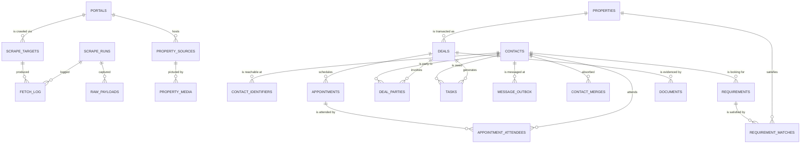

# Review v1.1.0 — defects, roadmap & cuts

*Part of [Database Schema](../DATABASE_SCHEMA.md) — §22–§24. Chapter files are authoritative; the root index only summarises.*

---

Two review passes against v1.0.0 on **2026-08-09** and **2026-08-10**, both read-only. Nothing in this chapter is applied; the live database still carries the V0 shape described in §2.2, and `src/pw/db/schema.sql` still carries the uncorrected V1 DDL.

Three findings here **supersede rulings written in v1.0.0**. Those sections carry an inline `⚠️ SUPERSEDED v1.1.0` marker pointing back to this chapter — the original reasoning is left intact, because a decision record that quietly rewrites itself is not a record.

Still true, and the reason every item below is priced as cheap: **every table is empty.** `[MEASURED: SELECT count(*) FROM listings @ 2026-08-06 → 0]`, and the V1 tables exist in no database at all.

---

## 22. Defects found after v1.0.0 {#defects-v11}

### 22.1 Timestamp format will split into two dialects — **IG-10**

```
[MEASURED: sqlite3 3.51.0 @ 2026-08-10]
  SELECT datetime('now');                                → 2026-08-09 04:46:17
  SELECT '2026-08-09 23:00:00' < '2026-08-09T01:00:00';  → 1
  SELECT julianday('2026-08-09T04:46:17') IS NOT NULL;   → 1
```

§4 makes two claims about instants that quietly conflict: *"`TEXT`, ISO-8601, **always UTC**, via `datetime('now')`"*. `datetime('now')` emits the SQLite variant — **space** separator, no offset. Canonical ISO-8601 uses `T`, and both producers in play emit that form:

| Writer | Emits |
|---|---|
| DDL `DEFAULT (datetime('now'))` | `2026-08-09 04:46:17` |
| Python `datetime.now(UTC).isoformat()` | `2026-08-09T04:46:17+00:00` |
| JS `new Date().toISOString()` — **the n8n producer** | `2026-08-09T04:46:17.000Z` |

`TEXT` comparison is bytewise. Space is `0x20`, `T` is `0x54`, so **every space-form timestamp sorts below every T-form timestamp**, regardless of the instant each represents. One column fed by both writers is not sorted at all.

**What breaks, all silently:**

- **§7.3's expiry sweep.** `WHERE last_seen_at < datetime('now','-14 days')` — the comparison value is space-form, so no T-form row ever matches. Scraped rows never expire, the feed grows without limit, and the sweep reports success every night.
- **AP-07**, the contact timeline: `ORDER BY occurred_at DESC` interleaves wrongly wherever the two forms mix.
- **§9.1's keyset pagination**: `(first_seen_at, id) < (?4, ?5)` skips or repeats whole pages at the boundary.

The third measurement above is why this is nasty: `julianday()` parses **both** forms correctly, so every aggregate — including `follow_up_inbox.stale_hours` — stays right while the ordering around it is wrong. The corruption is invisible in totals and visible only in sequence, which is the hardest class of bug to notice and the last one anyone suspects.

**Ruling: standardise on the space form**, i.e. exactly what `datetime('now')` emits. It is what every `DEFAULT` clause in `schema.sql` already produces, so the alternative means editing ~20 defaults to change nothing about correctness. Two producers change instead of twenty defaults.

Enforce it in the DDL:

```sql
-- Turso Database 0.7.x / stock SQLite 3.37+
CHECK (created_at GLOB '[0-9][0-9][0-9][0-9]-[0-9][0-9]-[0-9][0-9] [0-9][0-9]:[0-9][0-9]:[0-9][0-9]')
```

```
[MEASURED: sqlite3 3.51.0 @ 2026-08-10 — the guard, against each form it must judge]
  '2026-08-09 04:46:17'      → 1   accepted
  '2026-08-09T04:46:17'      → 0   rejected (T form)
  '2026-08-09 04:46:17+00:00'→ 0   rejected (offset)
  '2026-08-09 04:46:17.123Z' → 0   rejected (millis + Z)
  'abcd-ef-gh ij:kl:mn'      → 0   rejected (right shape, wrong alphabet)
```

> **Do not write this guard with `LIKE`-style wildcards.** GLOB uses Unix globbing — `*` and `?` — so `_` is a **literal underscore**, and the intuitive-looking `GLOB '____-__-__ __:__:__'` rejects every valid timestamp including the correct one `[MEASURED @ 2026-08-10 → 0]`. The digit classes above are also strictly better than `'????-??-?? ??:??:??'`, which accepts `abcd-ef-gh ij:kl:mn`.

Apply to every instant column: `created_at`, `updated_at`, `first_seen_at`, `last_seen_at`, `occurred_at`, `observed_at`, `started_at`, `finished_at`, `listed_at`.

**Producer obligations** — the transform is one call on each side:

```python
datetime.now(UTC).strftime('%Y-%m-%d %H:%M:%S')          # Python
```
```javascript
new Date().toISOString().slice(0, 19).replace('T', ' ')   // n8n
```

**Cost of deferring.** Today this is a `CHECK` in a `CREATE TABLE`. Once data exists it is a 12-step table rebuild per table (profile §5) *plus* a repair `UPDATE` — and the repair has to decide, row by row, which format each value is in and whether a `+08:00` offset was ever applied. Some of those rows will be unrecoverable, because a naive local-time write is indistinguishable from a UTC write eight hours earlier.

**Add to §8's table as IG-10.**

---

### 22.2 `contacts.phone UNIQUE` makes identity a single mutable attribute

§6.1 calls the phone-keyed grain *"the single best decision in the V1 schema"*. The **grain** is right — one row per person, role on the relationship. The **key** is not.

Three failure modes, all live:

1. **One person, two numbers.** Agents routinely carry a personal number and an agency number, and portals list whichever was typed that day. Same human, two `contacts` rows, and `contact_properties` and `interactions` split across both — so "everything I know about this agent" returns half of it, with no indication that it did.
2. **A number changes hands.** Malaysian prepaid numbers are recycled. The unique key then silently merges two unrelated people into one row, and the interaction history of a stranger appears in someone's timeline.
3. **`phone` is nullable**, documented in §6.1 as deliberate (a walk-in may have only an email). SQLite treats `NULL`s as **distinct** in a unique index, so email-only contacts have no dedup key at all — precisely the unbounded-duplicates failure IG-1 documents for `advertisement_id`.

**Ruling: `contacts` stays the person; identity moves out.**

```sql
-- Turso Database 0.7.x / stock SQLite 3.37+
CREATE TABLE contact_identifiers (
  id          INTEGER PRIMARY KEY,
  contact_id  INTEGER NOT NULL REFERENCES contacts(id) ON DELETE CASCADE,
  kind        TEXT NOT NULL CHECK (kind IN ('phone','email','wa_id','ren')),
  value       TEXT NOT NULL,          -- normalised: phones 60…, emails lowercased
  is_primary  INTEGER NOT NULL DEFAULT 0 CHECK (is_primary IN (0,1)),
  created_at  TEXT NOT NULL DEFAULT (datetime('now')),
  CONSTRAINT uq_contact_identifiers_kind_value UNIQUE (kind, value)
);
CREATE INDEX idx_contact_identifiers_contact ON contact_identifiers(contact_id);
```

`contacts.phone`, `contacts.email` and `contacts.ren_number` are dropped from the parent. **AP-03 costs exactly what it costs today** — one probe, now on `uq_contact_identifiers_kind_value` instead of `uq_contacts_phone`. IG-2's normalisation contract moves to this table unchanged and matters more here, since the unique key is now the *only* thing holding identity.

It also makes the repair path possible: two rows later found to be one person are merged by repointing identifier rows, not by choosing which history to destroy (§23.2, `contact_merges`).

**Cost of deferring.** Every contact written under the old key must be re-keyed, and any pair already split across two rows **cannot be rejoined automatically** — nothing in the data records that they were the same human. That knowledge exists only in the agent's head, and only for as long as they remember.

---

### 22.3 `follow_up_inbox` sorts never-contacted rows to the bottom

```
[MEASURED: sqlite3 3.51.0 @ 2026-08-10]
  SELECT julianday(NULL);                                → (null)
  ORDER BY v DESC        over (5, NULL, 9)               → 9, 5, NULL
  ORDER BY v DESC NULLS FIRST                            → NULL, 9, 5
```

§11 documents `never_contacted` yielding `NULL` for `stale_hours` and defends it: *"`NULL` means unknown, which is exactly right"*. The **value** is right. The **consequence** was not followed through.

AP-06 orders `stale_hours DESC`. SQLite sorts `NULL` smallest, so `DESC` places it **last**. A contact scraped three weeks ago and never called ranks below every contact you are merely slow in replying to. The bucket that most needs action is the one the ordering hides — and `test_never_contacted_has_null_stale_hours` locks the `NULL` in while no test covers ordering *across* buckets, so the suite passes.

**Ruling: give never-contacted rows a real clock.** For someone never contacted, the meaningful staleness is how long you have had them and done nothing:

```sql
CAST((julianday('now') - julianday(
       COALESCE(MAX(l.last_inbound_at, l.last_outbound_at),
                l.last_inbound_at,
                l.last_outbound_at,
                c.created_at)                 -- <- added
     )) * 24 AS INTEGER) AS stale_hours
```

`stale_hours` becomes non-`NULL` for every row, and `test_never_contacted_has_null_stale_hours` must be **changed rather than preserved** — it currently locks in the defect.

`ORDER BY stale_hours DESC NULLS FIRST` is the alternative that keeps the `NULL` as a signal. It works on stock SQLite `[MEASURED: 3.51.0 @ 2026-08-10]`, but `NULLS FIRST` arrived in SQLite 3.30 and this engine is a separate implementation — **verify on Turso Database 0.7.x before relying on it**. The `COALESCE` needs no such verification, which is most of why it is the ruling.

This fix travels with the query into the application (§24.1); it is not a reason to keep the view.

---

### 22.4 No change-detection hash on `property_sources`

§6.6 rules that `price_history` writes are change-only, and that ruling is right — it is the 500x storage decision. But it covers **one column**. Every other scraped field is blind-overwritten on each run:

- **`updated_at` becomes meaningless** the moment IG-4 is fixed. Every source row would update every night whether or not the ad changed, and the cheapest debugging column in the schema goes back to telling you nothing.
- **"What changed in this ad since yesterday"** is unanswerable, which is exactly the question a price-drop alert has to answer credibly before anyone acts on it.
- **A portal change and an extractor regression are indistinguishable.** The second is a defect and is currently invisible.

**Ruling: add two columns to `property_sources`.**

```sql
content_hash   TEXT,   -- sha256 of the normalised extracted payload
parser_version TEXT    -- the extractor build that produced this row
```

The ingest path compares `content_hash`; equal means touch `last_seen_at` and stop. The pair also disambiguates the three cases that matter:

| `content_hash` | `parser_version` | Meaning |
|---|---|---|
| differs | same | the portal changed the ad — a real observation |
| same | differs | safe re-parse, nothing to review |
| differs | differs | ambiguous — the only case a human should look at |

Pairs directly with `raw_payloads` (§23.1): the hash tells you *that* something changed, the payload lets you see *what*.

---

### 22.5 `properties.status` carries two lifecycles

`active | under_offer | closed | withdrawn | expired` mixes two owners:

- **machine-owned** — `active`, `expired`, set by §7.3's staleness sweep from `last_seen_at`
- **human-owned** — `under_offer`, `closed`, `withdrawn`, set by the agent

The sweep guards `AND status = 'active'`. So a unit the agent moved to `under_offer` **never expires**, even years after the ad vanished from the portal; and a unit that *should* be `under_offer` gets overwritten to `expired` whenever the agent has not updated it yet. Both outcomes are silent, and which one you get depends on a race between a human and a cron job.

The deeper error is grain. `under_offer` and `closed` are facts about a **deal**, not about a unit. A unit can be under offer to one buyer while still being marketed to others, and `properties.status` has room for exactly one answer.

**Ruling: split the axes.**

```sql
listing_status TEXT NOT NULL DEFAULT 'active'
  CHECK (listing_status IN ('active','expired','withdrawn'))
```

`withdrawn` stays — an owner pulling the ad is a fact about the listing. `under_offer` and `closed` move to `deals.stage` (§23.2). "Is this unit spoken for" becomes:

```sql
EXISTS (SELECT 1 FROM deals
         WHERE property_id = ?1 AND stage IN ('offer','booking','agreement'))
```

**Index consequence.** `idx_properties_acq (acquisition, status)` and §9.1's proposed `idx_properties_feed` both reference `status`; both become `listing_status`. The partial predicate is otherwise unchanged, and since neither index exists on any deployed database yet, this is a text edit.

---

## 23. Proposed entities {#roadmap}

v1.0.0 documents the seven tables that exist. This section names what a working product needs that they do not cover.

**Nothing here is designed to §6's depth, and none of it carries a storage estimate.** §6's estimates were derived from measured column widths against a specific volume model; these tables have no rows, no producers, and no measured widths, so any figure would be invention dressed as arithmetic. One exception is stated explicitly below, because ignoring it would be worse than estimating it.

Tiers reflect what blocks what, not preference:

- **Tier 0** — infrastructure. Ship before V1 carries data.
- **Tier 1** — the workspace half. The product is not a workspace without these.
- **Tier 2** — triggered. Named so the trigger is recognised when it arrives, not so it is built now.

### 23.1 Tier 0 — infrastructure {#tier-0}

#### `schema_migrations`

§2.6: no migration mechanism, no version table, `PRAGMA user_version = 0` `[MEASURED @ 2026-08-06]`. That absence is not a missing nicety — **it is why the V0/V1 divergence went unnoticed for months.** There is no way to ask a database file which schema it holds.

```sql
CREATE TABLE schema_migrations (
  version    TEXT PRIMARY KEY,                          -- '0001_initial'
  applied_at TEXT NOT NULL DEFAULT (datetime('now')),
  checksum   TEXT NOT NULL                              -- sha256 of the file as applied
);
```

`checksum` catches a migration edited after it was applied — the exact failure §17's *"never edit an applied migration"* discipline can otherwise only request politely. **Blocking: nothing else in this chapter is safe to ship without it.**

#### `raw_payloads`

The table a scraper cannot function without.

**Grain: one row per HTTP fetch**, not per listing — one search-results page yields ~35 ads and one payload.

```sql
CREATE TABLE raw_payloads (
  id             INTEGER PRIMARY KEY,
  scrape_run_id  INTEGER REFERENCES scrape_runs(id) ON DELETE SET NULL,
  portal_id      INTEGER NOT NULL REFERENCES portals(id),
  source_url     TEXT NOT NULL,
  fetched_at     TEXT NOT NULL DEFAULT (datetime('now')),
  http_status    INTEGER NOT NULL,
  content_sha256 TEXT NOT NULL,
  body           BLOB,                    -- gzipped; NULL once retention drops it
  parser_version TEXT NOT NULL,
  CONSTRAINT uq_raw_payloads_content UNIQUE (content_sha256)
);
```

Portals change their markup without notice. You find out days later, by which time every affected row is already wrong **and the ad is gone**, so re-scraping recovers nothing. With payloads you re-parse. It is also the only possible answer to *"why does this row say RM 450 when the ad said RM 4,500"*.

**Retention: drop `body` at 30 days, keep the row.** URL, hash, status and timing stay useful indefinitely and cost almost nothing without the blob.

**The one storage figure worth stating**, because this table is the only proposal that can dominate the database:

```
[ESTIMATED: 3 portals × 1 page/day = 3 fetches/day today;
            ~30/day if pagination lands (OQ-10, ~10 pages).
            A mudah __NEXT_DATA__ document gzips to roughly 40 KB.
            30 × 40 KB = 1.2 MB/day × 30-day blob retention ≈ 36 MB steady state]
```

**~36 MB against §15's 6.2 MB whole-database projection** — this table would be roughly six times everything else combined. That is still trivial in absolute terms and the value is high, but it belongs in §15's table rather than arriving as a surprise, and the 30-day blob drop is what keeps it bounded rather than linear.

#### `portals`

Replaces `website TEXT` and retires IG-6 structurally rather than by `CHECK`.

```sql
CREATE TABLE portals (
  id                INTEGER PRIMARY KEY,
  slug              TEXT NOT NULL UNIQUE,      -- 'mudah'
  display_name      TEXT NOT NULL,
  base_url          TEXT NOT NULL,
  is_enabled        INTEGER NOT NULL DEFAULT 1 CHECK (is_enabled IN (0,1)),
  rate_limit_rps    REAL,
  min_delay_ms      INTEGER,
  robots_checked_at TEXT,
  parser_module     TEXT,
  last_ok_run_at    TEXT
);
```

`property_sources.website TEXT` becomes `portal_id INTEGER NOT NULL REFERENCES portals(id)`, and the dedup key becomes `UNIQUE (portal_id, advertisement_id)`. `'mudah'` / `'Mudah'` / `'mudah.my'` can no longer become three portals, because they can no longer be typed. It also gives crawl policy — rate limits, robots checks, which parser — a home other than an n8n node, and narrows the largest table's key by several bytes per row.

#### `scrape_targets`

The crawl frontier. Today "what to scrape" is three URLs in n8n node 12 with pagination commented out (OQ-10).

```sql
CREATE TABLE scrape_targets (
  id                   INTEGER PRIMARY KEY,
  portal_id            INTEGER NOT NULL REFERENCES portals(id) ON DELETE CASCADE,
  listing_type         TEXT NOT NULL CHECK (listing_type IN ('rent','sale')),
  area                 TEXT NOT NULL,
  url_template         TEXT NOT NULL,
  max_pages            INTEGER NOT NULL DEFAULT 1,
  cadence_minutes      INTEGER NOT NULL DEFAULT 1440,
  priority             INTEGER NOT NULL DEFAULT 0,
  next_run_at          TEXT NOT NULL DEFAULT (datetime('now')),
  last_run_at          TEXT,
  consecutive_failures INTEGER NOT NULL DEFAULT 0,
  is_enabled           INTEGER NOT NULL DEFAULT 1 CHECK (is_enabled IN (0,1))
);
CREATE INDEX idx_scrape_targets_due ON scrape_targets(next_run_at) WHERE is_enabled = 1;
```

This is the table that turns a script into a scraper. Pagination, per-area cadence, backoff on repeated failure, and §16.3's expansion from Kajang to the Klang Valley all become **rows** instead of workflow edits. The partial index is the scheduler's only query: *what is due*.

#### `fetch_log`

Per-URL outcome. `scrape_runs` reports 105 found / 3 errors; it cannot tell you *which* URL returned 403, or that PropertyGuru began serving 200 with an empty body.

```sql
CREATE TABLE fetch_log (
  id            INTEGER PRIMARY KEY,
  scrape_run_id INTEGER NOT NULL REFERENCES scrape_runs(id) ON DELETE CASCADE,
  target_id     INTEGER REFERENCES scrape_targets(id) ON DELETE SET NULL,
  url           TEXT NOT NULL,
  attempt       INTEGER NOT NULL DEFAULT 1,
  http_status   INTEGER,
  latency_ms    INTEGER,
  bytes         INTEGER,
  error_class   TEXT,
  fetched_at    TEXT NOT NULL DEFAULT (datetime('now'))
);
```

This is also the other half of IG-5: with per-item rows, `scrape_runs`' counters stop being independently written and become derivable. See §24.2, which takes that argument to its conclusion.

### 23.2 Tier 1 — the workspace half {#tier-1}

#### `deals` + `deal_parties` — the largest gap in the schema

An agent's work is a pipeline and there is no table for it. `contact_properties.role` can say *this person is an interested buyer*; it cannot say which stage, at what price, on whose commission, or when it closed. **Commission is why the agent opens the application, and it is currently unrepresentable.**

**Grain:** one row per (property, transaction attempt). A unit that fails to sell and is relisted is two deals.

```sql
CREATE TABLE deals (
  id                   INTEGER PRIMARY KEY,
  property_id          INTEGER NOT NULL REFERENCES properties(id) ON DELETE CASCADE,
  deal_type            TEXT NOT NULL CHECK (deal_type IN ('rent','sale')),
  stage                TEXT NOT NULL DEFAULT 'lead'
                       CHECK (stage IN ('lead','viewing','negotiating','offer',
                                        'booking','agreement','completed','lost')),
  agreed_price_cents   INTEGER CHECK (agreed_price_cents IS NULL OR agreed_price_cents > 0),
  commission_cents     INTEGER CHECK (commission_cents IS NULL OR commission_cents >= 0),
  commission_split_pct REAL,
  expected_close_on    TEXT,
  closed_on            TEXT,
  lost_reason          TEXT,
  created_at           TEXT NOT NULL DEFAULT (datetime('now')),
  updated_at           TEXT NOT NULL DEFAULT (datetime('now')),
  CONSTRAINT ck_deals_terminal CHECK (
    (stage IN ('completed','lost')) = (closed_on IS NOT NULL))
);
CREATE INDEX idx_deals_stage ON deals(stage, expected_close_on)
  WHERE stage NOT IN ('completed','lost');

CREATE TABLE deal_parties (
  id         INTEGER PRIMARY KEY,
  deal_id    INTEGER NOT NULL REFERENCES deals(id)    ON DELETE CASCADE,
  contact_id INTEGER NOT NULL REFERENCES contacts(id) ON DELETE CASCADE,
  role       TEXT NOT NULL CHECK (role IN ('buyer','tenant','vendor','landlord',
                                           'co_agent','lawyer','banker')),
  CONSTRAINT uq_deal_parties UNIQUE (deal_id, contact_id, role)
);
```

Amounts are MYR sen, per §4.2. `interactions` gains a nullable `deal_id`, and the follow-up inbox stops being purely contact-centric — *"deals stalled at `viewing` for ten days"* is the query that actually makes money, and it is unaskable today.

#### `appointments` + `appointment_attendees`

`interactions` is past-tense **by construction** — `occurred_at`, append-only, no `updated_at` (§6.5, §14.1). Nothing in this schema can hold *"viewing Saturday 3pm, unit A-12-3, tenant and owner both attending"*. A property agent tool without a calendar entity is a notebook.

```sql
CREATE TABLE appointments (
  id               INTEGER PRIMARY KEY,
  property_id      INTEGER REFERENCES properties(id) ON DELETE SET NULL,
  deal_id          INTEGER REFERENCES deals(id)      ON DELETE SET NULL,
  kind             TEXT NOT NULL CHECK (kind IN ('viewing','key_handover','signing',
                                                 'inspection','call')),
  scheduled_at     TEXT NOT NULL,
  duration_minutes INTEGER,
  status           TEXT NOT NULL DEFAULT 'scheduled'
                   CHECK (status IN ('scheduled','confirmed','done','no_show','cancelled')),
  location         TEXT,
  reminder_sent_at TEXT,
  created_at       TEXT NOT NULL DEFAULT (datetime('now'))
);
CREATE INDEX idx_appointments_upcoming ON appointments(scheduled_at)
  WHERE status IN ('scheduled','confirmed');

CREATE TABLE appointment_attendees (
  appointment_id INTEGER NOT NULL REFERENCES appointments(id) ON DELETE CASCADE,
  contact_id     INTEGER NOT NULL REFERENCES contacts(id)     ON DELETE CASCADE,
  PRIMARY KEY (appointment_id, contact_id)
);
```

**The handoff matters:** when an appointment reaches `done`, write the matching `interactions` row. Past and future stay in separate tables, which is what lets `interactions` remain honestly append-only instead of acquiring a mutable "did it happen yet" column.

#### `tasks`

`follow_up_inbox` is **derived**, so it can hold no intent. It cannot be snoozed, cannot be dismissed, and cannot record *"call back after Raya"* or *"chased three times, dead"*. A derived inbox permanently re-surfaces everything you consciously deferred, and an agent stops trusting it inside a week.

```sql
CREATE TABLE tasks (
  id            INTEGER PRIMARY KEY,
  contact_id    INTEGER REFERENCES contacts(id)   ON DELETE CASCADE,
  deal_id       INTEGER REFERENCES deals(id)      ON DELETE CASCADE,
  property_id   INTEGER REFERENCES properties(id) ON DELETE SET NULL,
  title         TEXT NOT NULL,
  due_at        TEXT,
  snoozed_until TEXT,
  done_at       TEXT,
  dismissed_at  TEXT,
  source        TEXT NOT NULL DEFAULT 'manual'
                CHECK (source IN ('manual','auto_followup','price_drop','alert_match')),
  created_at    TEXT NOT NULL DEFAULT (datetime('now'))
);
CREATE INDEX idx_tasks_open ON tasks(due_at)
  WHERE done_at IS NULL AND dismissed_at IS NULL;
```

This is also the concrete reason §24.1 moves the inbox into the application: the real inbox is a `UNION` of derived signals and explicit tasks, minus dismissals, and no view expresses that cleanly.

#### `requirements` + `requirement_matches` — the actual product

Four thousand scraped listings exist in order to serve buyers, and **nothing links the two halves.**

```sql
CREATE TABLE requirements (
  id              INTEGER PRIMARY KEY,
  contact_id      INTEGER NOT NULL REFERENCES contacts(id) ON DELETE CASCADE,
  listing_type    TEXT NOT NULL CHECK (listing_type IN ('rent','sale')),
  area            TEXT,
  min_price_cents INTEGER,
  max_price_cents INTEGER,
  min_bedrooms    INTEGER,
  min_size_sqft   REAL,
  property_type   TEXT,
  is_active       INTEGER NOT NULL DEFAULT 1 CHECK (is_active IN (0,1)),
  expires_on      TEXT,
  created_at      TEXT NOT NULL DEFAULT (datetime('now')),
  CONSTRAINT ck_requirements_price_range CHECK (
    min_price_cents IS NULL OR max_price_cents IS NULL
    OR min_price_cents <= max_price_cents)
);

CREATE TABLE requirement_matches (
  id             INTEGER PRIMARY KEY,
  requirement_id INTEGER NOT NULL REFERENCES requirements(id) ON DELETE CASCADE,
  property_id    INTEGER NOT NULL REFERENCES properties(id)   ON DELETE CASCADE,
  matched_at     TEXT NOT NULL DEFAULT (datetime('now')),
  score          REAL,
  notified_at    TEXT,
  outcome        TEXT NOT NULL DEFAULT 'pending'
                 CHECK (outcome IN ('pending','sent','viewed','rejected','viewing_booked')),
  CONSTRAINT uq_requirement_matches UNIQUE (requirement_id, property_id)
);
```

`uq_requirement_matches` is load-bearing, not hygiene: **it is what stops the same buyer being sent the same unit twice** — the one bug in this domain that costs a client rather than a debugging session. This pair is also what turns the scrape from a feed into an alert engine, which is the difference between the tool being opened daily and not at all.

#### `property_media`

Every portal ad carries 10-30 photos and none are stored. Beyond the obvious UI need, **perceptual-hash equality is the strongest cross-portal dedup signal available** — identical photos mean identical unit, far more reliably than IG-8's fuzzy address-and-size matching.

```sql
CREATE TABLE property_media (
  id                 INTEGER PRIMARY KEY,
  property_source_id INTEGER NOT NULL REFERENCES property_sources(id) ON DELETE CASCADE,
  url                TEXT NOT NULL,
  position           INTEGER NOT NULL DEFAULT 0,
  sha256             TEXT,
  phash              TEXT,
  width              INTEGER,
  height             INTEGER,
  stored_key         TEXT,
  CONSTRAINT uq_property_media UNIQUE (property_source_id, url)
);
CREATE INDEX idx_property_media_phash ON property_media(phash) WHERE phash IS NOT NULL;
```

#### `documents`

Booking form, tenancy agreement, IC copy, floor plan, offer letter.

```sql
CREATE TABLE documents (
  id          INTEGER PRIMARY KEY,
  deal_id     INTEGER REFERENCES deals(id)      ON DELETE CASCADE,
  property_id INTEGER REFERENCES properties(id) ON DELETE SET NULL,
  contact_id  INTEGER REFERENCES contacts(id)   ON DELETE SET NULL,
  kind        TEXT NOT NULL,
  storage_key TEXT NOT NULL,
  mime        TEXT,
  sha256      TEXT,
  size_bytes  INTEGER,
  uploaded_at TEXT NOT NULL DEFAULT (datetime('now')),
  expires_on  TEXT
);
```

**This will hold the highest-sensitivity PII in the system** — IC and passport scans — and the schema currently has nowhere to admit it exists. That is not neutral: it means the files land in Google Drive with no link back to the person and **no erasure path at all**. See §23.4.

#### `message_outbox`

V0 carried `outreach_message`; V1 dropped it, and the outreach itself did not go away.

```sql
CREATE TABLE message_outbox (
  id                  INTEGER PRIMARY KEY,
  contact_id          INTEGER NOT NULL REFERENCES contacts(id) ON DELETE CASCADE,
  deal_id             INTEGER REFERENCES deals(id) ON DELETE SET NULL,
  channel             TEXT NOT NULL CHECK (channel IN ('whatsapp','sms','email')),
  body                TEXT NOT NULL,
  idempotency_key     TEXT NOT NULL,
  status              TEXT NOT NULL DEFAULT 'queued'
                      CHECK (status IN ('queued','sent','delivered','failed','skipped')),
  queued_at           TEXT NOT NULL DEFAULT (datetime('now')),
  sent_at             TEXT,
  provider_message_id TEXT,
  error               TEXT,
  CONSTRAINT uq_message_outbox_idem UNIQUE (idempotency_key)
);
```

`uq_message_outbox_idem` is the entire point. An n8n retry today means the owner receives the same LLM-drafted pitch twice, from an agent asking for their business. `interactions` gets its row only on `sent` — the log records what happened, not what was attempted.

#### `contact_merges` / `property_merges`

Deduplication is fuzzy by construction (IG-8), so it **will** be wrong in both directions. Merging without a record is irreversible: foreign keys from `interactions`, `contact_properties` and `deals` get repointed and the losing id is gone.

```sql
CREATE TABLE contact_merges (
  id           INTEGER PRIMARY KEY,
  surviving_id INTEGER NOT NULL REFERENCES contacts(id) ON DELETE CASCADE,
  merged_id    INTEGER NOT NULL,               -- deliberately not an FK: the row is gone
  merged_at    TEXT NOT NULL DEFAULT (datetime('now')),
  reason       TEXT,
  payload_json TEXT CHECK (payload_json IS NULL OR json_valid(payload_json))
);
```

`payload_json` holds the losing row as it was. Two small tables (the `property_merges` twin is identical in shape) that convert a catastrophe into an inconvenience.

### 23.3 Tier 2 — triggered, not now {#tier-2}

| Proposed | What it buys | Trigger to build it |
|---|---|---|
| **`buildings`** | Forty listings in "Forest Green Condominium" roll up to one building with shared address, coordinates and facilities. Makes comps a one-table query and makes IG-3's area problem far smaller | The first time "what do 3-bedroom units in this block rent for" is asked |
| **`areas`** + alias table | Hierarchical `state → district → area` with portal spellings mapped to canonical values. Fixes IG-3 properly rather than by Python normalisation | Expansion beyond one district (§16.3) |
| **`users`** + `audit_log` | `created_by` / `updated_by`, and §14.1's layer 2 | OQ-6's tripwire: the day a second person can write |

### 23.4 PII additions {#pii-v11}

To be merged into §14.3 when these tables land:

| Column | Classification | Erasure strategy |
|---|---|---|
| `contact_identifiers.value` | **PII — direct identifier, and now *the* identity of a person in this system** | Cascades with the `contacts` row. Replaces §14.3's `contacts.phone` / `email` / `ren_number` rows |
| `documents.storage_key` | **Highest sensitivity in the system** — IC and passport scans. The row is a pointer; the file is elsewhere | **Hard delete is not enough.** Deleting the row orphans the file. Erasure must delete the object in blob storage first, then the row — and that ordering has to be written down before the first upload, not after |
| `message_outbox.body` | PII — free text, LLM-generated, frequently names the recipient | Cascades with the contact. Same unreachable-third-party risk as OQ-8 |
| `property_media.url` / `stored_key` | Low — property photos. Occasionally captures people or vehicles | Retained with the property |

### 23.5 Proposed access patterns {#ap-v11}

IDs are permanent (Gate 4), so these append to §3 and never renumber. All marked `[P] proposed` — none has a reader yet, and per Gate 4 **no index above is justified until its AP is real.**

| ID | Pattern | Predicates | Sort | Serving structure |
|---|---|---|---|---|
| **AP-17** `[P]` | Deal pipeline board: open deals by stage | `stage NOT IN ('completed','lost')` | `expected_close_on` | `idx_deals_stage` |
| **AP-18** `[P]` | Today's appointments | `scheduled_at BETWEEN ? AND ? AND status IN ('scheduled','confirmed')` | `scheduled_at` | `idx_appointments_upcoming` |
| **AP-19** `[P]` | Open task inbox | `done_at IS NULL AND dismissed_at IS NULL AND COALESCE(snoozed_until,'') <= ?` | `due_at` | `idx_tasks_open` |
| **AP-20** `[P]` | Match new feed rows against active requirements | per requirement: `area`, `listing_type`, price range, `min_bedrooms` | — | `idx_properties_feed` (§9.1), reused |
| **AP-21** `[P]` | Which targets are due to scrape | `is_enabled = 1 AND next_run_at <= ?` | `next_run_at` | `idx_scrape_targets_due` |
| **AP-22** `[P]` | Resolve a person by any identifier | `kind = ? AND value = ?` | — | `uq_contact_identifiers_kind_value` — **supersedes AP-03's structure** |
| **AP-23** `[P]` | Find duplicate units by image hash | `phash = ?` | — | `idx_property_media_phash` |
| **AP-24** `[P]` | Commission earned in a period | `stage = 'completed' AND closed_on BETWEEN ? AND ?` | `closed_on` | none yet — a scan over a small table is correct at these volumes |

### 23.6 Proposed entity relationships {#erd-v11}

Kept separate from §5 so that §5 remains a picture of what exists. Existing entities in this diagram are shown only where a proposed table attaches to them.



---

## 24. Proposed cuts {#cuts}

Simplification pass. Storage saved is trivial — a few hundred KB — and that is not the argument. What each cut removes is a future defect: an experimental-engine dependency carrying the flagship feature, an unverifiable metrics source, a column guaranteed to hold stale numbers, and two guaranteed to hold false ones.

### 24.1 Cut the `follow_up_inbox` **view** — keep the query {#cut-view}

**Supersedes §11.** The strongest cut here, and not for size reasons.

§2.7 names it as risk #1: *"`follow_up_inbox` is a view. It is the follow-up feature. On this engine views are experimental."* The tests pass through `pyturso` 0.7.2, so the flagship feature currently rests on a pre-1.0 engine behaving in a way **its own manual says it does not**. §11 records this as "works today, not contractually stable" and then keeps the dependency anyway.

The dependency is unnecessary. The definition is thirty lines of `WITH latest AS (…)` that runs identically as a named query in `src/pw/queries/follow_up.py`. Moving it also unblocks three things a view cannot do:

- §22.3's never-contacted clock fix (trivial either way, but it travels with the query)
- snooze and dismiss, which need a `UNION` against `tasks` (§23.2) and an anti-join against dismissals
- deal-stalled buckets (AP-17), which are not contact-shaped and will not fit this view's grain

Keep the SQL verbatim on the way out. Zero behaviour change; one experimental-feature dependency deleted. §11's `active_feed` view recommendation falls with it — the same predicate belongs in a query builder.

### 24.2 Cut `scrape_runs` — conditionally {#cut-scrape-runs}

**Supersedes §6.7 in part.** The condition is **OQ-2**, which is unresolved.

**Cut it if n8n remains the ingest layer.** It has no foreign key in and none out; nothing references it and nothing reads it. n8n already stores richer execution history in the `n8n_data` volume — timing, status, per-node payloads, error stacks — and §1 explicitly scoped that as *"n8n's business, not ours"*. As it stands the table is a worse reimplementation of a log that already exists.

**Keep it if the Python scraper is built**, where it becomes the parent of `fetch_log` and `raw_payloads` (§23.1) and genuinely earns its place.

**Either way, its shape is wrong.** Six of its eleven columns are independently written counters that nothing can check (IG-5). If it stays, keep `(id, portal_id, started_at, finished_at, status)` and drop `pages_fetched`, `listings_found`, `new_count`, `duplicate_count`, `error_count`, `notes` — deriving each from `fetch_log` and `property_sources`:

```sql
SELECT count(*) FROM property_sources WHERE scrape_run_id = ?1;
```

Derived counts cannot disagree with reality. That retires IG-5 by deletion rather than by discipline. It does require the `scrape_run_id` column that §19 item 14 and OQ-7 currently reject — and that rejection was correct under Gate 4 *at the time*, because no access pattern needed it. `fetch_log` and `raw_payloads` supply the missing pattern.

> **A counter nothing can verify is worse than no counter at all: it gets trusted.** You learn the scraper broke by noticing the feed is stale, while the dashboard reports healthy.

### 24.3 Cut `properties.price_per_sqft` {#cut-ppsf}

**Supersedes §6.2 and §13.**

- Pure derivation of `price_cents / size_sqft`.
- **No reader.** No AP references it; no query in the repository, the tests, or the n8n workflows selects it `[MEASURED: grep across all query sites @ 2026-08-06]`.
- §13 already documents that it goes stale when `price_cents` changes on a rescrape and `size_sqft` does not, **with no mechanism to recompute it** — generated columns are experimental on this engine (§2.7).

A derived column with no reader and a documented drift bug is the easiest cut in the schema. Compute at read; revisit as a generated column if the embedded path moves to stock SQLite (§16.2).

### 24.4 Cut `property_sources.price_at_scrape_cents` {#cut-price-at-scrape}

**Supersedes §6.3 and §13.**

Third copy of the same value. §13 defends `properties.price_cents` explicitly (AP-05 sorts on it) and `price_history.property_id` explicitly (AP-13 avoids a join); it never defends this one — it only renames it from `REAL`.

The column is exactly *"the newest `price_history` row for this source"*, which the proposed `UNIQUE (property_source_id, observed_at)` index answers in one probe. No access pattern reads it. §17's upsert shape writes it on every conflict, so it also costs a write per observation to store something already stored.

**Caveat, stated because it is the one real counter-argument:** under §6.6's change-only policy, a source whose price has *never* changed since first sighting has exactly one `price_history` row, and a source observed before the policy took effect might have none. The upsert must therefore always write the first `price_history` row for a new source, not only on change. That is one line in the ingest path and it is required for the cut to be safe.

### 24.5 Cut `properties.created_at` {#cut-created-at}

**Supersedes §6.2.** Provably always equal to `first_seen_at`.

```
[MEASURED: sqlite3 3.51.0 @ 2026-08-10]
  CREATE TABLE t (a DEFAULT (datetime('now')),
                  b DEFAULT (datetime('now')),
                  c DEFAULT (datetime('now')));
  INSERT INTO t DEFAULT VALUES;
  SELECT a = b AND b = c;                              → 1
```

`now` is fixed for the duration of a statement, both columns carry the same default, and nothing overrides either — for `scraped` rows because they are created on first sighting, and for `own_mandate` rows because `first_seen_at` has no independent meaning. Keep `first_seen_at`: it is the semantic one and it pairs with `last_seen_at` to drive AP-11.

`contacts` has no `first_seen_at`, so its `created_at` stays. `interactions.occurred_at` versus `created_at` is **not** an instance of this — those genuinely differ under backdating, which §6.5 explains and which is correct as written.

### 24.6 `updated_at` on `contacts` and `properties` — fix it or cut it {#cut-updated-at}

**Supersedes §6.1 and §6.2.**

IG-4: triggers are experimental on this engine, no write path sets the column, and `DEFAULT` fires on insert only. So `updated_at` equals `created_at` forever. **Today it is a column that asserts something false**, and the first person to debug with it will believe it.

Two honest options, and the current middle state is not one of them:

- **Fix** — every application write sets it explicitly. It then earns its 19 bytes and IG-4 is discharged rather than merely recorded.
- **Cut** — until `pw` exists to maintain it. `src/pw/` is empty `[MEASURED: 32 bytes across 7 files @ 2026-08-06]`, so there is nothing to do the maintaining.

**Recommend cut now, restore with the first real write path** — the same release that discharges IG-4. If it is kept, §12's trigger is the mechanism to adopt the day the embedded path moves to stock SQLite.

### 24.7 Looks cuttable, is not {#kept}

Stated so nobody removes them later on the reasoning above.

| Kept | Why it survives |
|---|---|
| **`price_history`** | The only table recording something unreconstructible. §19 item 8 is right and nothing here weakens it. Under change-only writes it is ~367 KB/year |
| **`properties.scam_score`** | Always `NULL`, no reader — but `NULL` costs **0 bytes** (§15's row-width rules), so it is genuinely free, and adding it later to a populated table is a 12-step rebuild |
| **`contact_properties`** | Keep the table. **Split the enum**, because it is doing two unrelated jobs — see below |

**`contact_properties` — keep, but the enum is wrong.**

- `owner`, `listing_agent`, `co_agent`, `current_tenant` are facts **about the unit**. They belong here.
- `interested_buyer`, `interested_tenant` are **deal state**. They belong on `deal_parties` (§23.2).

The symptom that proves the split: the table has `created_at` and **no `ended_on` and no status**. A buyer who loses interest, or a tenant whose lease ends, cannot be recorded as such — `current_tenant` is permanent, which is false of every tenancy that has ever existed. Move the two interest roles out when `deals` lands, and add `ended_on TEXT` to what remains.

---

## Summary of proposed changes

| | |
|---|---|
| **New defects** | IG-10 (timestamp dialect), contact identity key, inbox ordering, missing change hash, status carrying two lifecycles |
| **Tables removed** | `follow_up_inbox` (view), `listings` (already ruled, §6.8), `scrape_runs` (conditional on OQ-2) |
| **Columns removed** | `price_per_sqft`, `price_at_scrape_cents`, `properties.created_at`, `updated_at` ×2, `scrape_runs` counters ×6, and `contacts.phone`/`email`/`ren_number` (moved, not deleted) |
| **Tables proposed** | 5 Tier 0, 13 Tier 1, 4 Tier 2 |
| **Access patterns added** | AP-17 … AP-24, all `[P] proposed` |

**Suggested order** — each step is a `CREATE TABLE` today and a maintenance window in six months:

1. `schema_migrations` — nothing else is safe to ship without it
2. §22.1 timestamp guard + §22.2 `contact_identifiers` — both are free while the tables are empty
3. `portals`, `scrape_targets`, `raw_payloads` — makes the scraper a scraper
4. `deals`, `appointments`, `tasks` — makes the workspace a workspace
5. `requirements` + `requirement_matches` — the reason the other two exist
